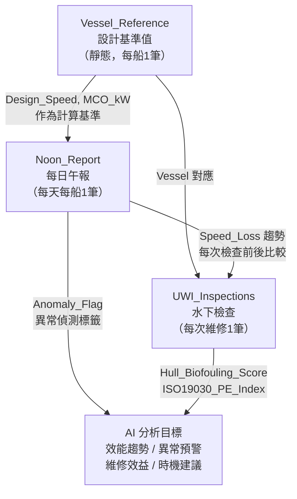

# 模擬資料欄位說明

:::banner{type="info"}
**`YangMing_MockData_Hackathon.xlsx`** 是一份模擬資料集，展示 PDF 解析完成後資料「理論上應該長成的樣子」。本頁逐欄說明各欄位的意義，幫助不熟悉航運術語的參賽者快速理解資料結構。
:::

:::alert{type="warning"}
這份資料是**參考基準，不是標準答案**。你可以設計完全不同的欄位結構——只要能回答四項評選需求即可。儲存格式也不限 Excel，CSV、Parquet 或資料庫都可以。
:::

---

:::tabs
::tab[📋 Noon\_Report]

## Noon\_Report 工作表

每艘船每天填寫一筆，記錄當日午報的核心數值。共 5 年 × 3 艘船 × 約 365 天。

---

### 識別資訊（這筆紀錄是哪艘船、哪天、哪個航次）

| 欄位名稱 | 中文說明 | 型別 | 補充說明 |
|---|---|---|---|
| `Vessel` | **船名** | 文字 | `YM WELLNESS` / `YM VICTORY` / `YM COSMOS` 三艘船 |
| `Route` | **航線** | 文字 | 如 `Trans-Pacific`、`Intra-Asia`，影響天候與壓載條件 |
| `Voyage_No` | **航次編號** | 文字 | 格式 `V++數字`，同一航次連續多天會共享同一編號 |
| `Position_Lat` | **緯度** | 數值 | 正值 = 北緯，負值 = 南緯。影響天候修正計算 |
| `Position_Lon` | **經度** | 數值 | 用於定位當天船位 |

---

### 主機動力（引擎跑了多用力？）

| 欄位名稱 | 中文說明 | 型別 | 補充說明 |
|---|---|---|---|
| `ME_Power_kW` | **主機功率** | 數值 | 上報實測輸出，單位 kW，最大值（MCO）約 46,000–68,000 kW |
| `ME_RPM` | **主機轉速** | 數值 | 單位 rpm。功率 ≈ 轉速³，轉速稍微下降功率會大幅降低 |
| `ME_SFOC_g_kWh` | **主機燃油消耗率** | 數值 | 單位 g/kWh，約 160–180。數字越小代表引擎效率越好 |

---

### 航速 & Speed Loss（速度損失的核心值）

| 欄位名稱 | 中文說明 | 型別 | 補充說明 |
|---|---|---|---|
| `Actual_Speed_kt` | **實際航速** | 數值 | 單位 knots（海里/小時），船每天實際跑多快 |
| `Design_Speed_kt` | **設計航速** | 數值 | 造船時設計的最佳航速（參考值），三艘船約 20–22.5 kt |
| `Speed_Corrected_ISO15016_kt` | **ISO 15016 修正後航速** | 數值 | ::badge[核心指標]{type="success"} 把風浪、洋流、壓載狀態都扣掉後，還原成「平靜海面等效速度」，才能公平比較不同天 |
| `Speed_Loss_kt` | **速度損失（絕對值）** | 數值 | ::badge[關鍵]{type="warning"} = `Design_Speed` − `Actual_Speed`，正值代表比設計慢，主要來自船體污損 |
| `Speed_Loss_pct` | **速度損失（百分比）** | 數值 | ::badge[ML\_KPI]{type="info"} = `Speed_Loss_kt / Design_Speed × 100`，建議超過 4% 考慮清潔 |
| `Distance_Sailed_nm` | **當日行駛距離** | 數值 | 單位海里（nm）。= `Actual_Speed × 24 hrs` |

---

### 燃油消耗（花了多少油？最直接的錢）

| 欄位名稱 | 中文說明 | 型別 | 補充說明 |
|---|---|---|---|
| `ME_FOC_t_day` | **主機燃油消耗量** | 數值 | ::badge[金錢指標]{type="warning"} 單位公噸/天。Main Engine Fuel Consumption，約 200–230 噸/天 |
| `AE_FOC_t_day` | **輔機燃油消耗量** | 數值 | Auxiliary Engine（發電機組），約 5–10 噸/天 |
| `Total_FOC_t_day` | **當日總油耗** | 數值 | ::badge[金錢指標]{type="warning"} = ME + AE。VLSFO 油價約 600 USD/噸，乘以此數字 = 每天燒多少錢 |
| `Fuel_Type` | **燃油種類** | 文字 | `VLSFO`（低硫）/ `HFO` / `MGO`，IMO 2020 後基本都是 VLSFO |

---

### 風浪 & 天氣（ISO 15016 修正所需）

| 欄位名稱 | 中文說明 | 型別 | 補充說明 |
|---|---|---|---|
| `Wind_BFT` | **風力蒲福風級** | 數值 | 蒲福 0–5 = 輕風，6–8 = 強風，9+ = 暴風；直接影響阻力 |
| `Wind_Direction` | **風向** | 文字 | 如 `NNW/SW/ENE/NNE`，順風省油、逆風費油 |
| `Wave_Height_m` | **浪高** | 數值 | 單位公尺，ISO 15016 修正公式的輸入之一，浪越大阻力越大 |
| `Current_kt` | **洋流速度** | 數值 | 正值 = 順流，負值 = 逆流。黑潮順流可省 1–2 節 |
| `Slt_dept` | **海水溫度** | 數值 | 單位 °C，影響主機冷卻效率 |

---

### 船身狀態（吃水深度 & 船底乾淨度）

| 欄位名稱 | 中文說明 | 型別 | 補充說明 |
|---|---|---|---|
| `Draft_F_m` | **船頭吃水深度** | 數值 | 單位公尺，= 14–16m，依載貨量而變 |
| `Draft_A_m` | **船尾吃水深度** | 數值 | 通常比船頭深 1–2 cm（船尾有推進器重量） |
| `Days_Since_Hull_Clean` | **距上次清潔船體天數** | 數值 | ::badge[關鍵]{type="warning"} 天數越多，Speed Loss 越大；超過 90 天建議關注 |
| `Days_Since_Prop_Polish` | **距上次螺旋槳拋光天數** | 數值 | ::badge[關鍵]{type="warning"} 螺旋槳拋光後可回復 0.3–0.6 kt 船速 |

---

### 異常旗標（AI 要學習偵測的目標）

| 欄位名稱 | 中文說明 | 型別 | 補充說明 |
|---|---|---|---|
| `Anomaly_Flag` | **異常旗標** | 文字 | ::badge[訓練標籤]{type="danger"} `NORMAL` / `FOC_HIGH` / `SPEED_LOW` / `WEATHER_SEVERE`。SFOC > 1.05 倍基準、Speed Loss > 5% 等條件觸發 |

::tab[🔍 UWI\_Inspections]

## UWI\_Inspections 工作表

每次水下檢查一筆，約每 5–6 個月一次，記錄船底污損程度與維修建議。共 36 筆（3 艘船 × 2020–2024）。

---

### 識別資訊（這次檢查是哪艘船、在哪、誰查的）

| 欄位名稱 | 中文說明 | 型別 | 補充說明 |
|---|---|---|---|
| `Inspection_No` | **檢查編號** | 文字 | ::badge[主鍵]{type="info"} 格式 `UWI-0001`，每次唯一，用來跟 Noon Report 對齊時間點 |
| `Vessel` | **船名** | 文字 | 對應 Noon Report 的 `Vessel`，三艘船各有獨立的檢查紀錄 |
| `Inspection_Date` | **檢查日期** | 日期 | 約每 5–6 個月一次；這個日期就是查看 Speed Loss 趨勢圖「清潔前後效應」的基準點 |
| `Port` | **進行檢查的港口** | 文字 | 高雄、上海、新加坡、鹿特丹、洛杉磯；只有靠港才能做水下檢查 |
| `Inspector_Company` | **執行檢查的驗船機構** | 文字 | BV Marine、NK（日本海事）、RINA（義大利）、DNV（挪威）等國際認證機構 |

---

### 船體狀況（外殼髒了多少、直接影響 Speed Loss）

| 欄位名稱 | 中文說明 | 型別 | 補充說明 |
|---|---|---|---|
| `Hull_Biofouling_Score` | **船體生物污損評分** | 數值 | ::badge[核心指標]{type="success"} 1–100 分。20 以下 = 輕度；45 以下 = 中度；45 以上 = 重度（藤壺、藻類大量附著）。每增加 10 分約多耗油 3–5% |
| `Biofouling_Rating` | **污損等級（文字版）** | 文字 | `Light`（輕）/ `Medium`（中）/ `Heavy`（重），由 `Hull_Biofouling_Score` 換算而來，給人看的版本 |
| `Paint_Breakdown_pct` | **防污塗料剝落比例** | 數值 | 單位 %。剝落面積越大 → 生物更容易附著 → 下次污損會更快；剝落超過 30% 通常要重新上漆 |
| `Hull_Cleaning_Performed` | **這次有沒有做船體清潔** | 文字 | `Yes / No`。清潔 = 派潛水員刷掉船底污損物；做完通常 Noon Report 的 Speed Loss 會明顯下降 |

---

### 螺旋槳 & 舵（推進效率的另一個關鍵）

| 欄位名稱 | 中文說明 | 型別 | 補充說明 |
|---|---|---|---|
| `Propeller_Condition` | **螺旋槳狀態評級** | 文字 | ::badge[核心指標]{type="success"} `Good` / `Fair` / `Critical` 四級。螺旋槳葉片面積性缺損，推進效率可降低 5–10%；Critical 代表要立刻維修 |
| `Propeller_Polishing` | **這次有沒有做螺旋槳拋光** | 文字 | `Yes / No`。拋光 = 打磨螺旋槳表面讓它更光滑，每次拋光可回復約 0.3–0.6 kt 的船速 |
| `Rudder_Condition` | **舵的狀態評級** | 文字 | `Good / Fair / Poor`，舵損傷會影響操縱性與縱向阻力，但比螺旋槳影響小 |

---

### 效益估算（這次做維修值多少錢？）

| 欄位名稱 | 中文說明 | 型別 | 補充說明 |
|---|---|---|---|
| `Est_Speed_Recovery_kt` | **預估清潔後可回復的船速** | 數值 | ::badge[推算值]{type="default"} 單位 knots。= 船體污損量 × 速度回復係數；這個數字就是算維修 ROI 的起點 |
| `Est_FOC_Saving_pct` | **預估可節省的油耗比例** | 數值 | ::badge[推算值]{type="default"} 單位 %。= `Est_Speed_Recovery × 2.1`，每回復 1 kt 約省 2.1% 油耗，一艘大船每天油費 \$10–15 萬美元，2% 就是很大的節省 |

---

### ISO 19030 效能指標（國際標準量化效能）

| 欄位名稱 | 中文說明 | 型別 | 補充說明 |
|---|---|---|---|
| `ISO19030_PE_Index` | **效能指數（Performance Index）** | 數值 | 範圍 0–1.2，為 **ISO 標準**。`1.0` = 與基準效率相同；小於 1.0 = 效能變差（越趕越差）；大於 1.0 = 優於基準（很少）。低於 0.85 通常就要安排維修 |
| `ISO19030_Threshold_Flag` | **是否超過 ISO 19030 維修門檻** | 文字 | ::badge[警示旗標]{type="danger"} `OK` = 效能尚可；`EXCEEDED` = 已超過標準容許的效能門檻，建議安排維修 |

---

### 備註（驗船員的人工觀察）

| 欄位名稱 | 中文說明 | 型別 | 補充說明 |
|---|---|---|---|
| `Notes` | **驗船員文字備註** | 文字 | 例如「船首觀察到藤壺嚴重附著」，這樣的描述是非結構化文字，正是 Textract + Bedrock 要解析的對象 |

::tab[⚓ Vessel\_Reference]

## Vessel\_Reference 工作表

三艘船的靜態主尺度與設計基準，每艘船只有一列（共 3 列）。這份資料是**效能計算的查詢字典**，不會隨時間變動。

---

### 三艘船基礎資料

| 欄位 | YM WELLNESS | YM VICTORY | YM COSMOS |
|---|---|---|---|
| 建造年份 | 2017 年（最新） | 2015 年（中型） | 2010 年（最舊） |
| 載箱量 | 14,000 TEU | 8,500 TEU | 4,500 TEU |
| 設計航速 | 22.5 kt | 21.6 kt | 20.5 kt |
| 最大主機功率 | 68,000 kW | 58,000 kW | 48,000 kW |

:::alert{type="info"}
三艘船年齡、大小都不同，比較效能時要以**各自的設計基準**為標準，不能直接跨船比較絕對數值。
:::

---

### 船籍識別（這艘船的「身分證」）

| 欄位名稱 | 中文說明 | 補充說明 |
|---|---|---|
| `Vessel` | **船名** | ::badge[主鍵]{type="info"} 對應 Noon Report 與 UWI 的 Vessel 欄位，三艘船皆需要唯一對應 |
| `IMO_No` | **國際海事組織編號** | ::badge[主鍵]{type="info"} 全球唯一的 7 位數船舶識別號碼，IMO = International Maritime Organization，相當於船的「身分證字號」 |
| `Year_Built` | **建造年份** | 影響維修策略：越老的船基準效率越差，AI 需要以各船年齡調整預測標準 |
| `Flag` | **船旗（登記國家）** | 三艘船皆掛中華民國（台灣）國旗，影響適用的法規標準 |
| `Class` | **船級認證** | DNV（挪威）/ ABS（美國）/ LR（英國勞氏），負責定期驗船確保機械與結構安全使用 |
| `Alliance` | **航運聯盟** | 三艘船均屬 THE Alliance，共艙合作服務，與 ONE 共同組班、定期班次由聯盟統一調度 |

---

### 物理尺寸（決定阻力大小的基本參數）

| 欄位名稱 | 中文說明 | 補充說明 |
|---|---|---|
| `Type` | **船型** | 均為 Container Ship（貨櫃船） |
| `TEU_Capacity` | **最大載箱量** | ::badge[TEU]{type="default"} Twenty Foot Equivalent Unit（20 英呎貨櫃），14,000 TEU 約相當於 14,000 個標準貨櫃 |
| `LOA_m` | **全長** | 單位公尺（Length Overall），YM WELLNESS 長達 366m，相當於 3.6 個運足球場 |
| `Beam_m` | **船寬** | 單位公尺，船越寬水阻越大（但載量更多） |
| `Design_Draft_m` | **設計吃水深度** | 最高載貨量下船身入水深度，越深水阻越大，也代表搭越多貨 |

---

### 效能基準（Speed Loss 計算最重要的一組）

| 欄位名稱 | 中文說明 | 補充說明 |
|---|---|---|
| `Design_Speed_kt` | **設計航速** | ::badge[Speed Loss 基準]{type="warning"} 造船廠規格表上的理想航速，所有速度損失計算都以此為基準 |
| `MCO_kW` | **最大持續輸出功率** | Maximum Continuous Output = 引擎全力運轉的上限，Noon Report 的 ME_Power 通常是 MCO 的 65–85% |
| `NCO_kW` | **正常持續輸出功率** | Normal Continuous Output，約 MCO 的 85%，日常航行通常跑 NCO 附近，比 MCO 省油 |
| `Design_SFOC_g_kWh` | **設計油耗率** | ::badge[效能基準]{type="default"} 造船廠設定的標準油耗率，Noon Report 的 ME_SFOC 越接近這個值代表引擎越健康 |
| `Design_FOC_t_day_NCO` | **NCO 功率下設計日油耗** | ::badge[比較基準]{type="info"} = `NCO_kW × Design_SFOC × 24 ÷ 1,000,000`，理想狀態下每天應該燒多少油，與 Noon Report 的 Total_FOC 比較就能量化效率差了多少 |

---

### 船體噴漆（影響污損速度）

| 欄位名稱 | 中文說明 | 補充說明 |
|---|---|---|
| `Hull_Paint_Type` | **船底防污漆品牌與型號** | 不同品牌有效時間差異很大，決定多快開始污損。如 `Intersleek 1100SR`（YM WELLNESS），每艘船的防污性能有所差異 |

---

### 維修排程（AI 推薦最佳維修時機的依據）

| 欄位名稱 | 中文說明 | 補充說明 |
|---|---|---|
| `Last_Drydock` | **上次進塢（乾塢大修）日期** | ::badge[維修紀錄]{type="default"} 單位天數，進塢頻率約 2.5–5 年一次 |
| `Next_Drydock_Due` | **下次預計進塢日期** | ::badge[目標預測]{type="warning"} AI 可以根據 Speed Loss 趨勢、外推劣化速率建議是否提前或延後進塢日期，這裡是「最佳維修時機建議」的評選目標欄位 |

:::

---

## 欄位間的關係

