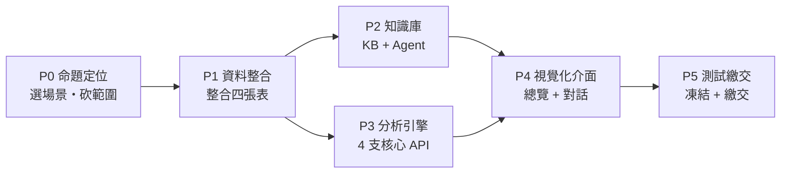

# 工作階段拆解指南

:::banner{type="info"}
**AWS Summit Taipei 2026 AI Hackathon — 百工百業瘋 AI**
把「歷史數據自動整合 → 國際標準公式導入 → 效能分析 → Dashboard 決策支援」這條命題，拆成六個可實際執行的開發階段。每個階段都有明確的目標、任務清單、產出物與對應評分權重，讓 2–5 人的隊伍在 7/14–7/16 的開發窗口內，知道「現在該做什麼、做到什麼程度算完成」。
:::

---

## 資料盤點 — 目前已知的資料資產

:::alert{type="info"}
主辦單位標示「數據與資源文件：將另行提供之」，但你已經拿到的 Mock Data 與兩份範例報告，足以先把 Pipeline 打通。以下是目前確認可用的資料，正式數據到手後，直接替換即可，架構不需要重寫。
:::

:::tabs
::tab[📋 Noon\_Report]
**5,483 列　|　2020–2024　|　YM WELLNESS / YM VICTORY / YM COSMOS**

| 欄位群 | 關鍵欄位 |
|---|---|
| 速度效能 | `Speed_Loss_kt` / `Speed_Loss_pct`、`Speed_Corrected_ISO15016_kt` |
| 動力 | `ME_Power_kW`、`ME_SFOC_g_kWh`、`ME_FOC_t_day`、`AE_FOC_t_day` |
| 海況 | `Wind_BFT`、`Wave_Height_m`、`Current_kt`、`Slt_dept` |
| 船況 | `Days_Since_Hull_Clean`、`Days_Since_Prop_Polish` |
| 旗標 | `Anomaly_Flag`（NORMAL / FOC_HIGH / SPEED_LOW / WEATHER_SEVERE） |

::tab[🔍 UWI\_Inspections]
**38 列　|　每 5–6 個月一次水下檢查**

| 欄位群 | 關鍵欄位 |
|---|---|
| 污損評分 | `Hull_Biofouling_Score`、`Biofouling_Rating`、`Paint_Breakdown_pct` |
| 維修紀錄 | `Hull_Cleaning_Performed`、`Propeller_Polishing` |
| 效益估算 | `Est_Speed_Recovery_kt`、`Est_FOC_Saving_pct` |
| ISO 指標 | `ISO19030_PE_Index`、`ISO19030_Threshold_Flag`（OK / EXCEEDED） |

::tab[⚓ Vessel\_Reference]
**3 列　|　船舶靜態基準參數（建議當 Dimension Table）**

| 欄位群 | 關鍵欄位 |
|---|---|
| 效能基準 | `Design_Speed_kt`、`MCO_kW`、`NCO_kW`、`Design_SFOC_g_kWh` |
| 維修排程 | `Hull_Paint_Type`、`Last_Drydock`、`Next_Drydock_Due` |
| 用途 | 做效能「基準線」——所有 Speed Loss 都要對這張表算 |

::tab[📊 KPI\_Monthly]
**182 列　|　已預先算好的月度 Rollup（可先當 Ground Truth）**

| 欄位群 | 關鍵欄位 |
|---|---|
| 效能指標 | `ISO19030_PI`、`Maintenance_Urgency`（HIGH / MED / LOW） |
| 用途 | 反向驗證自己算的 Speed Loss / FOC 對不對 |

::tab[📄 範例 PDF]

**Noon Report 範例（YM WELLNESS · 2024-11-15）**
- 格式非結構化、欄位命名不一致（解析器要做 fuzzy match）
- 船長備註是自由文字 → 正是 LLM 抽取結構化資訊的切入點

**UWI Report 範例（YM WELLNESS · 2024-10-15 · Singapore）**
- 含表格 + 圖片（船體照片、螺旋槳照片）
- 驗船師結論是自由文字建議 → 知識庫 / Agent 的絕佳素材
:::

---

## P0 · 命題定位與 MVP 範疇收斂

:::banner{type="warning"}
**Day 1　09:00–13:00**　開幕 + 企業說明會期間
:::

命題給了 4 大類、11 個子挑戰——三天內全包做不完。這個階段唯一的任務：**選一個具體場景，砍掉其他，讓評審一聽就懂你解決誰的什麼問題。**

:::alert{type="danger"}
這一步最容易被跳過，卻決定另外五個階段做不做得完。進入下一階段前，先把範疇確認清楚，之後不再更動。
:::

:::steps
1. 聽企業說明會時，specifically 記錄「節能小組」實際痛點與現行 SOP（人工查表 vs 自動化的落差在哪）

2. 決定主要使用者：船隊管理者（要總覽）／節能小組工程師（要診斷 + 建議）——建議先做後者，畫面更聚焦

3. 從 4 個子命題（效能趨勢／維修效益／異常預警／最佳維修時機）選 2 個做深，其餘 1 個做淺、1 個口頭提及即可

4. 畫出「一句話電梯簡報」：對象是誰、原本怎麼做、AI 後怎麼做、省了什麼

5. 把最終決定寫成一頁 One-Pager，全隊當天內確認，之後不再改範疇
:::

**產出物：**
- 範疇 One-Pager（人物誌 + 場景 + 2 個主打功能）
- 暫定隊伍分工表

::badge[主題切合度 30%]{type="warning"} ::badge[創意度 10%]{type="info"}

---

## P1 · 資料整合與標準化

:::banner{type="warning"}
**Day 1 午後 – Day 2 上午**
:::

對應命題「歷史數據自動整合」+ 「國際標準公式自動導入」。目標不是重新發明 ISO 公式，而是把 4 張表接成一個乾淨、可查詢的效能資料庫，並能證明你懂公式在算什麼。

:::steps
1. 把 `Noon_Report` / `UWI_Inspections` / `Vessel_Reference` / `KPI_Monthly` 轉存為 CSV／Parquet，上傳 S3（按 vessel/year 分區）

2. 清洗：`Anomaly_Flag` 空值、`SPEED_LOSS` 標記列另存一張「異常事件表」

3. 建立 `Vessel_Reference` 為 Dimension Table，`Noon_Report` 依 `Vessel` 做 Join，算出 `Speed_Loss` 相對 `Design_Speed` 的正確基準

4. 把 `UWI_Inspections` 依 `Vessel + Date` 對齊到最近一次 `Noon_Report`，建立「維修事件 ↔ 效能區段」的前後對照 View

5. 用 Glue Crawler 或直接建 Athena 外部表；資料量小（5,483 列）也可以先用 DuckDB/Lambda 內嵌查詢，求快

6. 寫一份「公式對照表」文件：Speed Loss、ISO 15016 修正速度、ISO 19030 PI 各自怎麼算、對應哪個欄位——這份文件同時餵給 P2 的知識庫

7. PDF 範例（Noon Report / UWI）用 Bedrock 做結構化抽取的 Prompt 先寫好，示範「未來正式數據若仍是 PDF，也能自動吃進來」
:::

**產出物：**
- S3 上結構化資料（`fact_noon_report`、`dim_vessel`、`fact_uwi`、`kpi_monthly`）
- 可查詢的 Athena / DuckDB Schema
- 公式對照表（給評審看「技術可行性」也給 Agent 當知識）
- PDF → 結構化抽取的 Prompt / Lambda 範例

::badge[技術可行性 15%]{type="info"} ::badge[完整度 25%]{type="success"}

---

## P2 · 知識庫與 Agent 建置

:::banner{type="warning"}
**Day 2 上午 – 下午**
:::

對應命題「知識傳承與標準化」+ 「解決無人可接手的技術斷層」。這不只是「建個知識庫文件」，重點是讓 Agent 同時能**讀懂非結構化知識（法規、驗船師建議）**又能**查詢結構化數據（真實的速度、油耗）**——兩者缺一，回答都會很空泛。

:::alert{type="warning"}
純 RAG 對「YM WELLNESS 上個月速度損失趨勢」這類問題答不出具體數字——一定要幫 Agent 掛上能查 P1 資料庫的 Tool（Function-calling），知識庫負責解釋「為什麼」，Tool 負責回答「數字是多少」。
:::

:::steps
1. Knowledge Base（Bedrock KB + OpenSearch Serverless）放：ISO 15016/19030 公式說明、P1 的公式對照表、UWI 驗船師結論範例、船舶維護領域字彙

2. 額外把「歷史 UWI Notes」整理成短文檔餵進 KB——這是「知識傳承」故事的核心素材

3. 設計 Agent 的 Tool（Function-calling）四支：
   - ``get_vessel_kpi(vessel, period)``
   - ``get_speed_loss_trend(vessel)``
   - ``get_anomaly_events(vessel)``
   - ``get_uwi_history(vessel)``
   — 呼叫 P1 建好的資料庫，而不是全部塞進 KB

4. 用 Bedrock AgentCore 串起「KB 檢索」+ 「結構化工具查詢」兩條路徑，讓 Agent 依問題類型自己選

5. 寫 3–5 個驗證用問題（如「YM WELLNESS 最近速度損失趨勢？」「上次清船體後省了多少油？」）先手測，確保 Agent 不瞎掰
:::

**產出物：**
- 可用的 Bedrock Knowledge Base（含索引文件清單）
- Agent + 4 個以上 Tool 定義，可在 Console／API 測試通過
- Prompt 測試紀錄（問題／預期答案／實際答案）

::badge[技術可行性 15%]{type="info"} ::badge[創意度 10%]{type="success"}

---

## P3 · 分析引擎與 API

:::banner{type="warning"}
**Day 2 下午 – Day 3 上午**（與 P2 可部分並行）
:::

把命題點名的四個分析項目，各對應一個明確的 API。每支 API 都要能被 Agent 呼叫，也能直接餵給 Dashboard——一份邏輯，兩處使用。

:::alert{type="info"}
③④ 不必上機器學習模型——比賽只有 30 小時，規則 + 趨勢分析講得清楚，比一個訓練不穩定的模型更能拿完整度分數。
:::

**四支核心 API：**

:::expand{title="① 效能趨勢 API"}
- 輸入：`vessel` + 期間
- 回傳：`Speed_Loss` 隨時間變化、對應 `ME_Power` / `SFOC` 基準線
:::

:::expand{title="② 維修效益驗證 API"}
- 抓 `UWI_Inspections` 的 `Hull_Cleaning` / `Propeller_Polishing` 事件日期
- 比對前後 14–30 天 `Speed_Loss`、`Total_FOC` 平均值，算出實際改善幅度
- 對照 UWI 表裡的 `Est_Speed_Recovery_kt` / `Est_FOC_Saving_pct`，驗證估算準不準
:::

:::expand{title="③ 異常預警與成因分類 API"}
- 用 `Anomaly_Flag` 為起點，規則式先分：
  - 油耗 ↑ 且風浪正常 → 疑似生物附著
  - 油耗 ↑ 且風浪大 → 海況因素
- 有餘力再用 LLM 對船長備註做語意分類
:::

:::expand{title="④ 最佳維修時機建議 API"}
- 用 `Days_Since_Hull_Clean` 與 `Speed_Loss` 的關係抓「邊際惡化速率」
- 結合 `Next_Drydock_Due`
- 輸出「建議 X 天內安排水下清潔／可延到大修」的判斷
- 可先用簡單門檻 + 線性趨勢，不必上重模型
:::

:::expand{title="🎯 策略建議：如果只能挑兩個做深，選 ② + ④"}

:::alert{type="success"}
**結論先說**：② 維修效益驗證 ＋ ④ 最佳維修時機建議 是這四支 API 裡 CP 值最高的組合——資料完全齊備、技術風險低、評分命中率高，而且兩支共用同一套邏輯，等於做完 ② 就完成了 ④ 大半。
:::

**四支 API 決策矩陣**

| API | Demo 吸睛度 | 資料可行性 | 技術風險 | 評分命中 |
|---|---|---|---|---|
| ① 效能趨勢 | 🟡 低（評審看很多次了） | 🟢 高 | 🟢 低 | 偏「完整度」，非亮點 |
| ② 維修效益驗證 | 🟢 **高**（前後對比一眼看懂） | 🟢 **高**（UWI 已有 Est 欄位可對照） | 🟢 低 | **主題切合度＋商業應用性** |
| ③ 異常預警分類 | 🟡 中 | 🟡 中（成因分類做到不牽強很花時間） | 🔴 **高**（現場被追問分類依據容易破功） | 創意度，但風險大於收益 |
| ④ 最佳維修時機 | 🟢 **高**（「AI 直接告訴你什麼時候做」） | 🟡 中（門檻式規則即可） | 🟡 中（簡單版可控） | **命題原文明說「強化決策效能」** |

**為什麼是 ② + ④，不是別的組合：**

- **① 不需要當賣點**——它是 ②③④ 的共同底層（算 Speed Loss、算基準線）。做成內部共用邏輯就好，不必包裝成一支「亮點功能」去講。

- **② 是幾乎白送的高分項**——資料完全齊備：`Noon_Report` 的逐日效能數據 ＋ `UWI_Inspections` 的維修事件日期與估計效益，邏輯就是「事件前後 X 天平均值相減」，不需要 ML。卻是評審最容易被說服的畫面：一張圖、一條垂直線標維修日、左右兩段數字一比，故事秒懂。

- **④ 是把 ①② 往前推一步**，把「儀表板」升級成「決策支援」——用「`Days_Since_Hull_Clean` vs `Speed_Loss` 惡化速率」＋「② 算出來的清潔效益」做簡單門檻判斷（預估惡化速率 × 距下次進塢天數 > 某個油耗成本閾值 → 建議提前安排）。不需要複雜模型，但命題說明裡明確寫「強化節能小組的決策效能」，這支就是直接對應的答案。更重要的是：**② 做完，④ 已完成大半，邊際成本極低。**

- **③ 建議只做輕量版**——用現成 `Anomaly_Flag` 抓出異常日，再讓 LLM 針對當天海況/船速生成「一句話推測成因」。不要做成看起來像嚴謹分類器的東西，因為統問統答評審很可能追問分類依據，經不起追問反而傷「技術可行性」分數。

**② + ④ 能講出一個完整故事：**

> 「我們驗證了維修真的有效（②），所以能用同一套邏輯預測下次該什麼時候做（④）」

這剛好同時打到權重最高的 **主題切合度 30%** 和 **商業應用性 20%**，而且全部是規則式計算，30 小時內做得完，也經得起現場提問。

:::

**產出物：**
- 4 支 REST API（API Gateway + Lambda）+ 回傳範例 JSON
- 「決策支援報告生成」API：把 ①～④ 結果丟給 Claude 產出一段自然語言摘要 + 建議（對應命題的自動生成報告）

::badge[技術可行性 15%]{type="info"} ::badge[完整度 25%]{type="success"} ::badge[商業應用性 20%]{type="warning"}

---

## P4 · Web Dashboard + Chatbot

:::banner{type="warning"}
**Day 2 晚上啟動 – Day 3 上午收尾**
:::

這是評審實際會看到、會操作的畫面，「完整度」25% 幾乎全押在這裡。原則：先求「船隊總覽 → 單船深入 → 對話追問」三層都能跑，再加裝飾。

:::steps
1. **船隊總覽頁**：3 艘船的 KPI 卡片（Speed Loss、FOC、Maintenance_Urgency 燈號），一眼看出哪艘船最該優先處理

2. **單船深入頁**（示範用 YM WELLNESS）：Speed Loss 趨勢圖 + 在圖上標出 UWI 維修事件點，直接視覺化證明「維修效益驗證」

3. **異常預警清單**：把 ③ 的分類結果列成表，可篩選成因類別

4. **Chatbot 面板**：接 P2 的 Agent，讓評審現場問「這艘船該不該安排清船體」，直接示範知識庫 + 數據雙引擎

5. **「產出決策支援報告」按鈕**：呼叫 P3 的報告生成 API，畫面上直接生成一段摘要文字（可加「下載 PDF」但非必須）

6. **技術選型求快**：Amplify Hosting + React（Recharts 畫趨勢圖），或 App Runner 跑一個 Streamlit——只要在 AWS 環境裡，兩種都合規
:::

:::alert{type="success"}
**最容易讓評審有共鳴的畫面**：「維修前後效能對比」圖——Speed Loss 趨勢線上清楚標出維修事件點，視覺上一眼就能看到清完船底後速度回升。請務必在 Demo 中放這張圖。
:::

**產出物：**
- 可公開存取的 Dashboard 網址（Live Demo 連結要交這個）
- Chatbot 嵌入同一頁面，非另開分頁
- 至少 1 段「維修前後效能對比」的圖

::badge[完整度 25%]{type="success"} ::badge[主題切合度 30%]{type="warning"}

---

## P5 · 整合測試、Demo 腳本與簡報繳交

:::banner{type="danger"}
**Day 3　11:30–14:30**　14:30 前必須繳交，逾時視同放棄
:::

簡章要求同時繳交「簡報 + GitHub 連結 + Live Demo 連結 + Demo 錄製影片」四項，缺一即有失格風險。這個階段不是趕功能，是把已完成的東西整理清楚、準時繳交。

:::alert{type="danger"}
**繳交物缺一即風險失格：**　提案簡報　|　GitHub 連結　|　Live Demo 連結　|　Demo 錄製影片
:::

:::steps
1. **凍結功能（Feature Freeze）**：14:30 前 90 分鐘停止加新功能，只修 bug

2. **錄製 Demo 影片（3–5 分鐘）**作為備援——現場網路或 AWS 額度出狀況時的 Plan B

3. **GitHub Repo README**：架構圖 + 如何啟動 + 資料表說明，讓技術評審快速理解「技術可行性」

4. **簡報（8 分鐘）依評分權重配置時間**：
   - 主題切合度與情境故事（3 分鐘）
   - Demo 實際操作（3 分鐘）
   - 技術架構（1.5 分鐘）
   - 商業/未來規劃（0.5 分鐘）

5. **準備 4 分鐘統問統答的「防守清單」**：資料隱私（賽後刪除數據）、AWS 服務清單、與現有記帳式庫存工具的差異化等命題原文會被追問的點

6. **16:00 抽籤前**抓緊時間走一次全隊排練（含操作 Dashboard 現場點擊）
:::

::badge[完整度 25%]{type="success"} ::badge[商業應用性 20%]{type="warning"}

---

## 團隊分工建議

:::alert{type="info"}
依 2–5 人彈性套用，人少時 AI 工程師可兼做資料工程。
:::

| 角色 | 主責階段 | 核心任務 |
|---|---|---|
| 船長 / PM + 敘事者 | P0、P5 | 範疇拍板、與命題企業/評審溝通語言、簡報敘事與統問統答準備 |
| 資料工程師 | P1 | 4 張表清洗整合、S3/Athena 建置、公式對照文件 |
| AI / 後端工程師 | P2、P3 | Knowledge Base、Agent Tool、4 支分析 API、報告生成 |
| 前端工程師 | P4 | Dashboard、圖表、Chatbot 嵌入、Demo 環境部署 |
| 第 5 人（彈性） | 全程游動 | QA 測試、影片錄製、GitHub README、備援排練 |

---

## 官方時程 × 開發階段對照

| 時間 | 官方議程 | 對應階段 |
|---|---|---|
| 7/14 09:00–13:00 | 報到、開幕、命題說明、環境說明、與命題企業交流 | **P0** 定位 |
| 7/14 13:00–17:00 | 黑客松實作（16:00 抽發表順序） | **P1** 資料整合 啟動 |
| 7/14 17:00 後 | 自行離開，線上續開發 | **P1** 收尾 |
| 7/15 全日 | 自由開發（線上遠端） | **P2** 知識庫 + **P3** 分析引擎 |
| 7/16 11:10–11:30 | TICC 報到 | **P4** 收尾檢查 |
| 7/16 11:30–14:30 | 最後衝刺，14:30 前繳交 | **P5** 測試繳交（Feature Freeze + 打包） |
| 7/16 15:00–16:30 | 競賽簡報及評選（12 分鐘／組） | 成果發表 |
