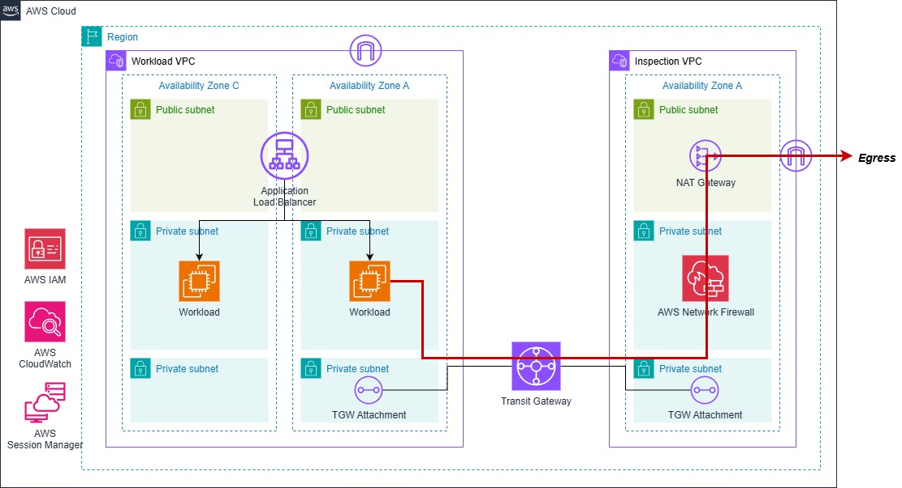

# 行前準備

:::banner{type="info"}
預計完成時間：**15 分鐘**
:::

---

## Prerequisites

:::alert{type="warning"}
開始前請確認以下工具已安裝完成：
:::

- 已安裝 [AWS CLI v2](https://docs.aws.amazon.com/cli/latest/userguide/getting-started-install.html)
- 已安裝 [Session Manager Plugin](https://docs.aws.amazon.com/systems-manager/latest/userguide/session-manager-working-with-install-plugin.html)
- 擁有 AWS 帳號並具備足夠權限（VPC、EC2、Network Firewall、Transit Gateway、IAM）

---

## 目標架構

---

## 架構說明

本次實作將建立兩個 VPC，透過 Transit Gateway 串連，並在 Inspection VPC 部署 Network Firewall 實現集中式流量檢查：

- **Workload VPC**：放置應用層（ALB + EC2），所有對外流量經由 TGW 送往 Inspection VPC
- **Inspection VPC**：部署 Network Firewall + NAT Gateway，負責流量過濾與 Egress 控制
- **Transit Gateway**：連通兩個 VPC，簡化路由管理

:::alert{type="info"}
確認所有工具安裝完成後，即可開始進行下一個章節。
:::
