# 建立虛擬網路 VPC、Subnets

:::banner{type="info"}
預計完成時間：**15 分鐘**
:::

---

## 建立 Workload-VPC 與 Subnets

:::steps
1. 前往 VPC Console，點擊 **Create VPC**

   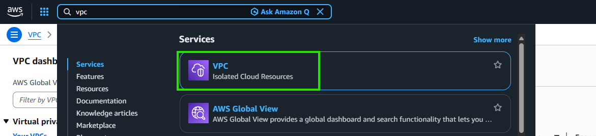

2. 選擇 **VPC and more**，填寫 Workload-VPC 相關設定

   :::alert{type="info"}
   **VPC 命名建議**：請將 VPC Name 設定為 ``workload-vpc-{{USERNAME}}`` (`10.0.0.0/16`)，方便講師與學員區分各自建立的資源。
   :::

   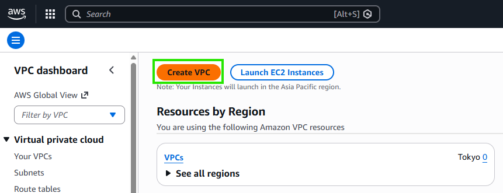

   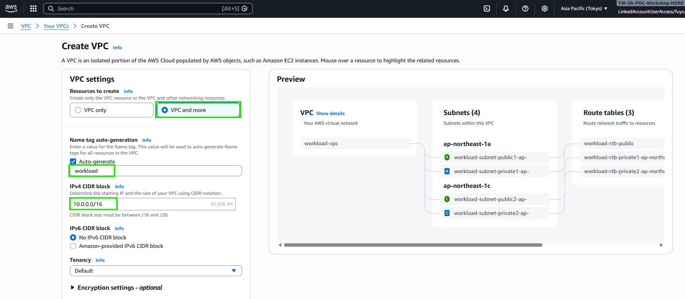

   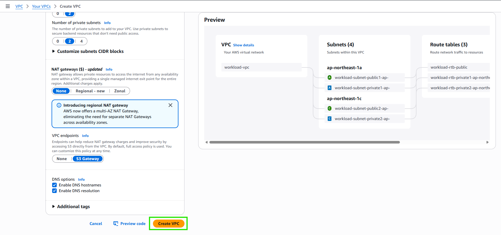

   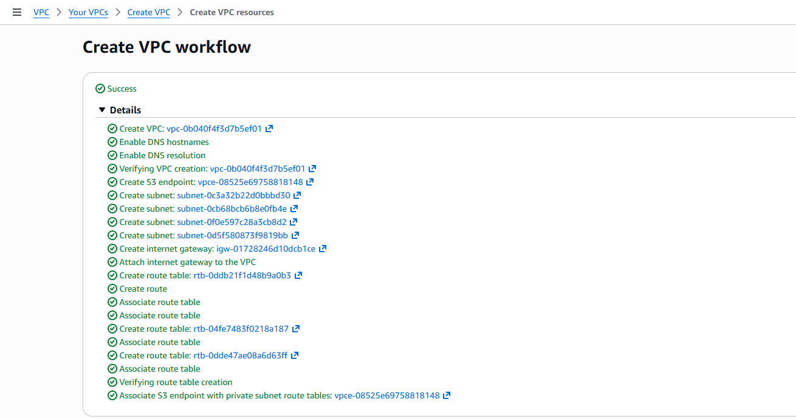

3. 確認建立完成

   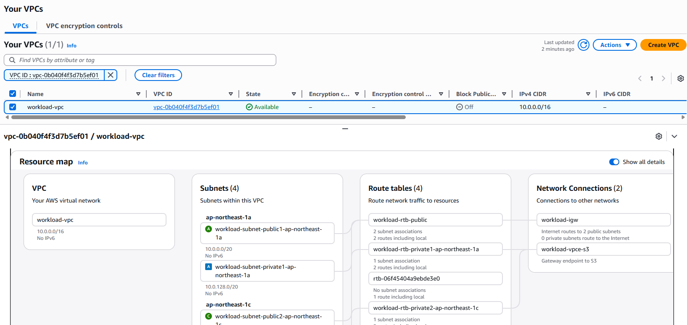
:::

---

## 於 Workload-VPC 建立 Transit Gateway 使用的 Subnet

:::alert{type="info"}
TGW Attachment 需要專用的 Subnet，建議使用 /28 的小網段。
:::

### 建立 TGW Subnet (1c)

:::steps
1. 建立 Subnet

   :::alert{type="info"}
   建議網段：`10.0.160.16/28` (``workload-tgw-subnet-private2-ap-northeast-1c-{{USERNAME}}``)
   :::

   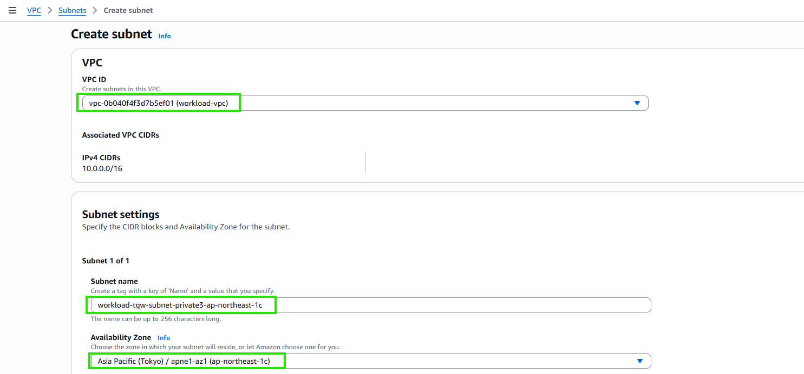

2. 建立對應的 Route Table

   :::alert{type="info"}
   建議命名：`workload-rtb-tgw-private2-ap-northeast-1c-{{USERNAME}}`
   :::

   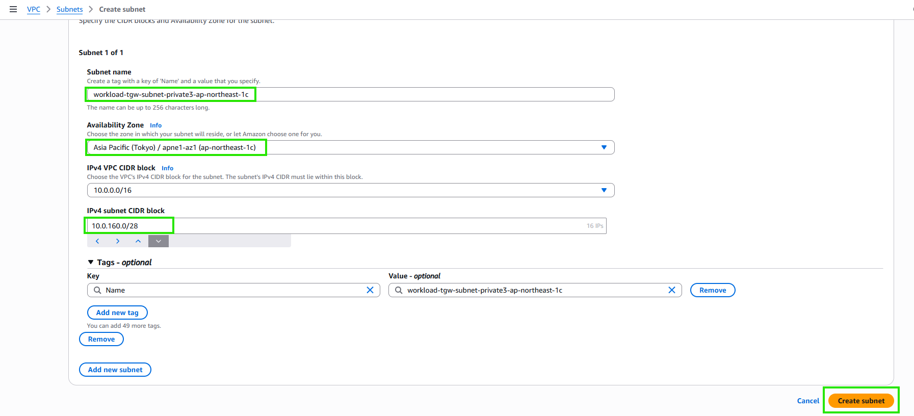

3. 編輯 Subnet 關聯性

   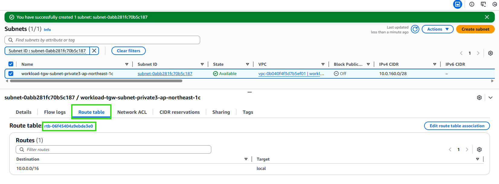

   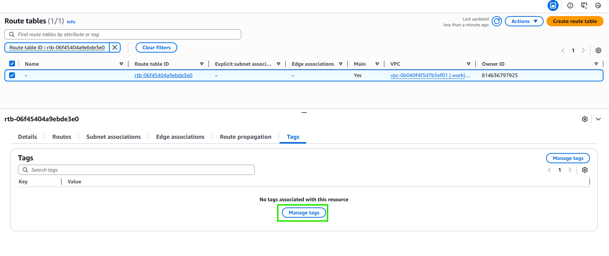

   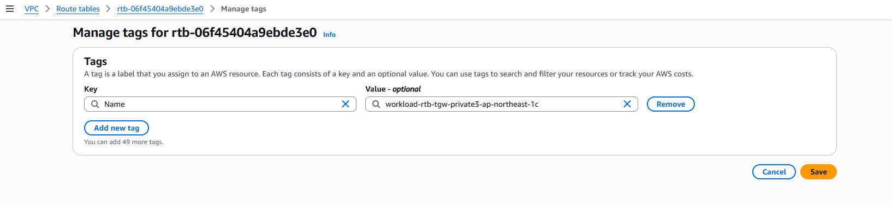

4. 檢視 Workload-VPC 的 Resource Map

   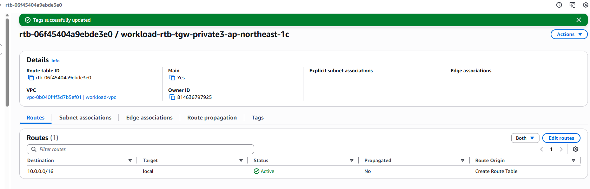
:::

### 創建另一個 TGW Subnet (1a)

:::steps
1. 前往 Subnets，點擊 **Create subnet**

   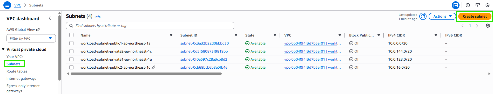

2. 選擇 Workload-VPC，填寫 TGW Subnet 資訊

   :::alert{type="info"}
   建議網段：`10.0.160.0/28` (``workload-tgw-subnet-private3-ap-northeast-1c-{{USERNAME}}``)
   :::

   

   

3. 設定 Route Table 命名 ``workload-rtb-tgw-private3-ap-northeast-1c-{{USERNAME}}``

   

   

   

4. 確認 TGW Subnets 建立完成

   
:::

---

## 建立 Inspection-VPC 與 Subnets

:::steps
1. 再次點擊 **Create VPC**，建立 Inspection-VPC

   

2. 填寫 Inspection-VPC 相關設定

   :::alert{type="info"}
   **VPC 命名建議**：請將 VPC Name 設定為 ``inspection-vpc-{{USERNAME}}`` (`192.168.0.0/20`)，方便講師與學員區分各自建立的資源。
   :::

   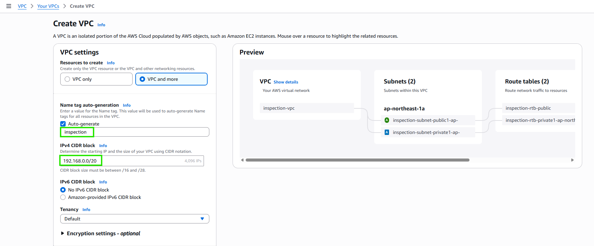

   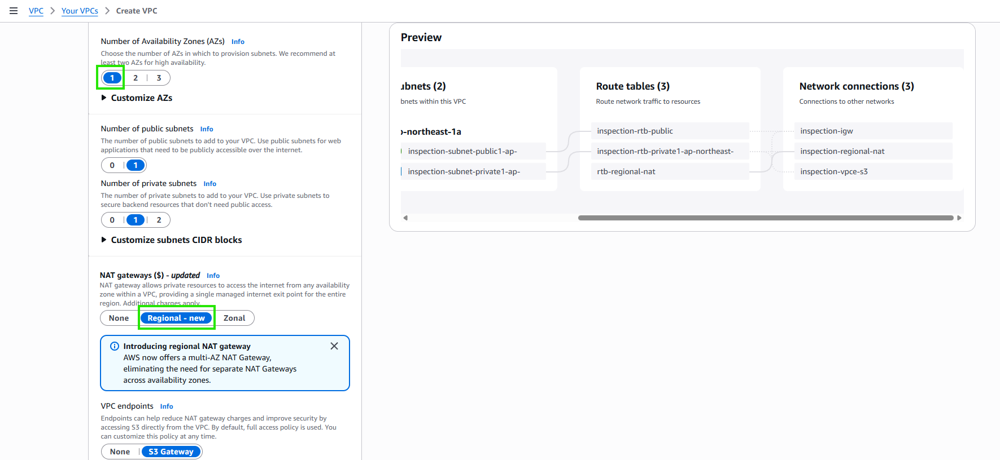

   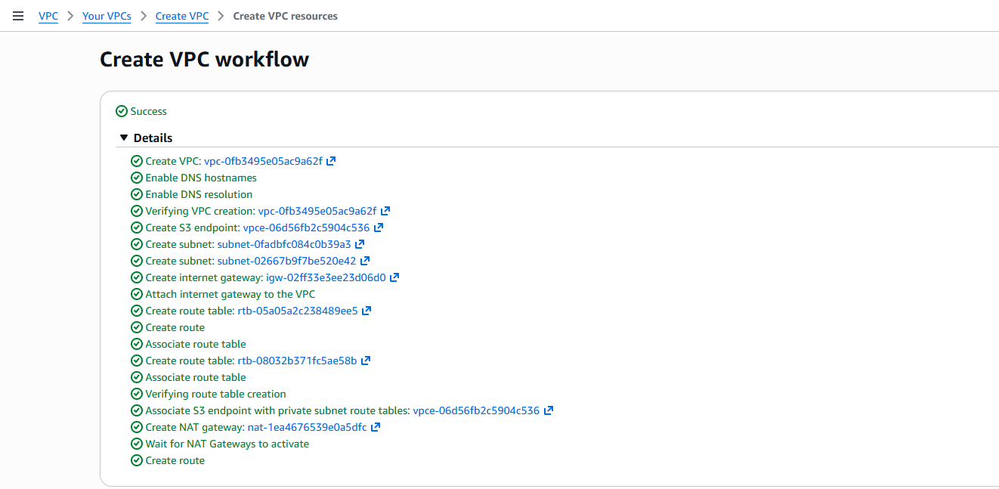

3. 確認建立完成

   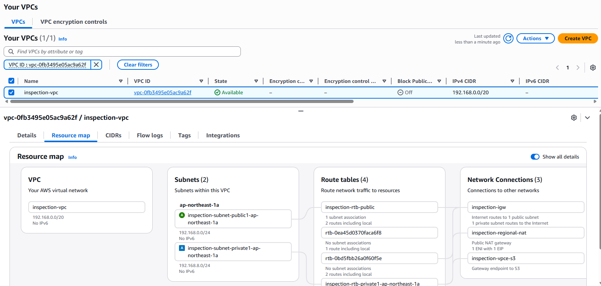
:::

---

## 於 Inspection-VPC 建立 Transit Gateway 使用的 Subnet

:::steps
1. 前往 Subnets，建立 Inspection-VPC 的 TGW Subnet

   :::alert{type="info"}
   **Subnet 命名建議**：請將 Subnet Name 設定為 ``inspection-tgw-subnet-private2-ap-northeast-1a-{{USERNAME}}`` (`192.168.15.0/28`)，方便講師與學員區分各自建立的資源。
   :::

   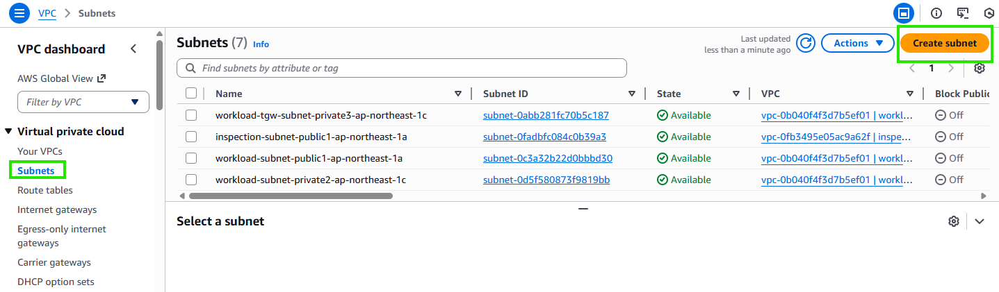

   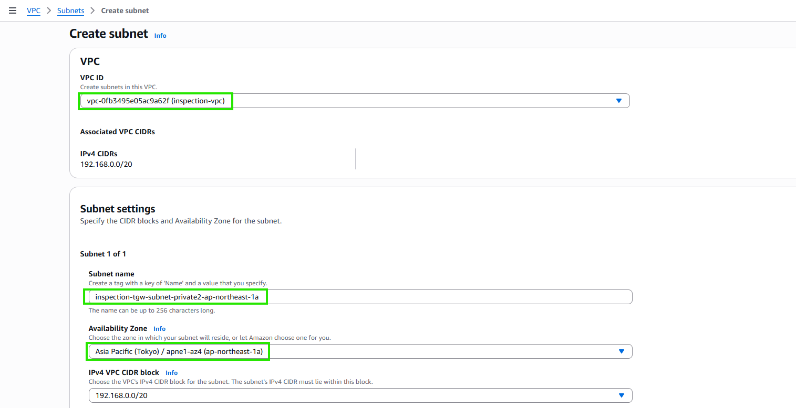

   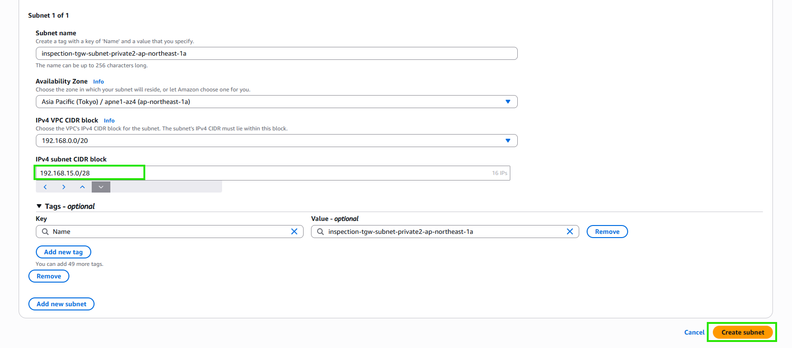

2. 設定 Route Table 命名 ``inspection-tgw-rtb-private2-ap-northeast-1a-{{USERNAME}}``

   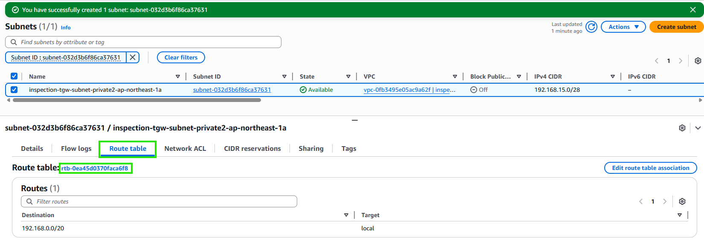

   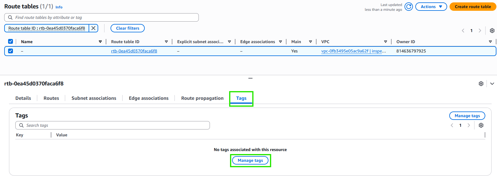

   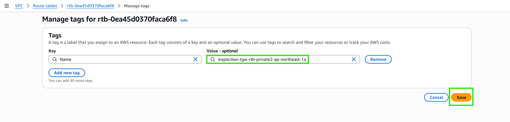

3. 確認所有 TGW Subnets 建立完成

   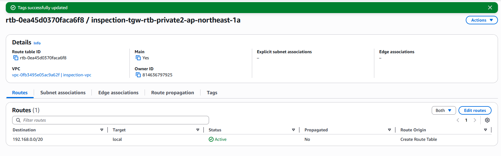

   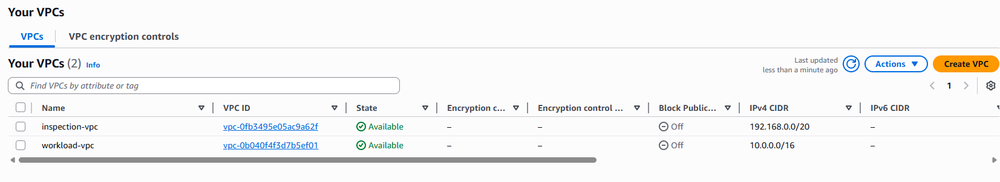
:::

:::alert{type="success"}
兩個 VPC（Workload-VPC 與 Inspection-VPC）及其所需的 Subnets 已全部建立完成。
:::
