# 變更 Inspection VPC 的子網路路由，測試防火牆規則是否生效

:::banner{type="info"}
預計完成時間：**15 ~ 20 分鐘**
:::

---

## 將 TGW Subnet 路由指向 Firewall Endpoint

:::steps
1. 前往 Route Tables，找到 Inspection-VPC 的 TGW Subnet Route Table

   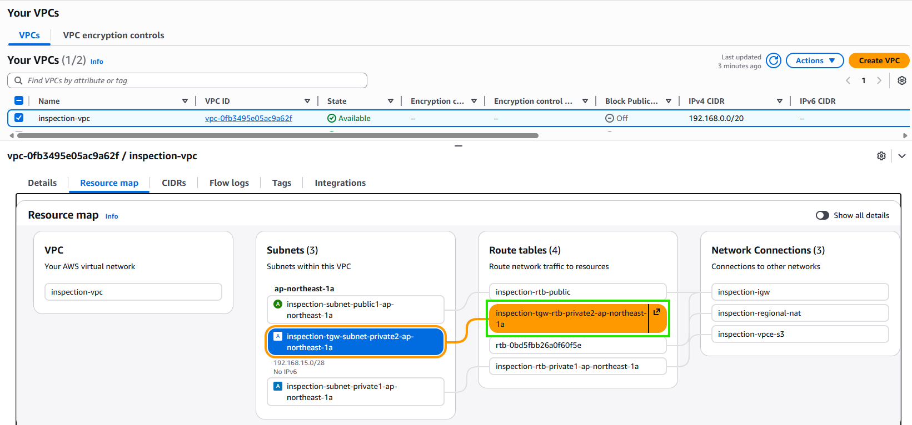

2. 編輯路由，新增指向 Firewall Endpoint 的路由

   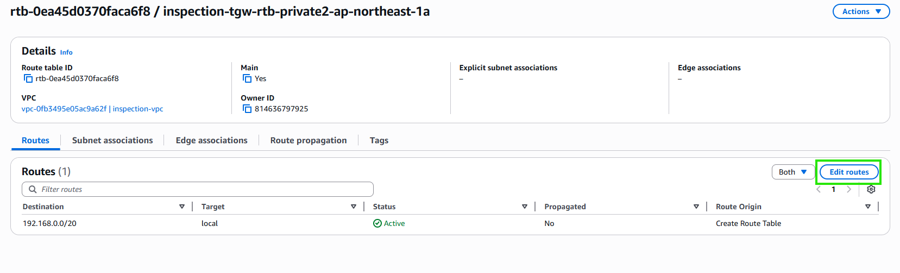

   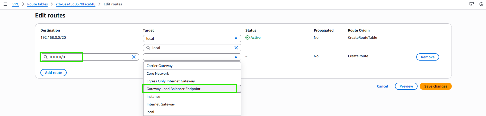

   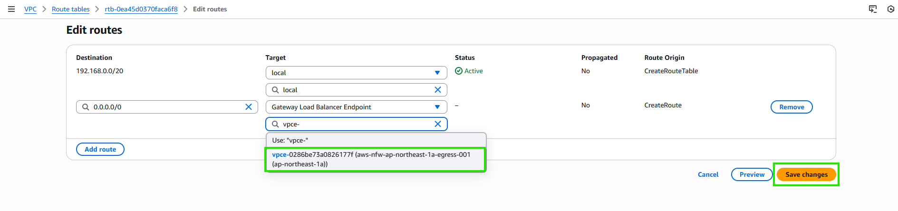

3. 儲存路由

   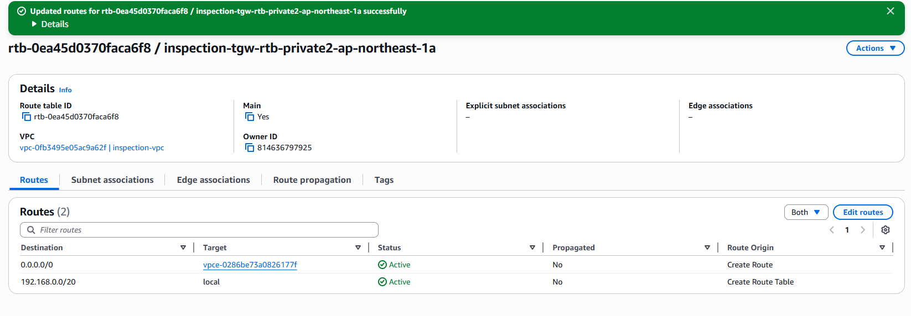
:::

---

## 確認 Firewall 的子網路指向 NAT Gateway

:::steps
1. 檢視 Firewall Subnet 的 Route Table

   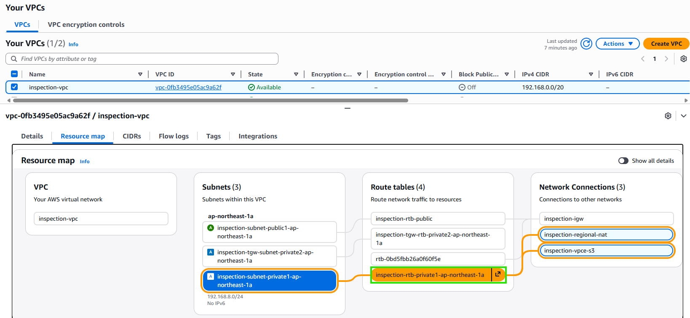

2. 確認已有 `0.0.0.0/0` 指向 NAT Gateway 的路由

   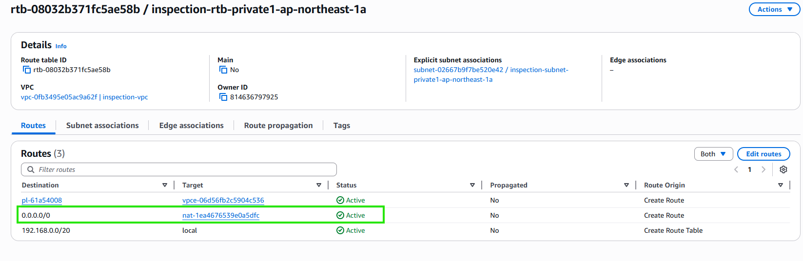
:::

---

## 將 NAT Gateway 的子網路路由指向 Firewall Endpoint（回程路由）

:::steps
1. 找到 Public Subnet（NAT Gateway 所在）的 Route Table

   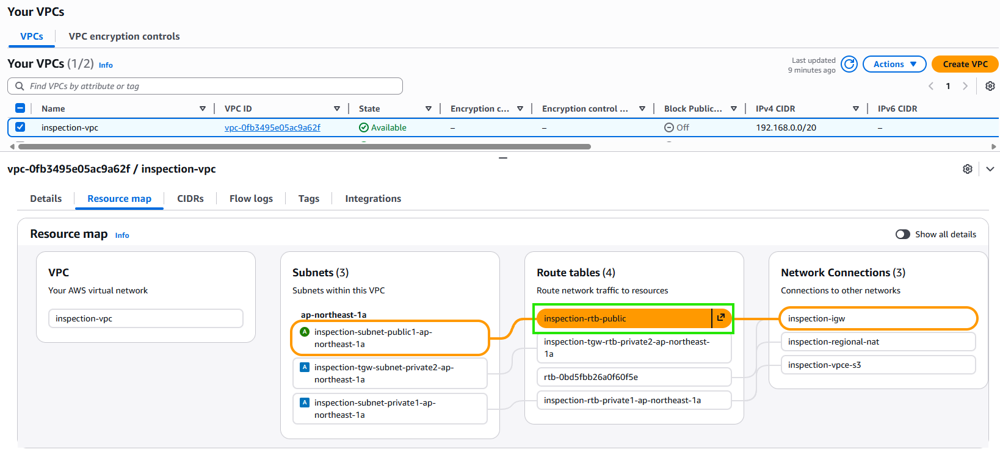

2. 新增回程路由，目的地為 TGW Subnet CIDR，指向 Firewall Endpoint

   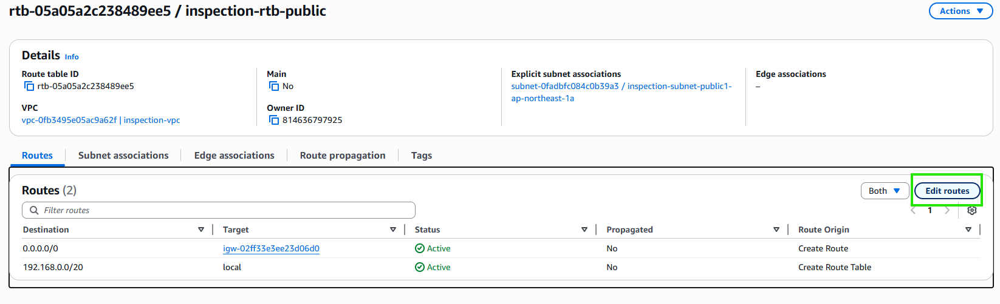

3. 查詢 TGW 的子網路 CIDR

   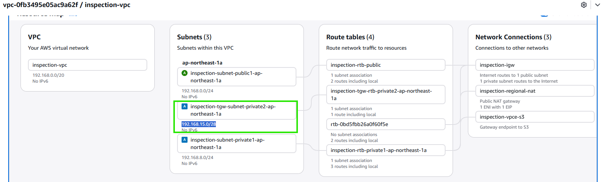

4. 填寫路由並儲存

   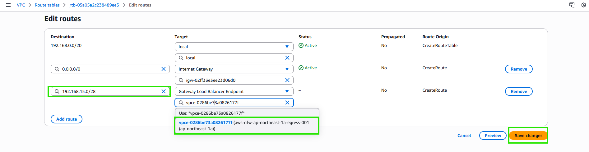

   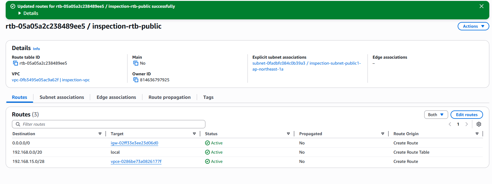
:::

---

## 啟用 AWS Systems Manager → Session Manager

:::steps
1. 前往 Systems Manager，點擊 **Enable the new experience**

   

   :::alert{type="warning"}
   啟用後需等待約 10-15 分鐘。
   :::

2. 確認 Systems Manager 已啟用

   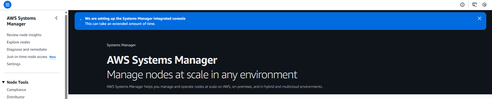

   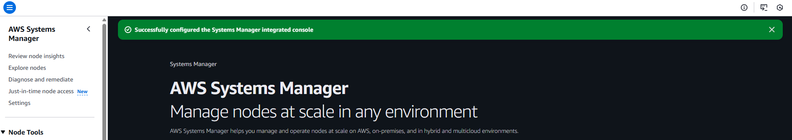

   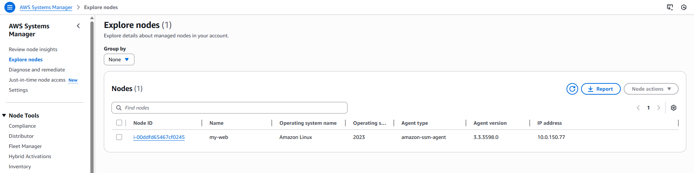

   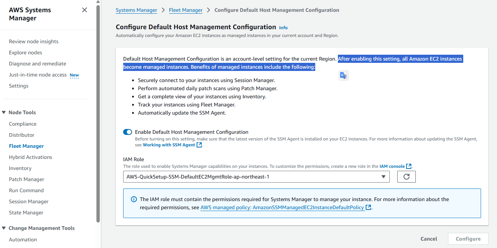
:::

---

## 於 Inspection VPC 建立測試 EC2

:::steps
1. 前往 EC2，點擊 **Launch instance**

   

2. 填寫 EC2 名稱與 AMI

   

3. 設定網路 — 選擇 Inspection-VPC 的 TGW Subnet

   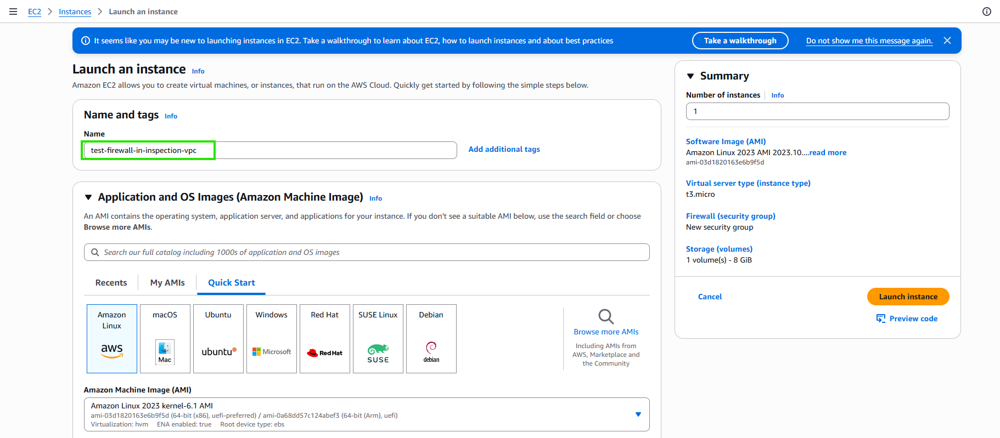

   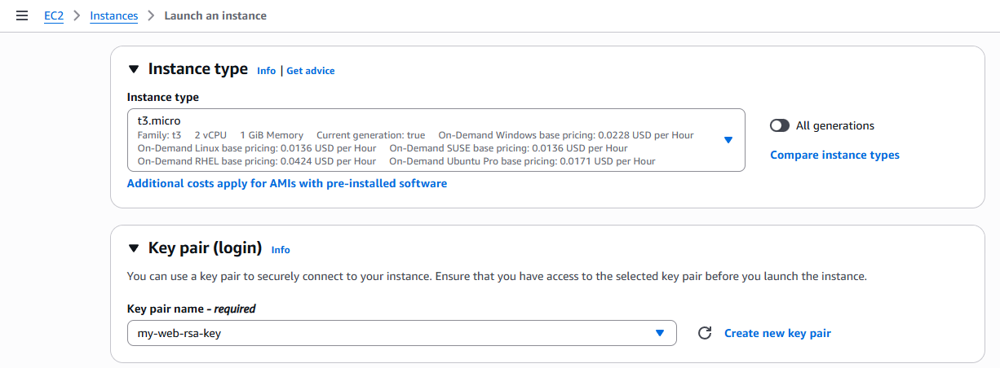

4. 設定 IAM Instance Profile（需具備 SSM 權限）

   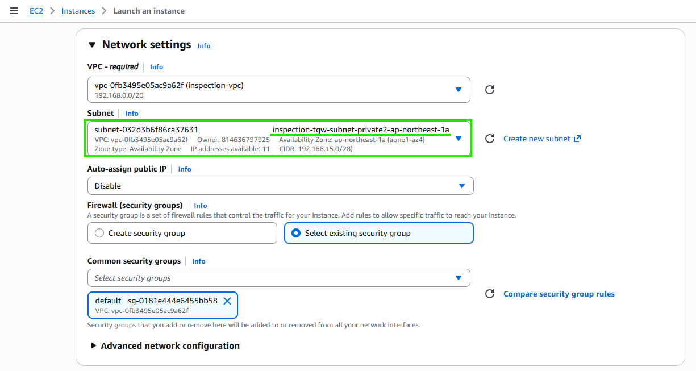

   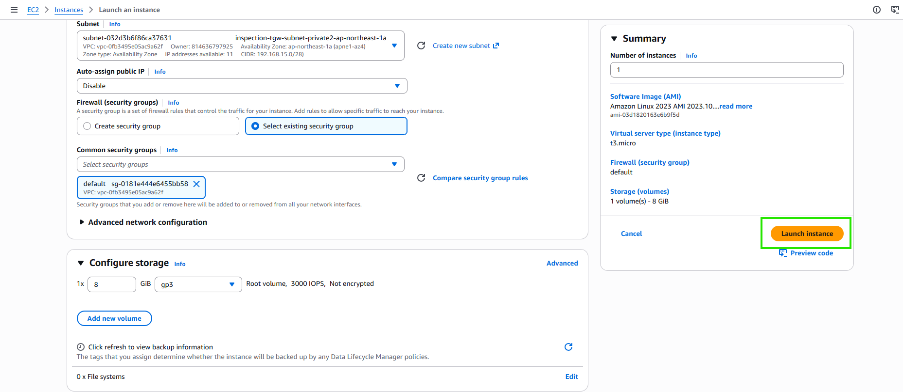

5. 確認建立完成

   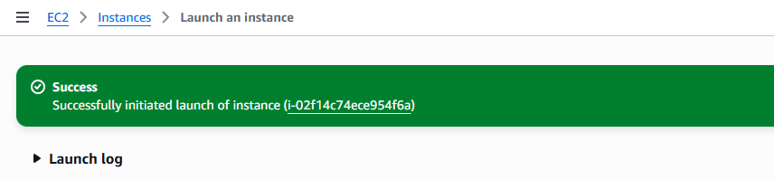
:::

---

## 使用 Session Manager 連線 EC2 進行測試

:::steps
1. 透過 Session Manager 連線至測試 EC2

   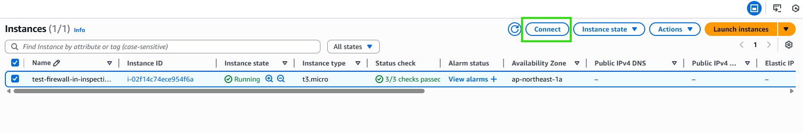

   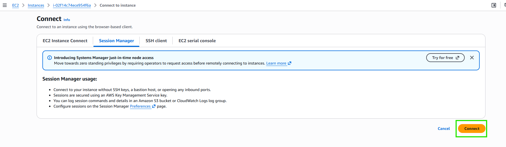

2. 測試 curl（驗證 allow-specific-domain-list 規則）

   ```bash
   curl -I https://www.google.com
   ```

   ")

3. 測試 ping（驗證 allow-ping-rg 規則）

   ```bash
   ping 8.8.8.8
   ```

   ")
:::

:::alert{type="success"}
防火牆規則驗證成功！允許的 Domain 可正常存取，ICMP ping 也正常運作。
:::
