# 在 Workload-VPC 創建 ALB 負載均衡器 + EC2 實例

:::banner{type="info"}
預計完成時間：**15 ~ 20 分鐘**
:::

---

## 建立 EC2 實例

:::steps
1. 前往 EC2，點擊 **Launch instance**

   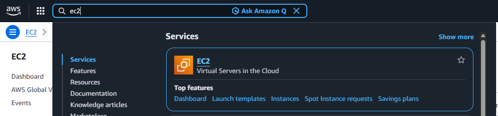

2. 填寫 EC2 名稱與 AMI

   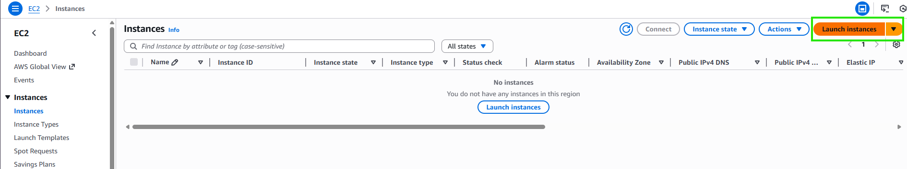

3. 設定網路 — 選擇 Workload-VPC 的 Private Subnet

   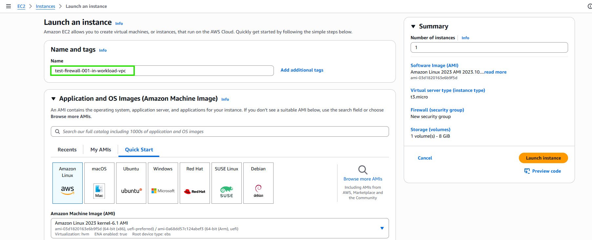

   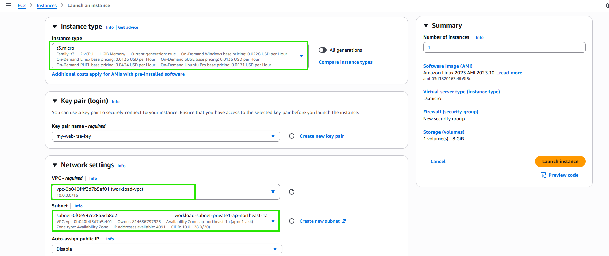

   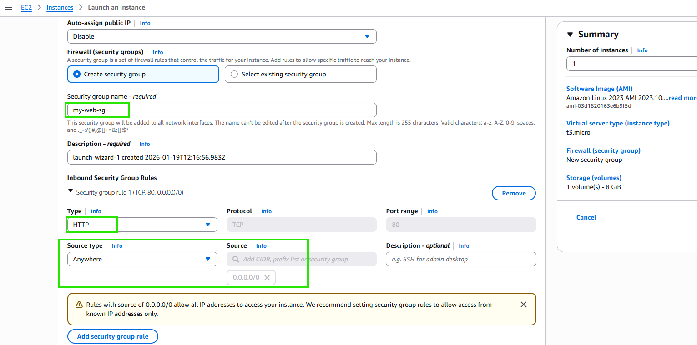

4. 設定 User Data

   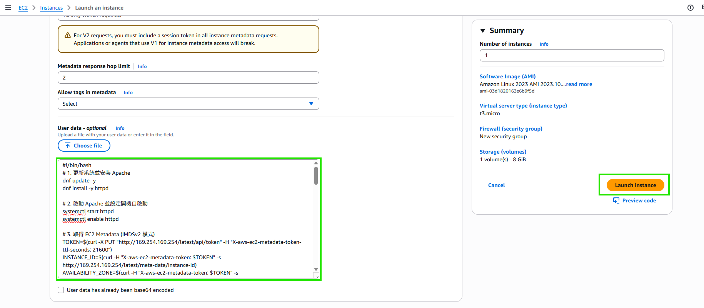

   :::expand{title="User Data 腳本"}
   ```bash
   #!/bin/bash
   # 1. 更新系統並安裝 Apache
   dnf update -y
   dnf install -y httpd

   # 2. 啟動 Apache 並設定開機自啟動
   systemctl start httpd
   systemctl enable httpd

   # 3. 取得 EC2 Metadata (IMDSv2 模式)
   TOKEN=$(curl -X PUT "http://169.254.169.254/latest/api/token" \
     -H "X-aws-ec2-metadata-token-ttl-seconds: 21600")
   INSTANCE_ID=$(curl -H "X-aws-ec2-metadata-token: $TOKEN" \
     -s http://169.254.169.254/latest/meta-data/instance-id)
   AVAILABILITY_ZONE=$(curl -H "X-aws-ec2-metadata-token: $TOKEN" \
     -s http://169.254.169.254/latest/meta-data/placement/availability-zone)
   PUBLIC_IP=$(curl -H "X-aws-ec2-metadata-token: $TOKEN" \
     -s http://169.254.169.254/latest/meta-data/public-ipv4)

   # 4. 建立 index.html
   cat <<EOF > /var/www/html/index.html
   <!DOCTYPE html>
   <html lang="zh-TW">
   <head>
       <meta charset="UTF-8">
       <title>Apache 部署成功</title>
       <script src="https://cdn.tailwindcss.com"></script>
   </head>
   <body class="bg-gray-100 min-h-screen flex items-center justify-center p-6">
       <div class="max-w-3xl w-full bg-white rounded-3xl shadow-2xl overflow-hidden">
           <div class="h-2 bg-blue-600"></div>
           <div class="p-8">
               <h1 class="text-3xl font-extrabold text-gray-900">Apache Web Server</h1>
               <p class="text-blue-600">已透過 User-data 自動化部署完成</p>
               <div class="grid grid-cols-2 gap-4 mt-6">
                   <div class="border rounded-2xl p-4">
                       <span class="text-xs text-gray-400">Instance ID</span>
                       <p class="font-mono">${INSTANCE_ID}</p>
                   </div>
                   <div class="border rounded-2xl p-4">
                       <span class="text-xs text-gray-400">AZ</span>
                       <p class="font-mono">${AVAILABILITY_ZONE}</p>
                   </div>
               </div>
           </div>
       </div>
   </body>
   </html>
   EOF
   ```
   :::

5. 確認 EC2 建立完成

   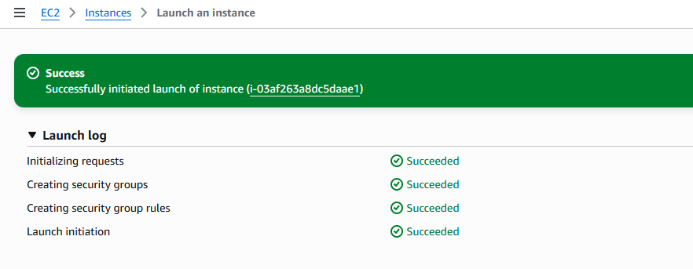
:::

---

## 建立 Target Group 目標群組

:::steps
1. 前往 EC2 → Target Groups，點擊 **Create target group**

   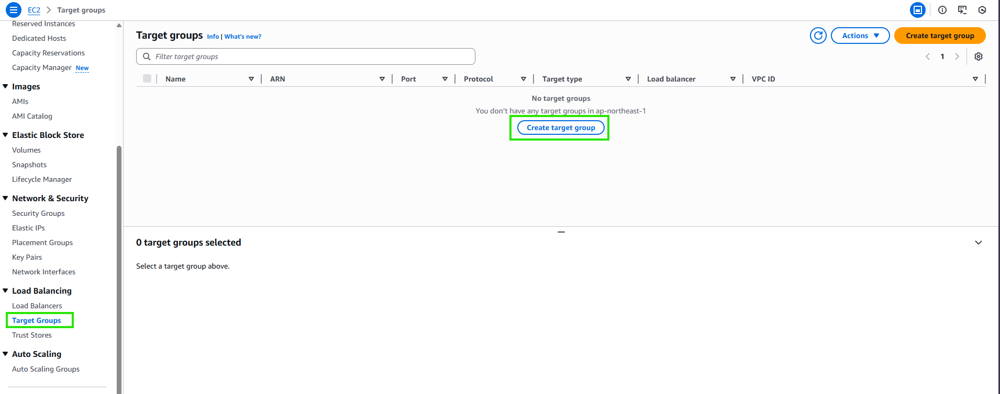

2. 選擇 Instances 類型

   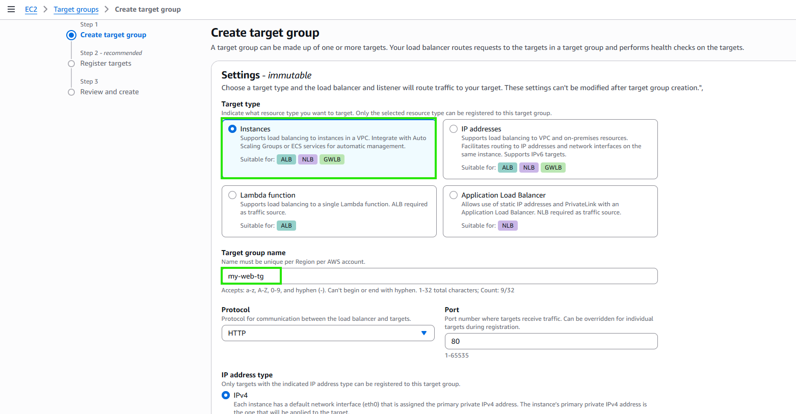

3. 填寫 Target Group 名稱，選擇 Workload-VPC

   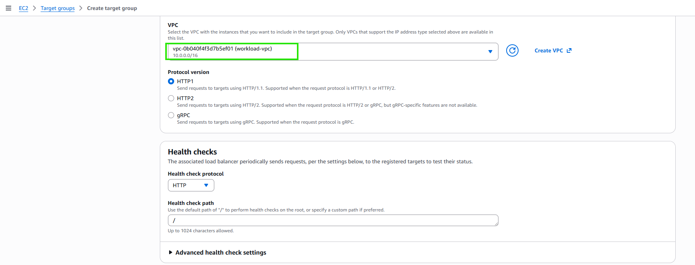

4. 註冊 EC2 實例

   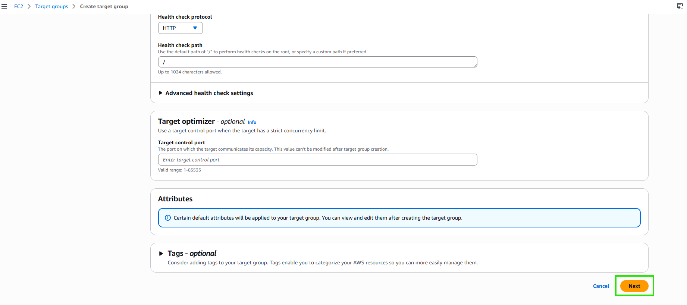

   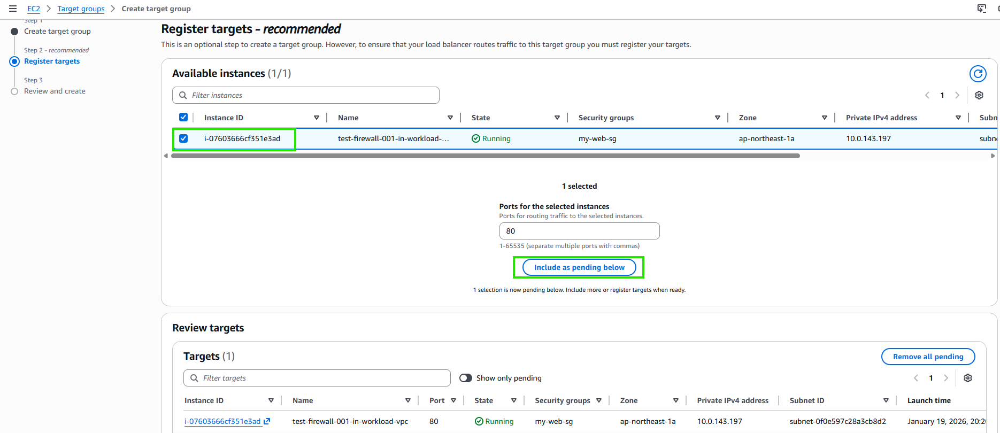

5. 確認建立完成

   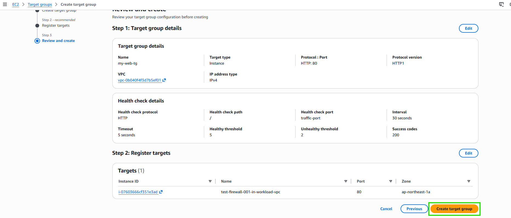
:::

---

## 建立 ALB 負載均衡器的 Security Group

:::steps
1. 前往 Security Groups，點擊 **Create security group**

   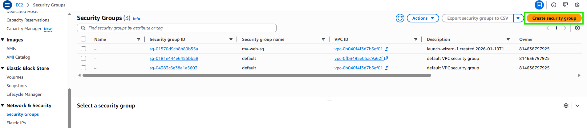

2. 填寫名稱，選擇 Workload-VPC，新增 HTTP (Port 80) Inbound Rule

   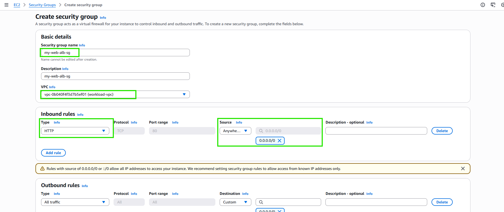

3. 確認建立完成

   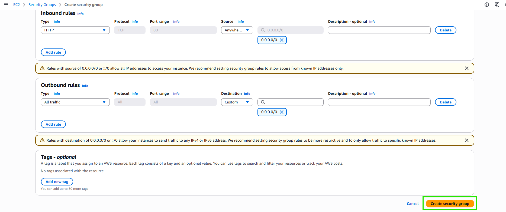
:::

---

## 建立 ALB 負載均衡器

:::steps
1. 前往 Load Balancers，點擊 **Create load balancer**

   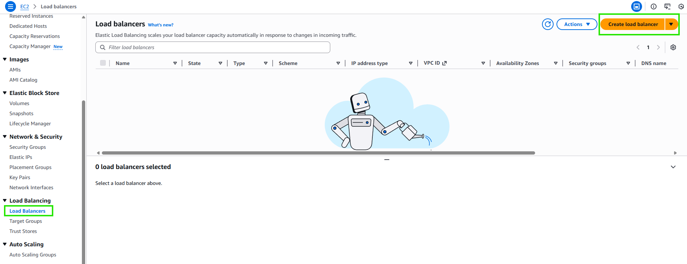

2. 選擇 Application Load Balancer

   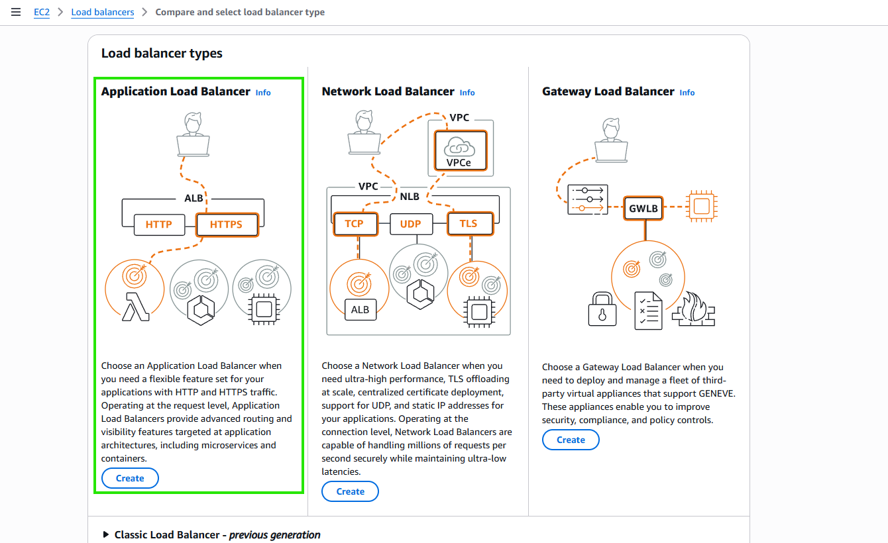

3. 填寫 ALB 名稱，選擇 Internet-facing

   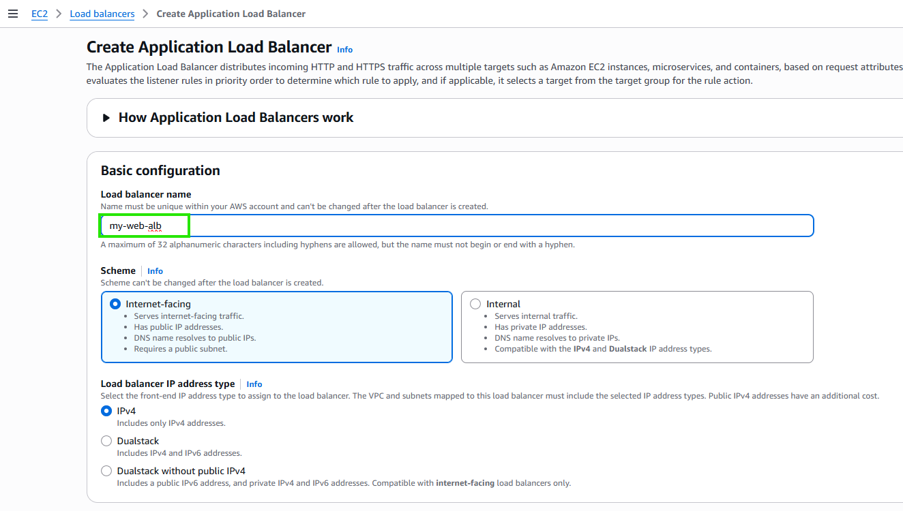

4. 選擇 Workload-VPC 的 Public Subnets

   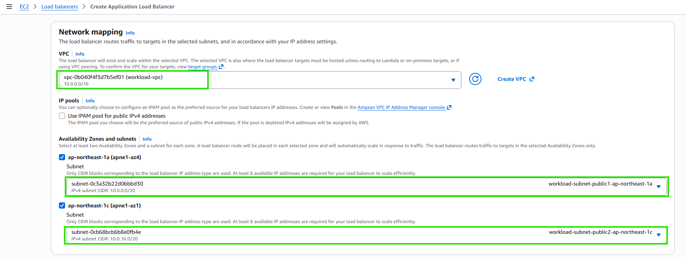

5. 選擇 Security Group（my-web-alb-sg）

   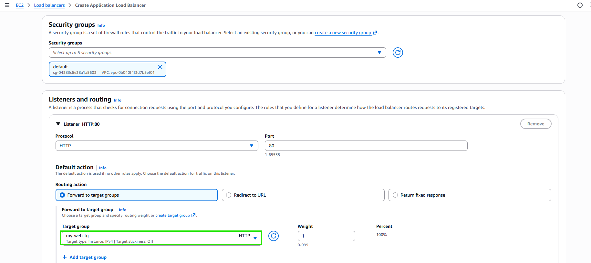

6. 設定 Listener，指向 Target Group

   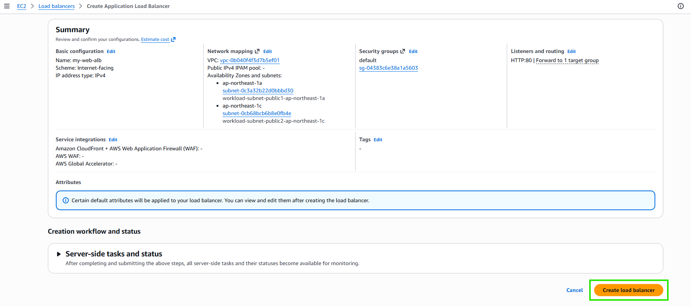

7. 等待 ALB 佈建完成（約 10-15 分鐘）

   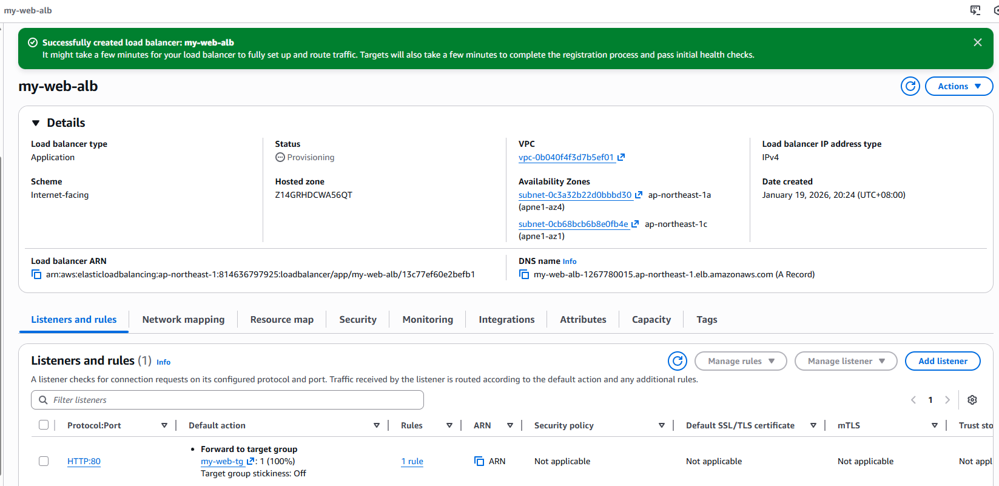

8. 確認 ALB 狀態轉為 **Active**

   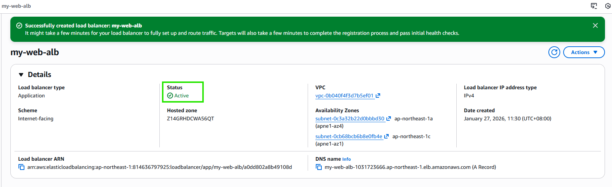

9. 確認 Target Group 的 Health Status 轉為 **Healthy**

   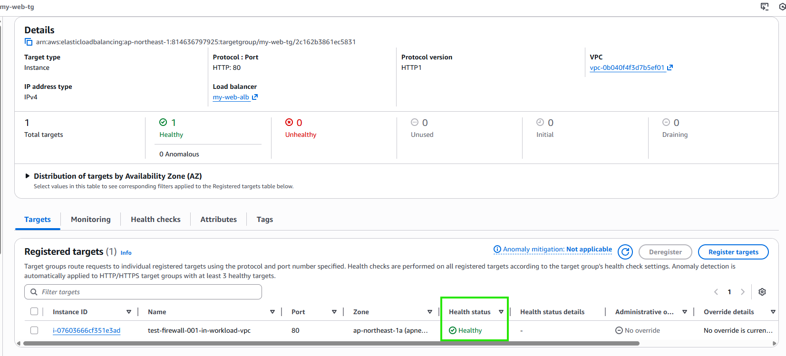
:::

---

## 測試訪問 ALB 的 DNS Name

:::steps
1. 複製 ALB 的 DNS Name

   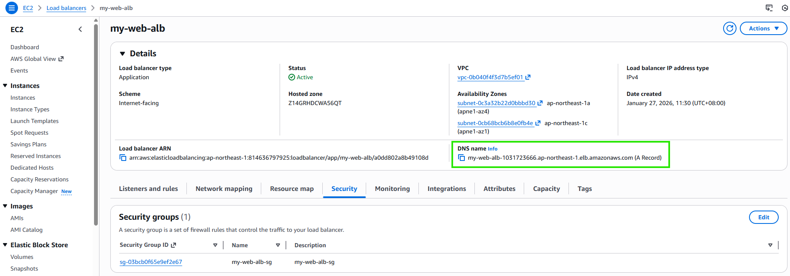

2. 在瀏覽器訪問，確認網頁正常顯示

   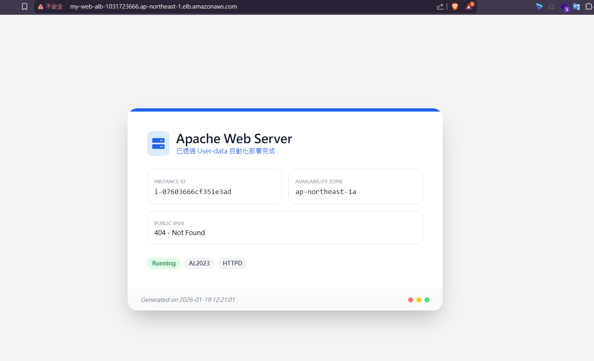
:::

:::alert{type="success"}
Workload-VPC 的 ALB + EC2 建立完成，可透過 ALB DNS Name 正常訪問 Web Server。
:::
