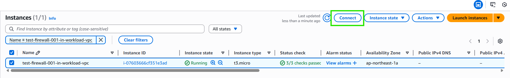
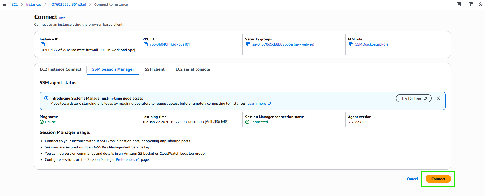

# 測試 Workload-VPC 底下的 EC2 連線

:::banner{type="info"}
預計完成時間：**10 ~ 15 分鐘**
:::

:::alert{type="info"}
最終驗證：從 Workload-VPC 的 EC2 發出的對外流量，是否正確經由 TGW → Inspection-VPC → Network Firewall → NAT Gateway 出去。
:::

---

## 連線 EC2 (test-firewall-001-in-workload-vpc)

:::steps
1. 前往 EC2 Console，選擇 Workload-VPC 內的 EC2 實例

   

2. 透過 Session Manager 連線

   

3. 測試 curl（驗證 allow-specific-domain-list 規則）

   ```bash
   curl -I https://www.google.com
   ```

   ")

   :::alert{type="success"}
   回傳 HTTP 200 表示 Domain 白名單規則生效，流量成功經由 Network Firewall 過濾後出去。
   :::

4. 測試 ping（驗證 allow-ping-rg 規則）

   ```bash
   ping 8.8.8.8
   ```

   ")

   :::alert{type="success"}
   ping 成功表示 ICMP 規則生效。
   :::
:::

---

## 驗證結果總結

| 測試項目 | 預期結果 | 說明 |
|---------|---------|------|
| `curl -I https://www.google.com` | HTTP 200 | Domain 在白名單內，允許通過 |
| `curl -I https://www.example.com` | Timeout | Domain 不在白名單內，被 Firewall 阻擋 |
| `ping 8.8.8.8` | 成功 | ICMP 規則允許 ping |

:::alert{type="success"}
恭喜完成所有實作！您已成功建立一個具備集中式 Egress 控制的進階網路安全架構，所有 Workload-VPC 的對外流量都經由 Transit Gateway 送往 Inspection-VPC 的 Network Firewall 進行過濾。
:::

---

## Cleanup

:::alert{type="danger"}
實作完成後，請記得清除以下資源以避免產生額外費用：
:::

依照以下順序刪除資源：

1. EC2 實例（所有測試用 EC2）
2. ALB + Target Group
3. VPC Endpoints（ssm、ssmmessages、ec2messages）
4. Transit Gateway Attachments
5. Transit Gateway
6. Network Firewall
7. NAT Gateway
8. Elastic IP
9. Security Groups（非 default）
10. Subnets
11. Route Tables（非 main）
12. Internet Gateway
13. VPC（Workload-VPC 與 Inspection-VPC）
14. CloudWatch Log Group
