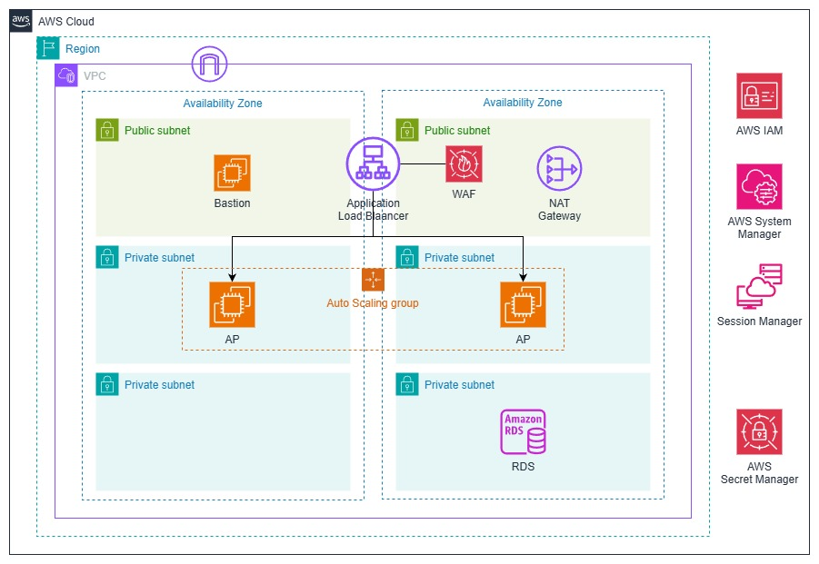
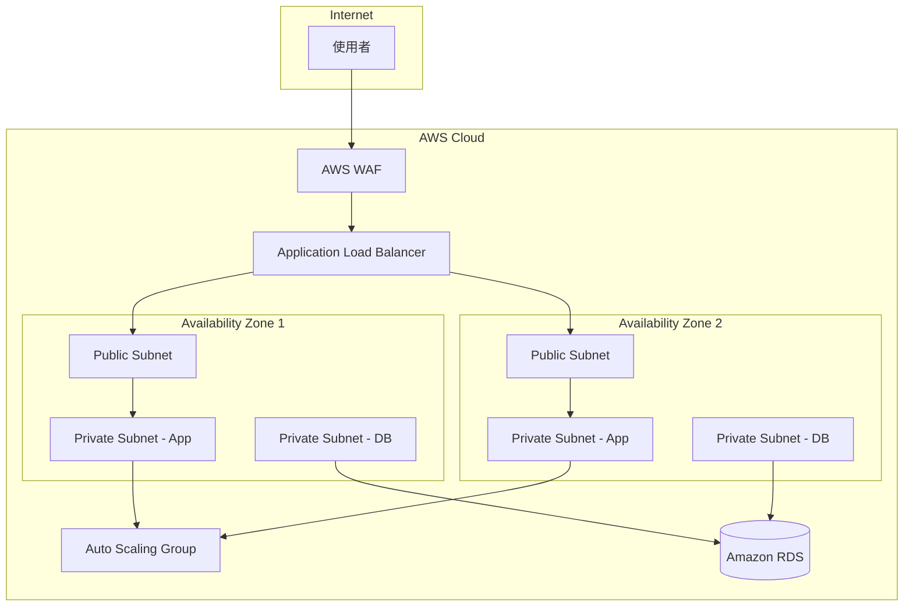

# 行前準備 - 安裝工具

:::banner{type="info"}
預計完成時間：**15 分鐘**
:::

---

## Prerequisites

:::alert{type="warning"}
開始前請確認以下工具已安裝完成：
:::

- 已安裝 [AWS CLI v2](https://docs.aws.amazon.com/cli/latest/userguide/getting-started-install.html)
- 已安裝 [Session Manager Plugin](https://docs.aws.amazon.com/systems-manager/latest/userguide/session-manager-working-with-install-plugin.html)
- 已安裝 [pgAdmin](https://www.pgadmin.org/download/)（用於連線 RDS 資料庫）
- 擁有 AWS 帳號並具備足夠權限（VPC、EC2、RDS、SSM、WAF、IAM）

---

## 目標架構

---

## 架構說明

本次實作將在單一 VPC 內橫跨兩個可用區域 (AZ) 部署以下元件：

:::alert{type="info"}
確認所有工具安裝完成後，即可開始進行下一個章節。
:::
