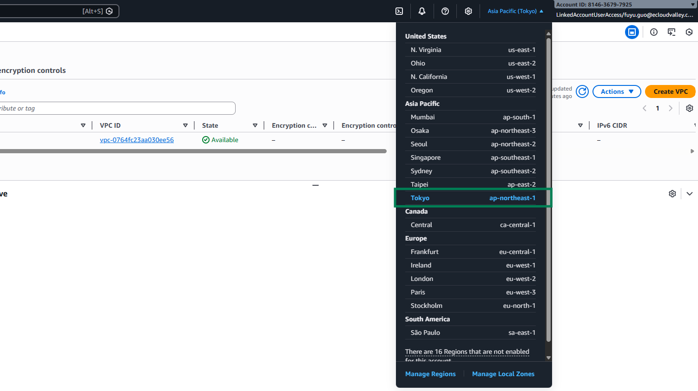
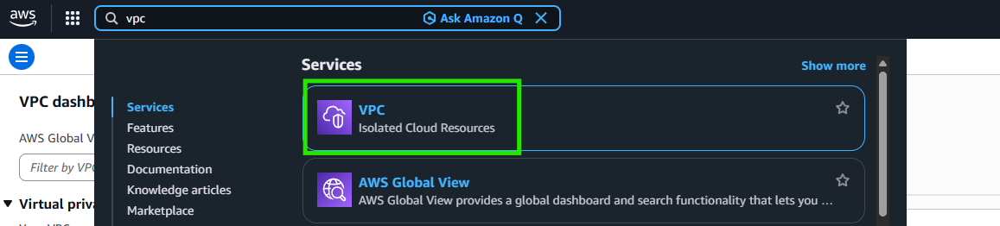
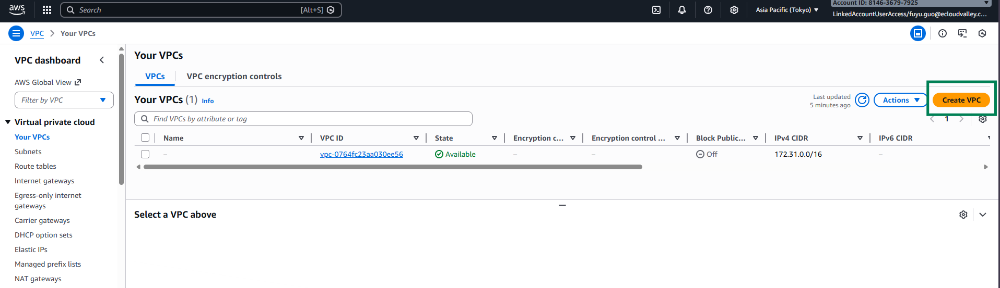
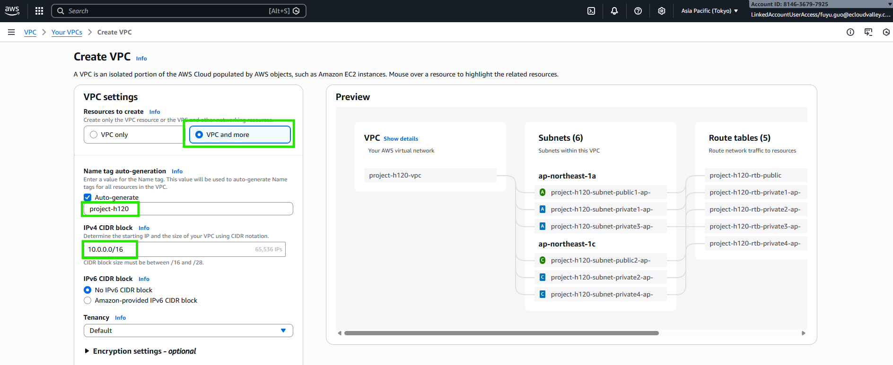
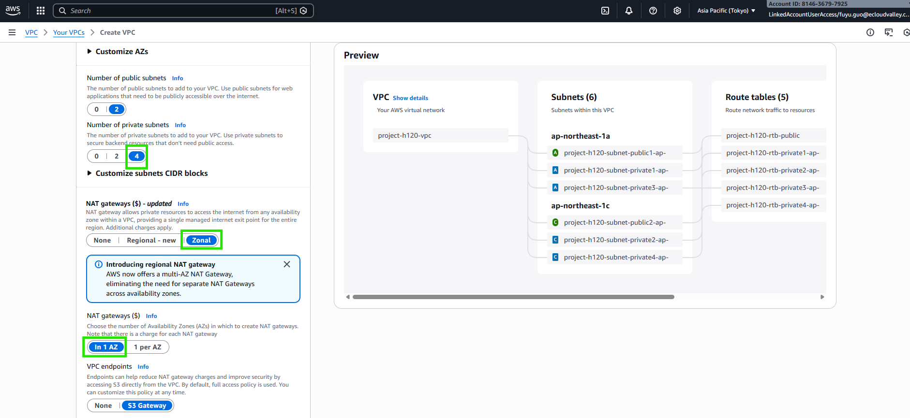
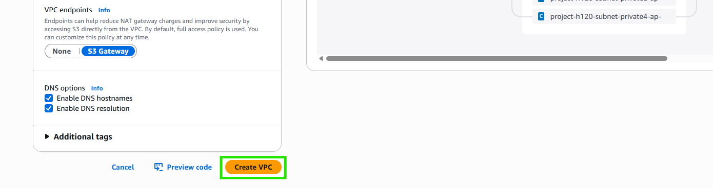
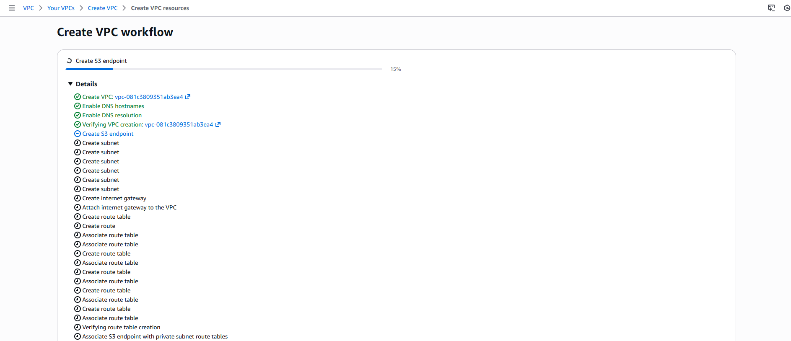
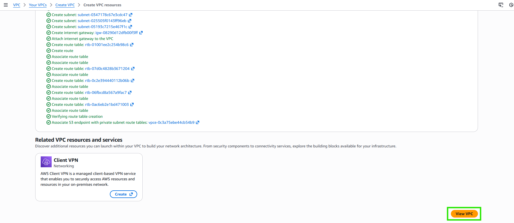

# 建立 AWS 雲端網路環境

:::banner{type="info"}
預計完成時間：**15 分鐘**
:::

---

## 切換至 Tokyo Region

在 AWS Console 右上方，切換選擇 **Tokyo 地區 (ap-northeast-1)**

---

## 建立 VPC

:::steps
1. 前往 VPC 介面，點擊 **Create VPC**

   

   

2. 選擇 **VPC and more**，並填寫相關 CIDR 資訊

   :::alert{type="info"}
   **VPC 命名建議**：請將 VPC Name 設定為 ``lab-{{USERNAME}}``，方便講師與學員區分各自建立的資源。
   :::

   

   

   

   

3. 確認 VPC & Subnets 創建完成

   
:::

:::alert{type="success"}
VPC 網路環境建立完成，包含 Public Subnet、Private Subnet、Internet Gateway、NAT Gateway 及 Route Tables。
:::
