# 建立 EC2 (Web Server) 樣板

:::banner{type="info"}
預計完成時間：**10 ~ 15 分鐘**
:::

:::alert{type="info"}
我們需要一台 EC2 實例，並且佈建好 Web Server，後續可以做為此 Workshop 的應用層。透過這台虛擬機，可以創建出 AMI、Launch Template 以實現 Auto Scaling 的目標。
:::

---

## 建立 EC2 實例

:::steps
1. 搜尋 EC2

   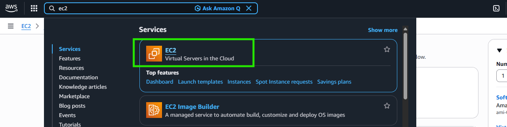

2. 點擊 **Launch instance**

   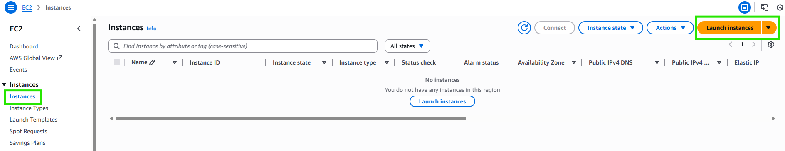

3. 填寫 EC2 名稱與 AMI 資訊

   :::alert{type="info"}
   **EC2 命名建議**：請將 Name 設定為 ``my-web-{{USERNAME}}``，方便講師與學員區分各自建立的資源。
   :::

   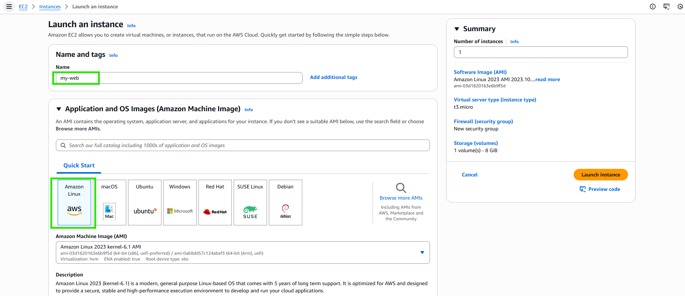

4. 選擇機器型別、設定 Key Pair

   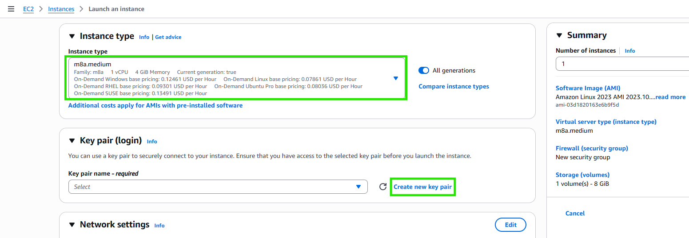

   :::alert{type="info"}
   **Key Pair 命名建議**：建立新的 Key Pair 時，請將名稱設定為 ``my-web-rsa-key-{{USERNAME}}``，方便識別與管理。
   :::

   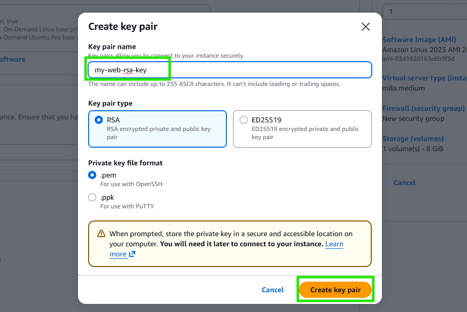

5. 設定網路資訊（選擇剛才創建的 VPC）

   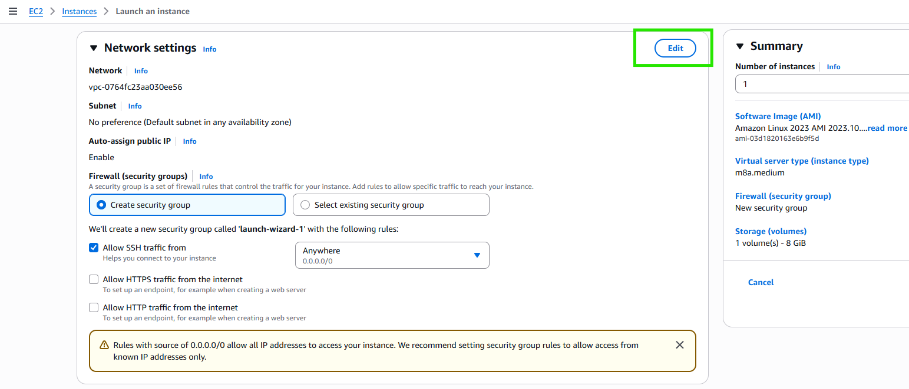

   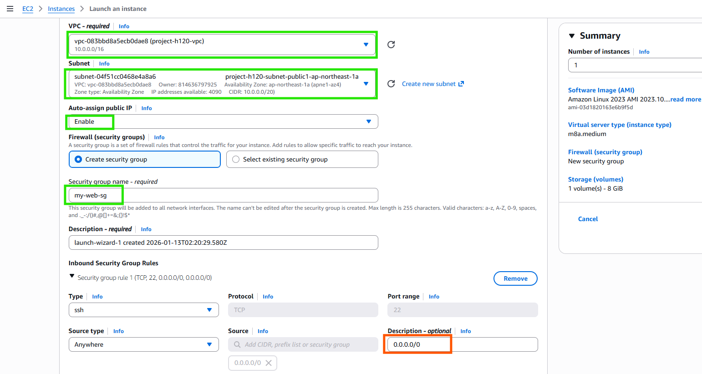

   :::alert{type="info"}
   **Security Group 命名建議**：請將 Security Group name 設定為 ``my-web-{{USERNAME}}-sg``，方便識別與管理。
   :::

   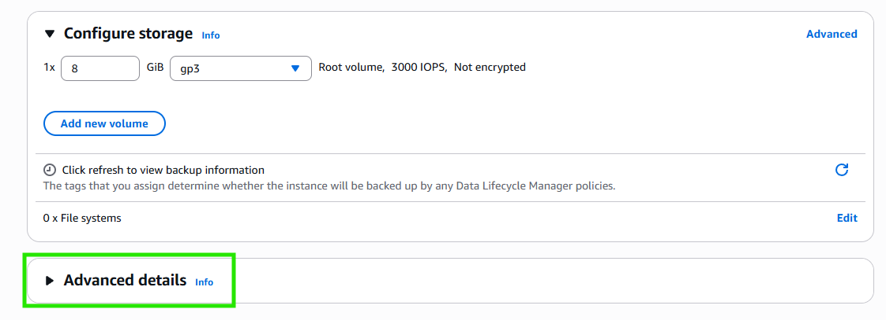

6. 設定 User Data

   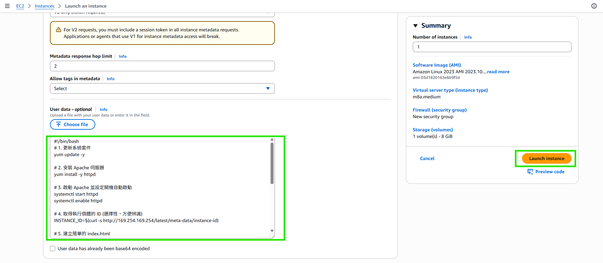

   貼上以下 User Data 腳本：

   ```bash
   #!/bin/bash
   # 1. 更新系統套件
   yum update -y

   # 2. 安裝 Apache 伺服器
   yum install -y httpd

   # 3. 啟動 Apache 並設定開機自動啟動
   systemctl start httpd
   systemctl enable httpd

   # 4. 取得執行個體的 ID (選擇性，方便辨識)
   INSTANCE_ID=$(curl -s http://169.254.169.254/latest/meta-data/instance-id)

   # 5. 建立簡單的 index.html
   cat <<EOF > /var/www/html/index.html
   <!DOCTYPE html>
   <html>
   <head>
       <title>EC2 Web Server</title>
       <style>
           body { font-family: sans-serif; text-align: center; margin-top: 50px; }
           h1 { color: #FF9900; }
       </style>
   </head>
   <body>
       <h1>Hello World!</h1>
       <p>這台伺服器是透過 <b>User Data</b> 自動部署的WebServer。</p>
   </body>
   </html>
   EOF
   ```

7. 確認 EC2 (Web Server) 創建完成

    創建")
:::

---

## 更新 Security Group - Inbound Rules

:::alert{type="warning"}
為了讓網頁可以透過 Public IP 順利訪問，需要調整 Security Group 的 Inbound Rules。
:::

:::steps
1. 進入 EC2 的 Security Group 設定

   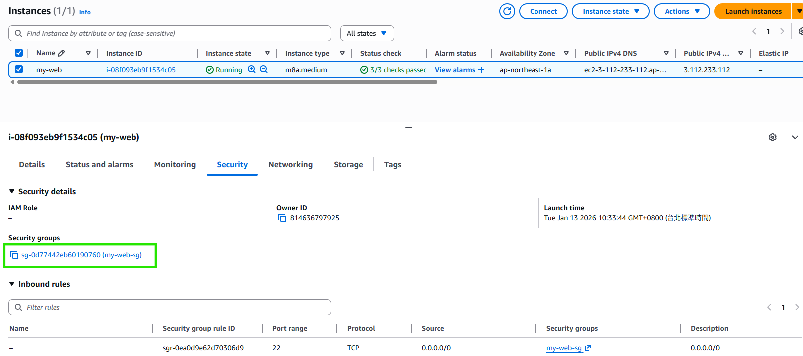

2. 編輯 Inbound Rules

   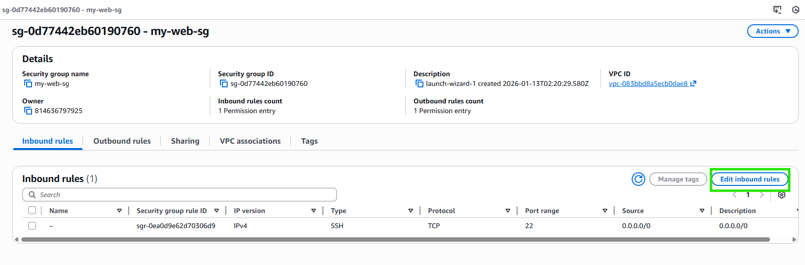

3. 新增 HTTP (Port 80) 規則，來源設定為 `0.0.0.0/0`

   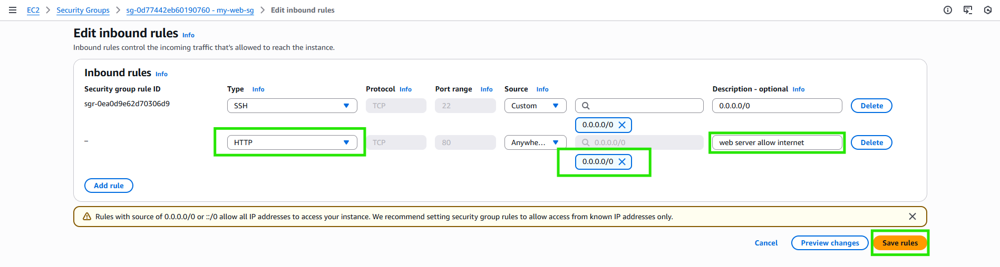
:::

---

## 透過 Public IP 檢視網頁

:::steps
1. 複製 EC2 的 Public IP，使用 **http** protocol 訪問

   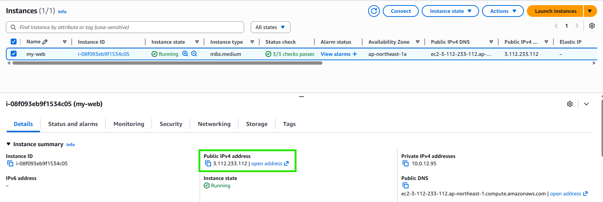

2. 確認網頁正常顯示

   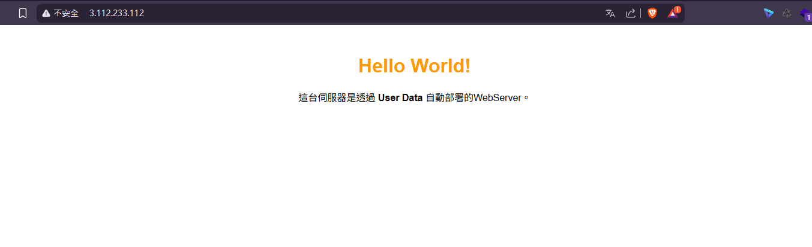
:::

:::alert{type="success"}
EC2 Web Server 樣板建立完成，可透過 Public IP 正常訪問網頁。
:::
