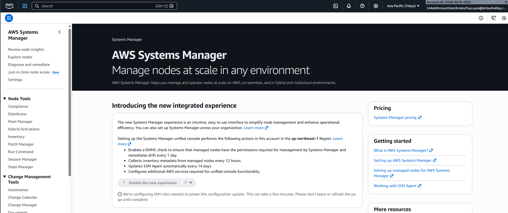
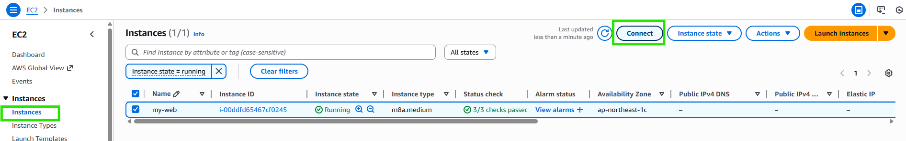
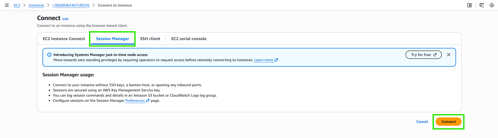
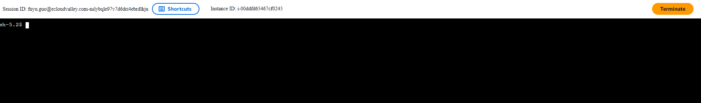

# 啟用 AWS Systems Manager

:::banner{type="info"}
預計完成時間：**15 ~ 20 分鐘**
:::

:::alert{type="info"}
AWS Systems Manager 提供免密鑰的遠端連線方式，透過 Session Manager 可以安全地連線至 EC2 實例，無需開放 SSH Port。
:::

---

## 啟用 Systems Manager

:::steps
1. 前往 AWS Systems Manager，點擊 **Enable the new experience**

   

   :::alert{type="warning"}
   啟用後需等待約 10-15 分鐘才能完成設定。
   :::

2. 確認 Systems Manager 已啟用

   

3. 前往 Session Manager

   

4. 確認 EC2 實例已出現在 Managed Instances 列表

   

5. 選擇實例，點擊 **Start session**

   

   

6. 確認連線設定

   

7. 成功透過 Session Manager 連線進入 EC2

   
:::

:::alert{type="success"}
已成功透過 Session Manager 連線至 EC2 實例，無需使用 SSH Key。
:::
