# 建立 RDS 資料庫

:::banner{type="info"}
預計完成時間：**15 ~ 20 分鐘**
:::

---

## 建立 RDS 資料庫

:::steps
1. 搜尋 RDS，進入 RDS Console

   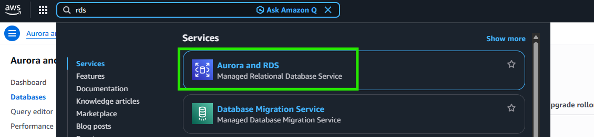

2. 點擊 **Create database**

   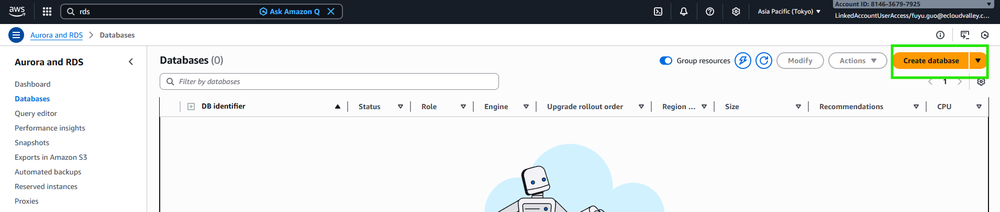

3. 選擇資料庫引擎（PostgreSQL）

   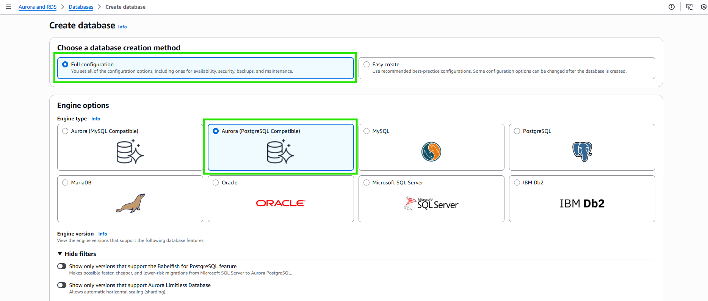

4. 選擇 Template（Dev/Test 或 Free tier）

   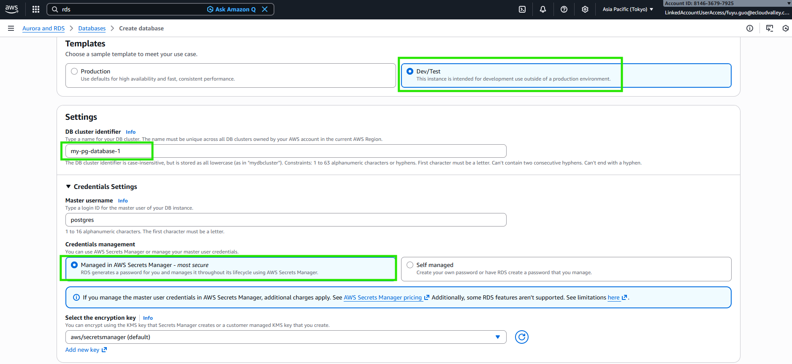

5. 設定 DB Instance 名稱與認證資訊

   :::alert{type="info"}
   **DB cluster identifier 命名建議**：請將名稱設定為 ``my-pg-database-{{USERNAME}}``，方便講師與學員區分各自建立的資源。
   :::

   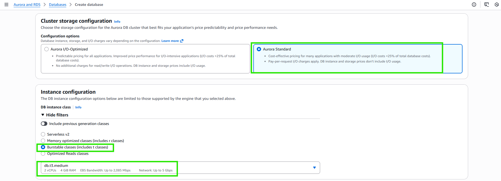

   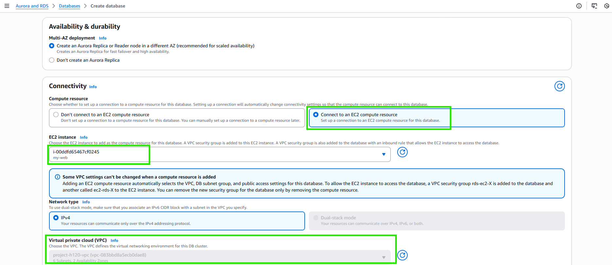

6. 設定 Instance 規格

   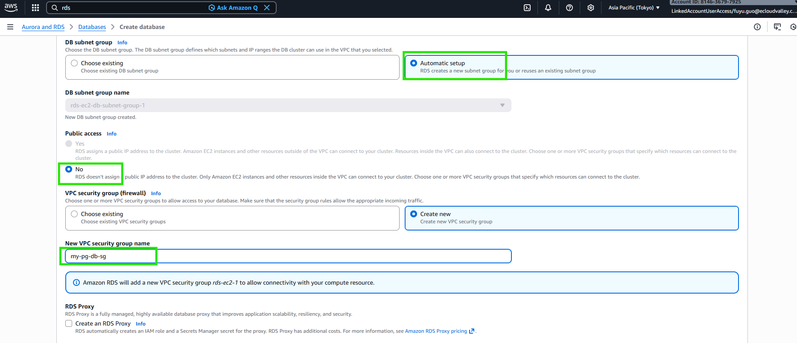

7. 設定網路 - 選擇 VPC 與 Private Subnet

   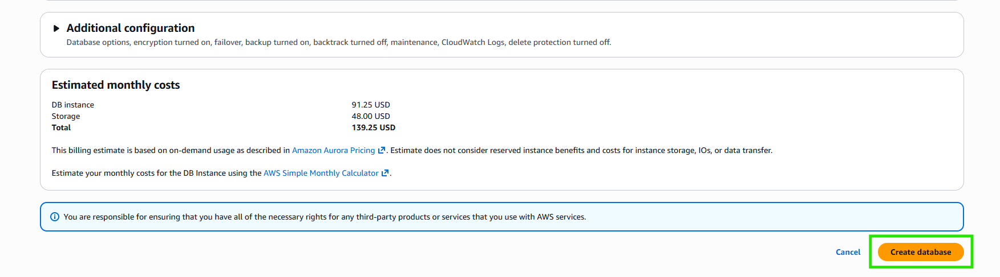

   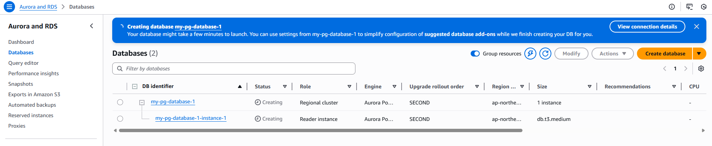

8. 設定 Security Group

   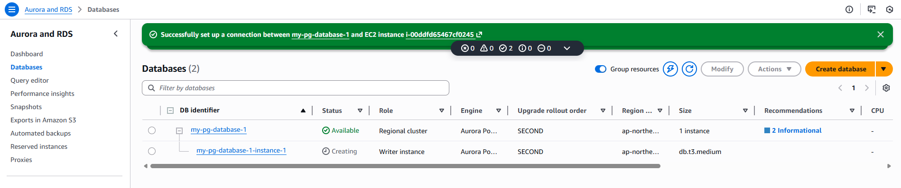

9. 等待 RDS 建立完成，檢視配置並複製 Writer Endpoint

   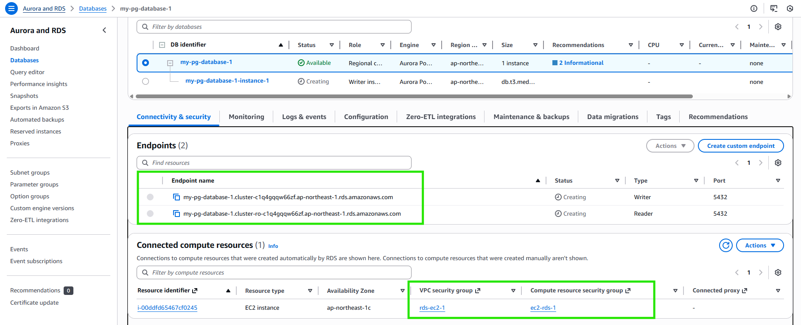

   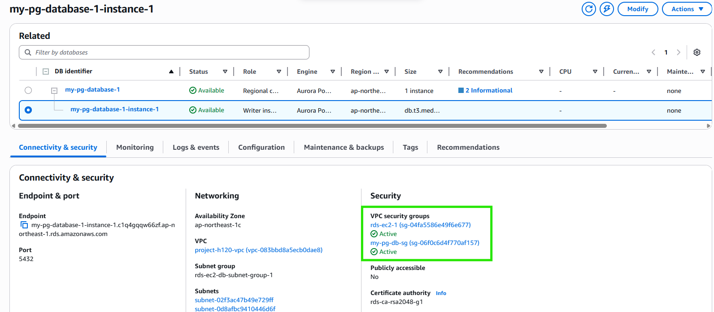
:::

---

## 從 EC2 測試 RDS 連線

透過 Session Manager 連線進入 EC2，測試 RDS 連線：

:::steps
1. 連線至 EC2

   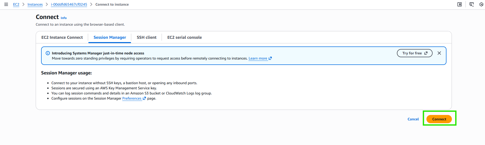

2. 安裝 Telnet

   ```bash
   sudo dnf install telnet -y
   ```

   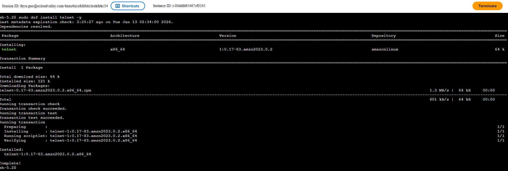

   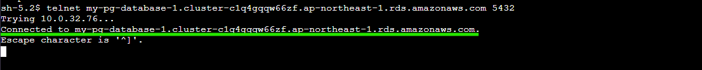

3. 安裝 PostgreSQL Client

   ```bash
   sudo dnf install postgresql15 -y
   ```

   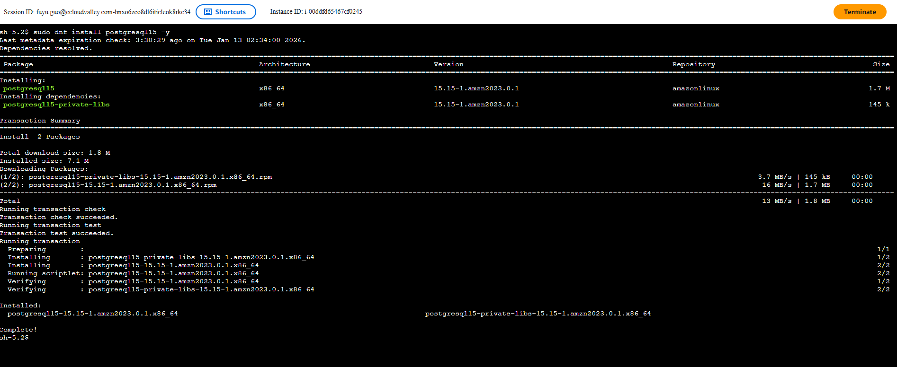

4. 連線至 RDS

   ```bash
   # 檢測版本
   psql --version

   # 嘗試連線 (endpoint 從 RDS 介面查找) (使用者名稱及密碼從 Secrets Manager 查找)
   psql -h <資料庫端點> -U <使用者名稱> -d <資料庫名稱>

   # Example
   psql -h my-pg-database-1.cluster-c1q4gqqw66zf.ap-northeast-1.rds.amazonaws.com -U postgres -d postgres
   ```

   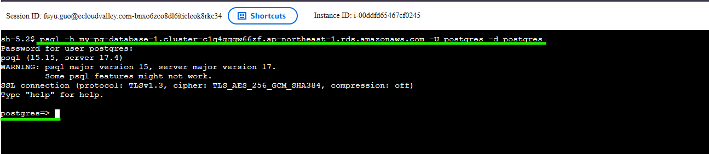

   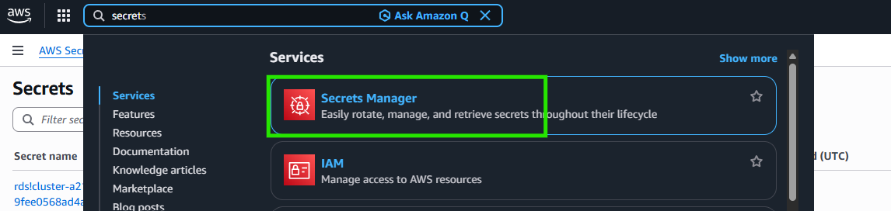

5. 確認連線成功

   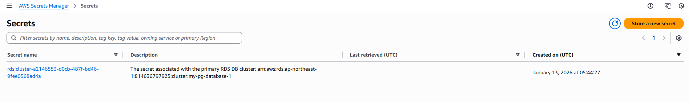

   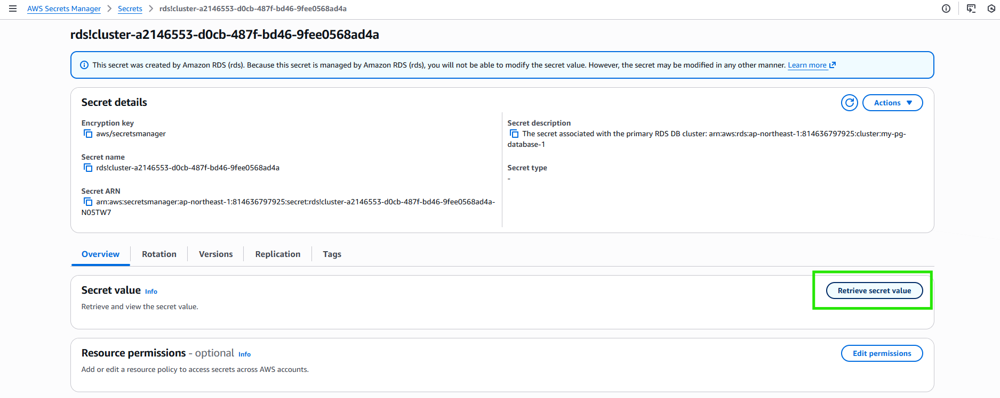

   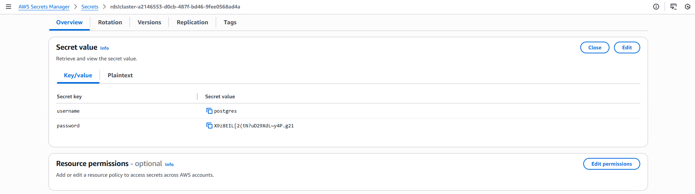
:::

:::alert{type="success"}
RDS 資料庫建立完成，並已從 EC2 成功連線驗證。
:::
