# 從本地 pgAdmin 連線 private RDS

:::banner{type="info"}
預計完成時間：**15 ~ 20 分鐘**
:::

:::alert{type="info"}
RDS 部署在 Private Subnet 內，無法直接從本地連線。以下提供兩種方式透過安全通道連線至 RDS。
:::

---

## 方式選擇

:::tabs
::tab[方式 A — Bastion Host SSH Tunnel]

> 透過 Bastion Host 建立 SSH Tunnel 連線 RDS

### 建立 Bastion 實例

:::steps
1. 建立一台 EC2 作為 Bastion Host，放置於 Public Subnet

   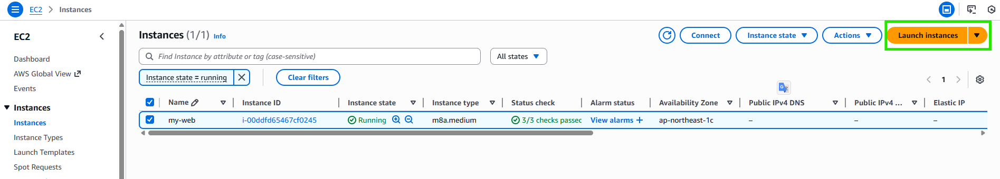

   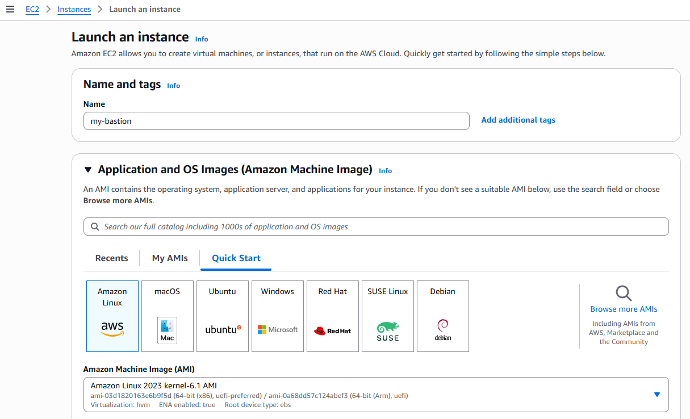

   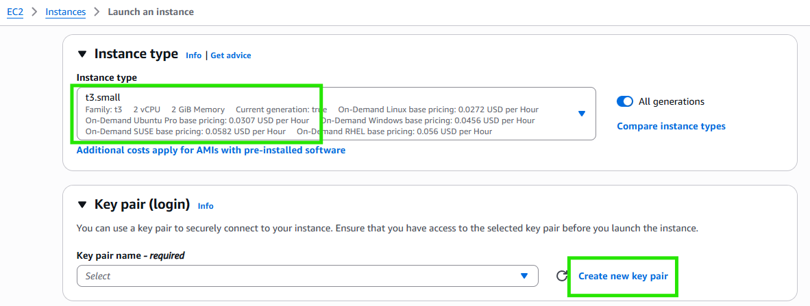

   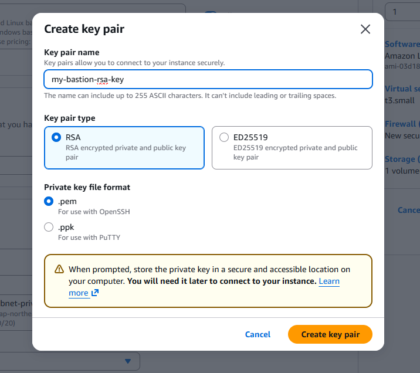

   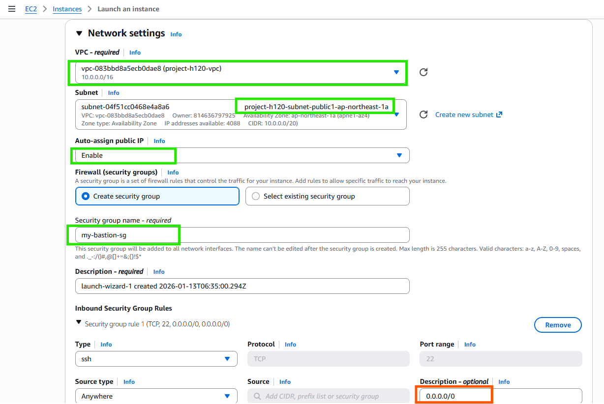

   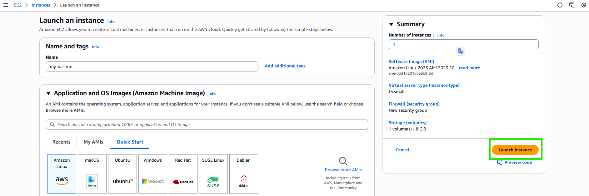

   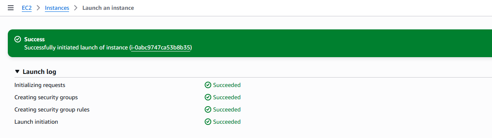
:::

### 設定 Security Group (ec2-rds-1)

:::alert{type="warning"}
需要確保 RDS 的 Security Group 允許來自 Bastion 的連線（Port 5432）。
:::

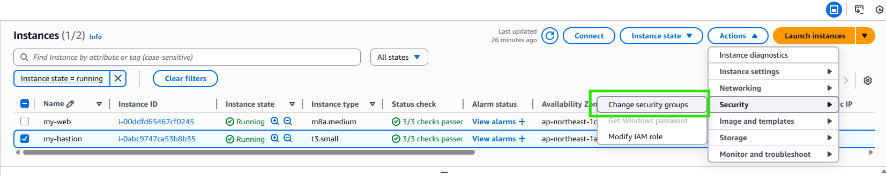

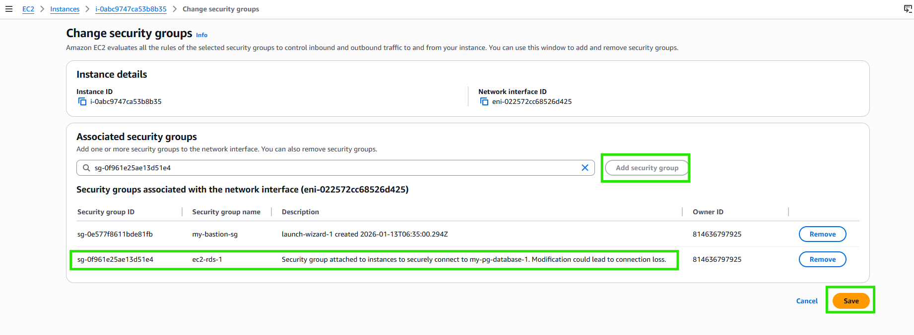

### 本地透過 SSH 建立 Tunnel 連線

```bash
# 將 key 修改為唯讀權限
chmod 400 ./your.pem

# 建立 SSH Tunnel
ssh -i ./your.pem -N -L 8182:<rds-dns-name>:5432 ec2-user@<bastion-public-ip> -v
```

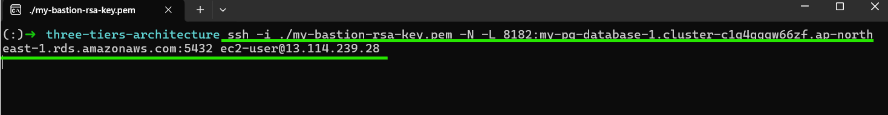

### 本地透過 pgAdmin 連線 RDS

:::steps
1. 開啟 pgAdmin，新增 Server

   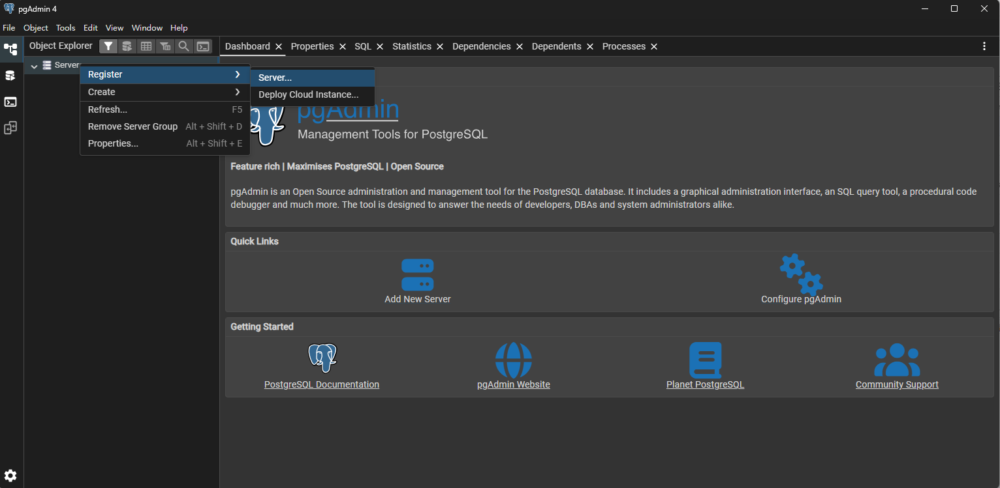

2. 設定連線資訊（Host: `localhost`、Port: `8182`）

   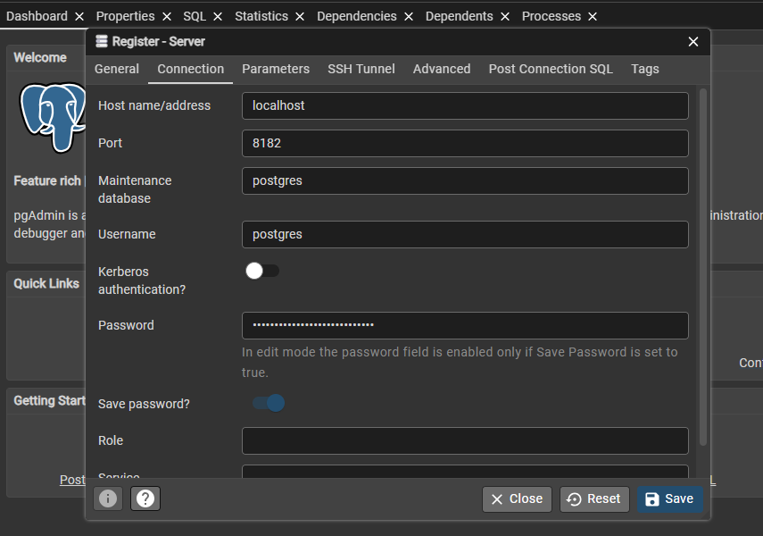

3. 確認連線成功

   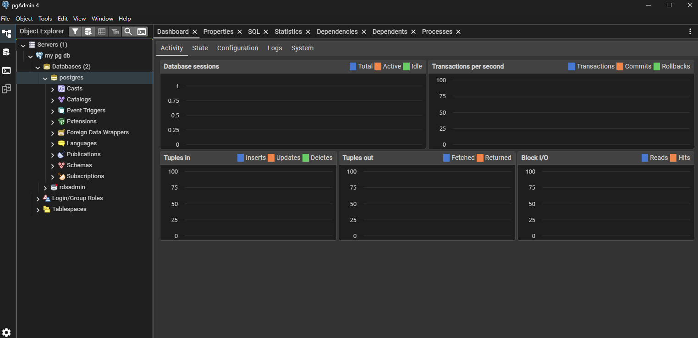
:::

::tab[方式 B — Session Manager Port Forwarding]

> 透過 AWS Systems Manager Session Manager 建立 Port Forwarding 連線 RDS（無需 Bastion Host）

### 先決條件

:::alert{type="warning"}
請確認以下工具已安裝：
:::

1. 已安裝 AWS CLI
2. 已完成 AWS SSO 驗證
3. 已安裝 Session Manager Plugin

:::expand{title="安裝 Session Manager Plugin（以 Ubuntu/WSL 為例）"}
```bash
# 1. 下載最新版本的 Debian 安裝包
curl "https://s3.amazonaws.com/session-manager-downloads/plugin/latest/ubuntu_64bit/session-manager-plugin.deb" -o "session-manager-plugin.deb"

# 2. 執行安裝
sudo dpkg -i session-manager-plugin.deb

# 3. 安裝完後可以刪除安裝檔
rm session-manager-plugin.deb

# 4. 測試是否成功安裝
session-manager-plugin
```
:::

:::expand{title="如何在本地電腦配置 AWS SSO 驗證"}

**配置 SSO**

```bash
aws configure sso
```

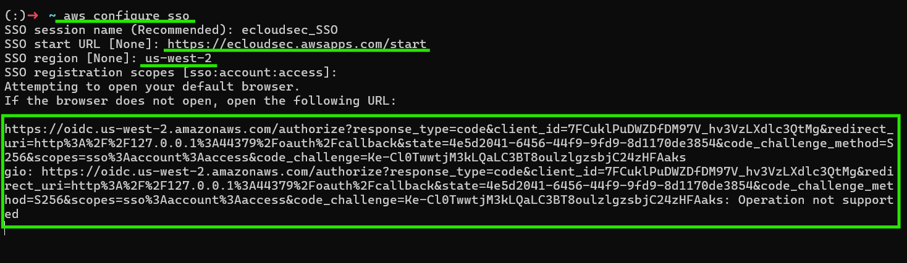

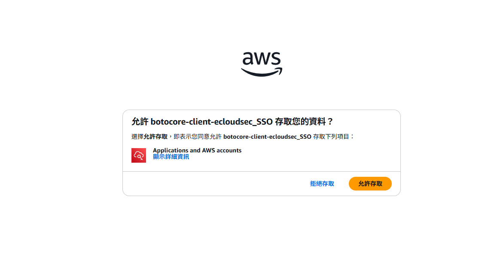

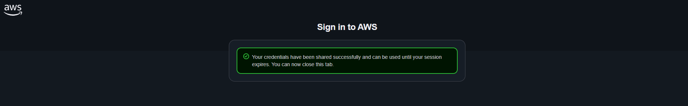

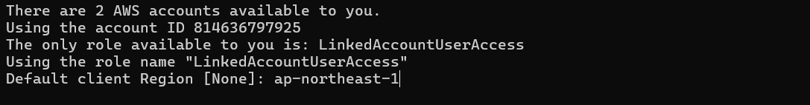

**登入**

```bash
aws sso login
```

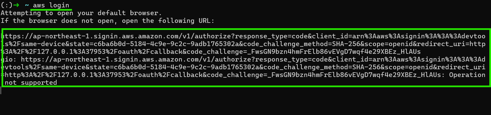

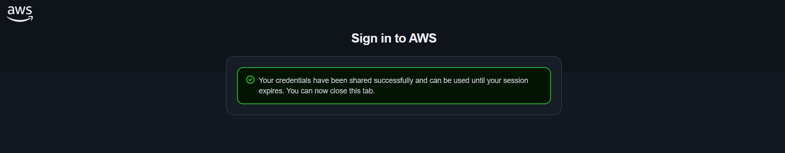

**測試**

```bash
aws s3 ls
```

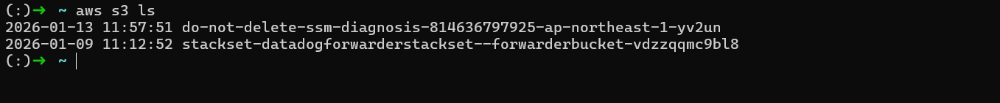
:::

### 建立 Port Forwarding 連線

```bash
aws ssm start-session \
    --target i-xxxxxxxxxxxxxxxxx \
    --document-name AWS-StartPortForwardingSessionToRemoteHost \
    --parameters '{"host":["your-rds-endpoint.region.rds.amazonaws.com"],"portNumber":["5432"],"localPortNumber":["8181"]}'
```

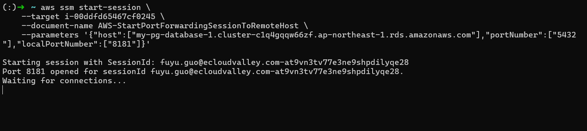

### 本地透過 pgAdmin 連線 RDS

:::steps
1. 開啟 pgAdmin，新增 Server

   

2. 設定連線資訊（Host: `localhost`、Port: `8181`）

   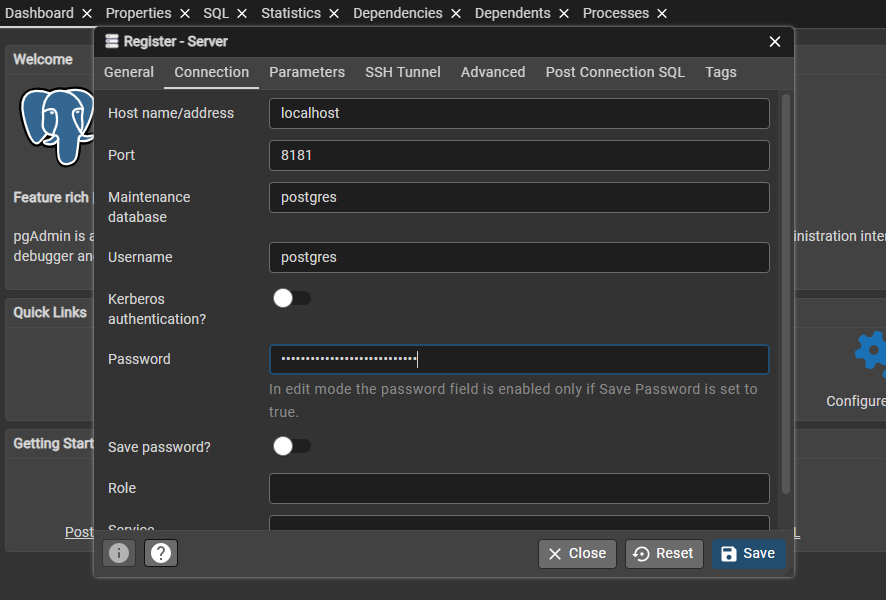

3. 確認連線成功

   
:::

:::

:::alert{type="success"}
已成功從本地 pgAdmin 連線至 Private Subnet 內的 RDS 資料庫。
:::
