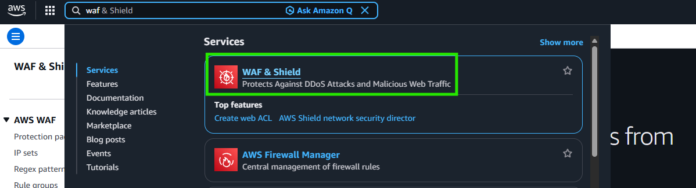
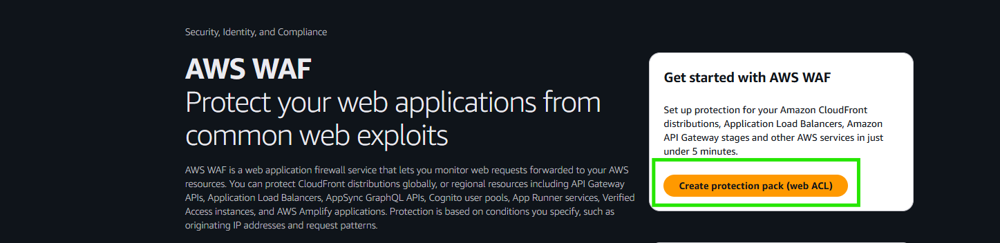
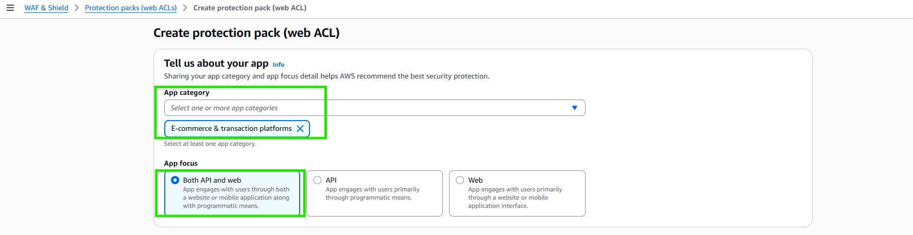
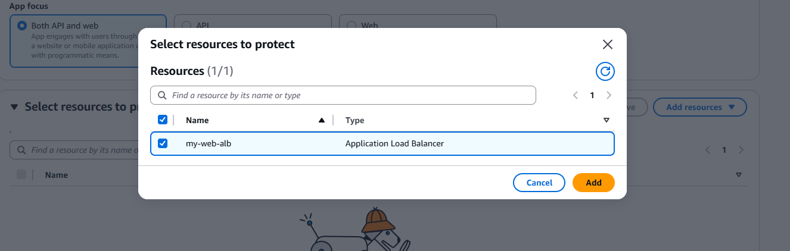
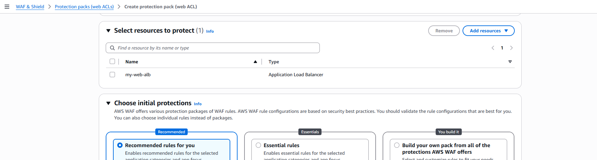
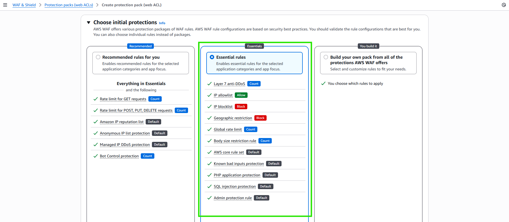
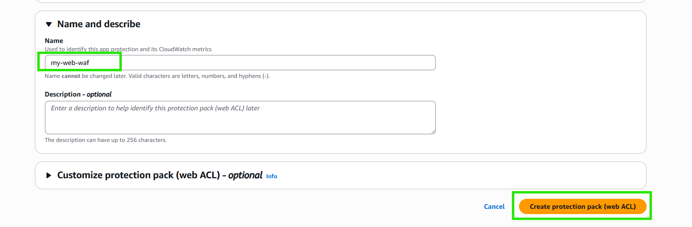
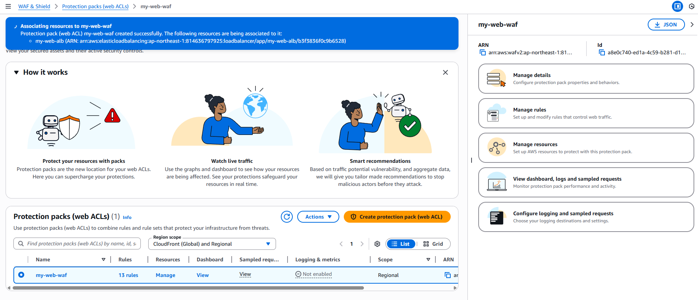
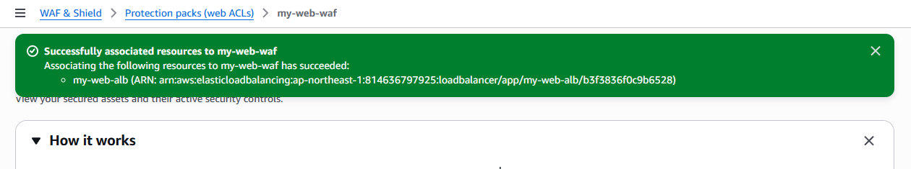

# 為 ALB 設定 WAF 防火牆規則

:::banner{type="info"}
預計完成時間：**10 分鐘**
:::

:::alert{type="info"}
AWS WAF (Web Application Firewall) 可以保護 Web 應用程式免受常見的網路攻擊，例如 SQL Injection、XSS 等。本節將為 ALB 設定 WAF 規則以增強安全性。
:::

---

## 建立 WAF Web ACL

:::steps
1. 搜尋 WAF，進入 AWS WAF Console

   

2. 點擊 **Create web ACL**

   

3. 填寫 Web ACL 名稱與 Region

   

4. 關聯 ALB 資源

   

5. 新增 AWS Managed Rules

   

   

6. 設定 Rule Priority

   

7. 設定 CloudWatch Metrics

   

8. 確認建立完成

   
:::

:::alert{type="success"}
WAF 防火牆規則已成功套用至 ALB，Web 應用程式現在受到 AWS Managed Rules 的保護。
:::

---

## 最佳實踐補充

:::alert{type="info"}
**EC2 → ALB Security Group 最佳實踐**：建議將 EC2 的 Security Group Inbound Rule 來源設定為 ALB 的 Security Group，而非 `0.0.0.0/0`，確保流量只能透過 ALB 進入。
:::

---

## Cleanup

:::alert{type="danger"}
實作完成後，請記得清除以下資源以避免產生額外費用：
:::

- WAF Web ACL
- ALB + Target Group
- Auto Scaling Group
- Launch Template
- AMI
- EC2 實例（Web Server + Bastion）
- RDS 資料庫
- NAT Gateway
- VPC（含 Subnets、Route Tables、Internet Gateway）
