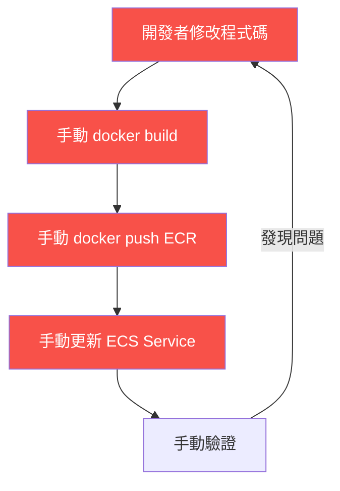
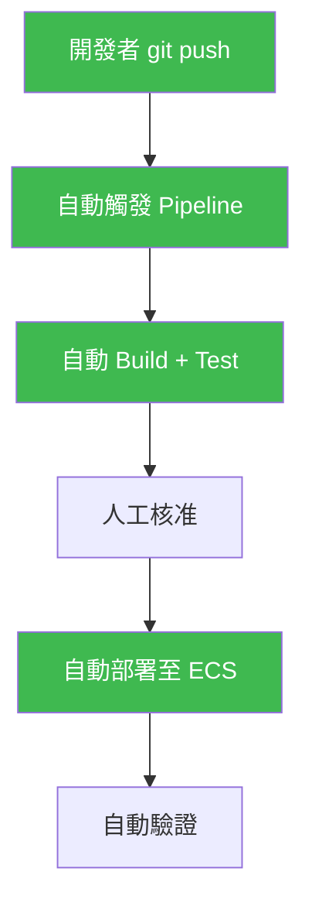

# CI/CD 核心概念

::badge[概念]{type="default"} ::badge[約 15 分鐘]{type="default"}

在開始實作之前，先了解 CI/CD 的核心概念以及 AWS 提供的工具。

---

## 什麼是 CI/CD？

**CI（Continuous Integration）** — 持續整合
開發者頻繁地將程式碼合併到主分支，每次合併都自動執行建置和測試，確保程式碼品質。

**CD（Continuous Delivery / Deployment）** — 持續交付 / 部署
- **Continuous Delivery**：程式碼通過測試後，自動準備好可部署的版本，但需要人工核准才部署
- **Continuous Deployment**：完全自動化，程式碼通過測試後直接部署到生產環境

本工作坊實作的是 **Continuous Delivery** — 包含一個人工核准步驟。

---

## 沒有 CI/CD 的世界



每次部署都要重複這些步驟，容易出錯、耗時、且無法追蹤。

---

## 有 CI/CD 的世界



開發者只需要 `git push`，其餘全部自動完成。

---

## AWS CI/CD 工具

| 服務 | 角色 | 類比 |
|------|------|------|
| **CodePipeline** | 指揮官 — 定義和執行整個流程 | 工廠的生產線控制系統 |
| **CodeBuild** | 工人 — 執行建置、測試、打包 | 工廠的組裝工人 |
| **CodeDeploy** | 搬運工 — 將成品部署到目標環境 | 工廠的物流部門 |
| **CodeConnections** | 門衛 — 連接外部程式碼來源（GitHub） | 工廠的原料進貨口 |

本工作坊使用 **CodePipeline** + **CodeBuild**，部署目標是 **ECS Fargate**（CodePipeline 內建 ECS deploy action，不需要 CodeDeploy）。

---

## Pipeline 四階段

本工作坊建立的 Pipeline 包含四個階段：

:::steps
1. **Source** — 偵測 GitHub Repository 的程式碼變更，自動拉取最新版本

2. **Build** — CodeBuild 執行 `buildspec.yml` 定義的步驟：建置 Docker Image、推送至 ECR

3. **Approval** — 人工核准關卡，模擬正式環境的部署審核流程

4. **Deploy** — 更新 ECS Service，使用新的 Docker Image 啟動容器
:::

---

## buildspec.yml

`buildspec.yml` 是 CodeBuild 的指令檔，定義了建置過程中要執行的命令：

```yaml
version: 0.2
phases:
  pre_build:    # 建置前準備（登入 ECR）
    commands:
      - aws ecr get-login-password | docker login ...
  build:        # 建置（build + tag image）
    commands:
      - docker build -t myapp .
  post_build:   # 建置後（push image + 產生部署檔）
    commands:
      - docker push myapp
      - echo '[{"name":"web","imageUri":"..."}]' > imagedefinitions.json
artifacts:
  files:
    - imagedefinitions.json   # 給 ECS Deploy Stage 用的檔案
```

:::alert{type="info"}
`imagedefinitions.json` 是 CodePipeline ECS Deploy Action 的關鍵檔案，它告訴 ECS 要用哪個 Image 更新 Service。
:::
