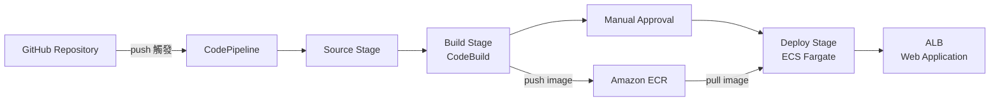

# CI/CD Pipeline 自動化部署實戰

::badge[HANDS-ON LAB]{type="info"} ::badge[約 3-3.5 小時]{type="default"}

還記得手動 build Docker image、push ECR、update ECS Service 的繁瑣流程嗎？本工作坊將這些步驟全部自動化 — 只要 `git push`，AWS CodePipeline 就會自動完成從建置到部署的所有工作。

---

## 學習目標

- 理解 CI/CD 的核心概念與價值
- 註冊並使用 GitHub 管理原始碼
- 撰寫 CodeBuild 的 `buildspec.yml` 定義建置流程
- 建立 CodeBuild Project 並執行自動化建置
- 建立 CodePipeline 串接 Source → Build → Approval → Deploy
- 體驗 `git push` 自動觸發完整部署流程
- 實現零停機應用切換

---

## 架構總覽

---

## 前置需求

- AWS 帳號（由講師提供 IAM User）
- GitHub 帳號（Task 0 會引導註冊）
- 現代瀏覽器（Chrome / Firefox / Edge）

---

## 工作坊流程

| Task | 內容 | 預估時間 |
|------|------|----------|
| Task 0 - GitHub 準備 | 註冊 GitHub、Fork 應用 Repo | 15 mins |
| Task 1 - 環境建置 | 部署 Lab 基礎設施與個人資源 | 10 mins |
| Task 2 - 準備應用 | Clone Repo、撰寫 buildspec.yml | 15 mins |
| Task 3 - 手動部署 | Build Image → Push ECR → 建立 ECS Service | 25 mins |
| Task 4 - CodeBuild | 建立 Build Project、測試自動化建置 | 20 mins |
| Task 5 - CodePipeline | 建立完整 Pipeline、串接所有 Stage | 30 mins |
| Task 6 - 體驗 CI/CD | Push 觸發 Pipeline、零停機換應用 | 20 mins |
| Task 7 - 資源清除 | 刪除所有 AWS 資源 | 10 mins |

---

:::alert{type="info"}
本工作坊為獨立 Lab，不需要完成其他工作坊即可參加。所有基礎設施由 CloudFormation 自動建立。
:::

:::alert{type="warning"}
本工作坊會建立 ALB、ECS、EC2 等計費資源，完成後請務必執行 Task 7 清除所有資源，避免產生額外費用。
:::
