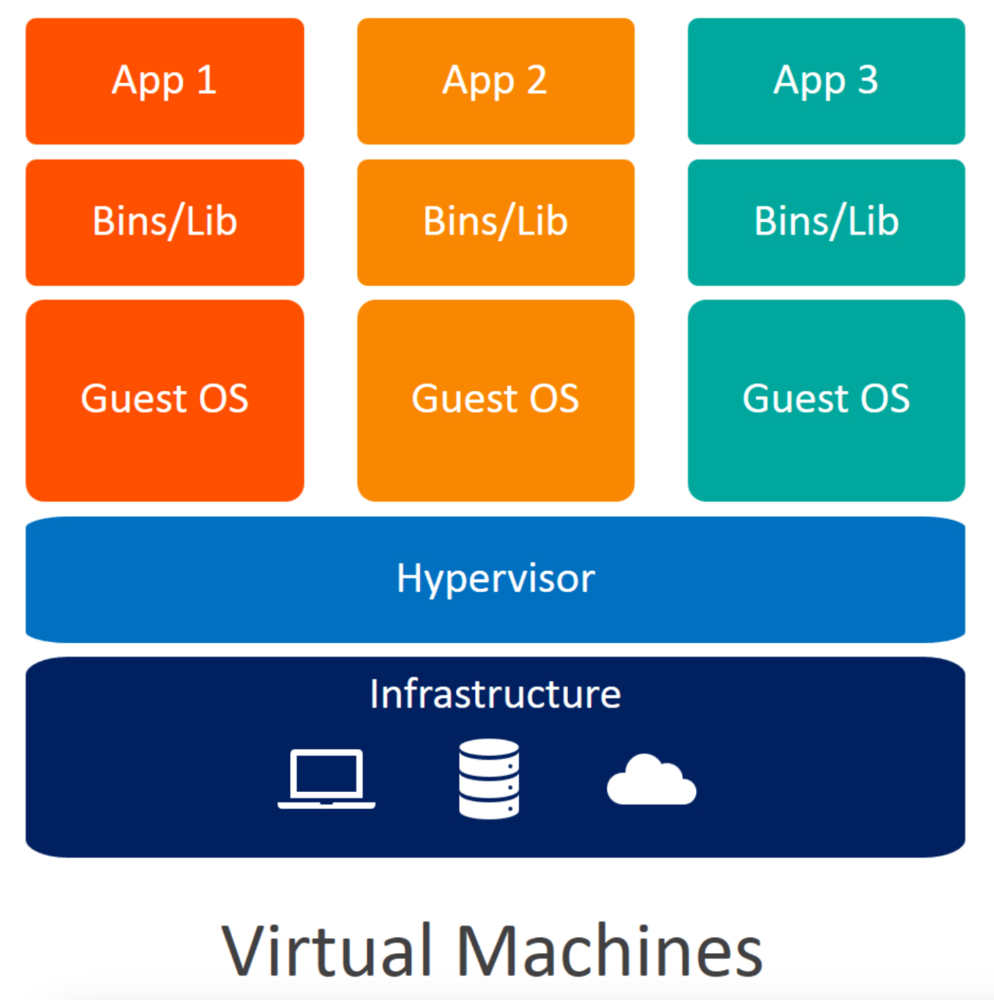
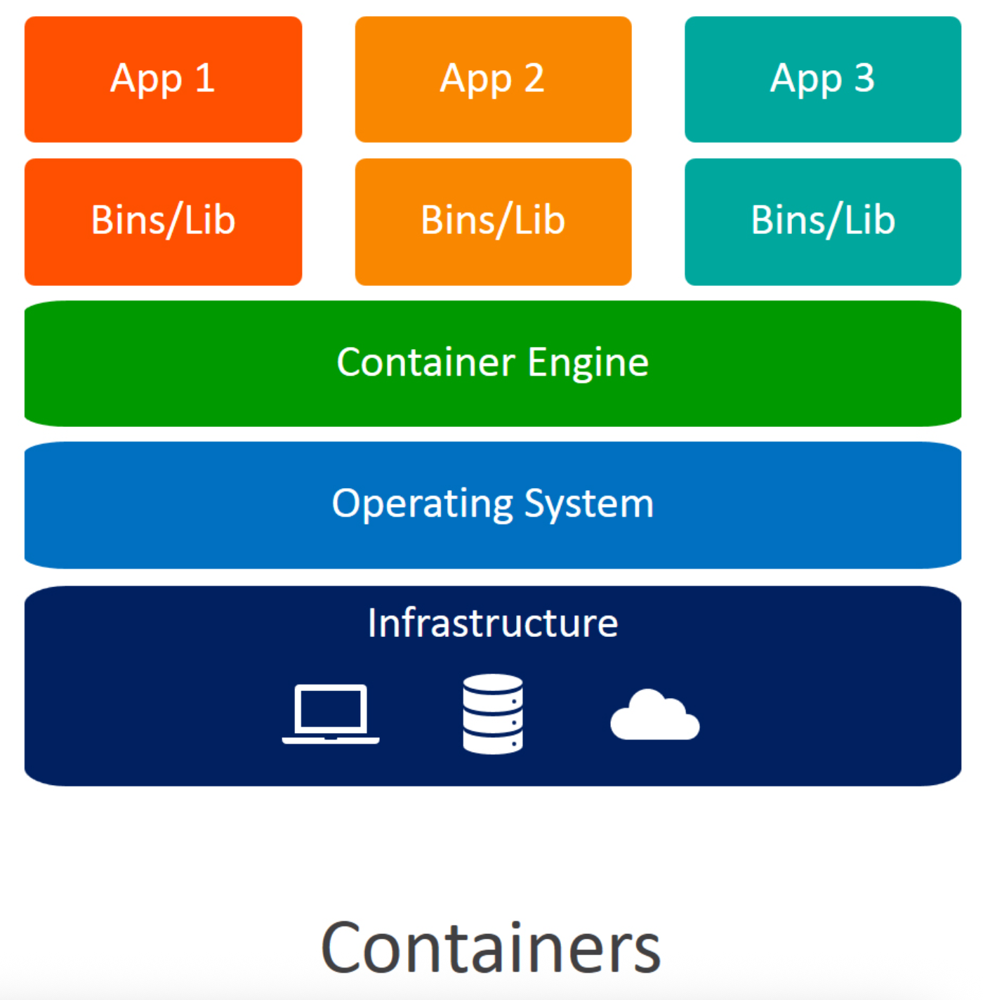
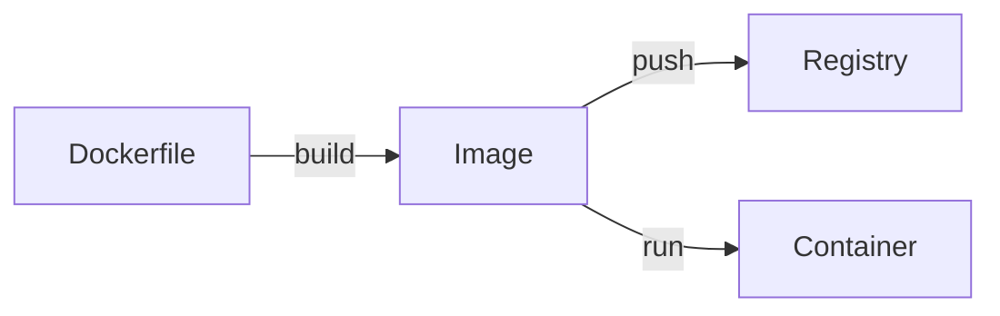

# 容器技術與 AWS 容器服務

::badge[概念]{type="info"} ::badge[約 15 分鐘]{type="default"}

在動手實作之前，先了解容器技術的演進脈絡，以及 AWS 提供的容器服務各自解決了什麼問題。

---

## 從虛擬機到容器

### 虛擬機（Virtual Machine）

傳統上，要在一台實體伺服器上運行多個應用，常見做法是使用虛擬機。每台 VM 都包含一個完整的作業系統（Guest OS），透過 Hypervisor 模擬硬體環境。

VM 提供了強隔離，但每台 VM 都要跑一個完整的 OS，啟動要數分鐘，映像動輒數 GB，同一台伺服器通常只能跑 10-15 台 VM。

### 容器（Container）

容器採用完全不同的方式。它不模擬硬體，而是利用 Linux Kernel 的 **Namespace**（隔離程序）和 **cgroup**（限制資源）來隔離應用，所有容器共享同一個 Host Kernel。

因為省去了 Guest OS 的開銷，容器啟動只需數秒，映像通常只有數十 MB，同一台伺服器可以跑數百個容器。

| 比較項目 | 虛擬機 | 容器 |
|----------|--------|------|
| 啟動速度 | 分鐘級 | 秒級 |
| 映像大小 | GB 級 | MB 級 |
| 資源效率 | 較低（每台 VM 一個 OS） | 高（共享 Kernel） |
| 隔離層級 | 硬體級（獨立 Kernel） | 程序級（共享 Kernel） |
| 密度 | 每台主機 10-15 台 | 每台主機數百個 |
| 適用場景 | 需要不同 OS、強隔離、合規需求 | 微服務、CI/CD、快速部署 |

:::alert{type="info"}
現代生產環境通常兩者並用：VM 作為基礎設施層提供安全隔離，容器作為應用層提供高效部署。AWS Fargate 就是這個模式 — 每個 Task 運行在獨立的 micro-VM 中，兼顧隔離與效率。
:::

---

## Docker

[Docker](https://www.docker.com/) 是最廣泛使用的容器化平台，它讓開發者可以將應用與所有相依套件打包成標準化的映像，在任何環境中一致運行。

### 核心概念

| 概念 | 說明 |
|------|------|
| **Dockerfile** | 定義如何建置映像的腳本 |
| **Image（映像）** | 根據 Dockerfile 建置的唯讀模板 |
| **Container（容器）** | Image 的執行實例 |
| **Registry（儲存庫）** | 存放和分發映像的服務 | 

Docker 解決的核心痛點是「在開發環境可以跑，到生產環境就壞了」的問題 — 透過將應用與環境一起打包，確保開發、測試、生產環境完全一致。

---

## Kubernetes（K8s）

當容器數量只有幾個時，手動管理就夠了。但當數量增長到數十、數百甚至數千個時，就需要一個編排系統來自動化部署、擴展和管理。

[Kubernetes](https://kubernetes.io/) 是 Google 開源的容器編排平台，已成為業界標準。它解決的核心問題包括：

- **服務發現與負載平衡** — 自動將流量分配到健康的容器
- **自動擴展** — 根據負載自動增減容器數量
- **自我修復** — 容器掛了自動重啟或替換
- **滾動更新** — 零停機部署新版本

但 Kubernetes 的學習曲線陡峭，自行維護 Control Plane 的運維成本高。這就是 AWS 託管服務存在的意義。

---

## AWS 容器服務全景

AWS 提供了一系列容器服務，各自解決不同層面的問題：

### Amazon ECR（Elastic Container Registry）

**解決的問題**：容器映像要存在哪裡？

ECR 是 AWS 的全託管容器映像儲存庫，對標 Docker Hub，但與 AWS 服務深度整合。

| 功能 | 說明 |
|------|------|
| Image Scanning | 推送時自動掃描 CVE 漏洞 |
| Lifecycle Policy | 自動清理舊映像，節省儲存成本 |
| IAM 整合 | 透過 IAM 精細控制存取權限 |
| 跨區域複製 | 支援映像跨 Region 複製 |
| 加密 | 靜態加密（AES-256） |

:::alert{type="info"}
相比 Docker Hub，ECR 的優勢在於與 ECS/EKS 的原生整合、IAM 權限控制，以及資料不出 AWS 網路。
:::

### Amazon ECS（Elastic Container Service）

**解決的問題**：如何在 AWS 上編排和管理容器？

ECS 是 AWS 自有的容器編排服務，提供高度整合的 AWS 原生體驗。無需學習 Kubernetes，即可輕鬆部署和管理容器化應用。

**核心元件**：

| 元件 | 說明 |
|------|------|
| **Cluster** | 資源的邏輯分組，可包含多個 Service |
| **Task Definition** | 容器的藍圖 — 定義 Image、CPU/Memory、Port、環境變數、IAM Role |
| **Task** | Task Definition 的執行實例，每個 Task 有獨立的網路介面 |
| **Service** | 維持指定數量的 Task 持續運行，異常時自動替補，可整合 Load Balancer |

### Amazon EKS（Elastic Kubernetes Service）

**解決的問題**：想用 Kubernetes 但不想自己管 Control Plane？

EKS 是 AWS 的託管 Kubernetes 服務。AWS 負責管理高可用的 Control Plane（跨多個 AZ），使用者只需管理 Worker Node 或搭配 Fargate。

**適用場景**：團隊已有 Kubernetes 經驗、需要跨雲可攜性、需要 K8s 生態系統（Helm、Istio、ArgoCD 等）。

### AWS Fargate

**解決的問題**：無需管理伺服器，專注於容器本身

Fargate 是 AWS 的 Serverless 容器運算引擎，同時支援 ECS 和 EKS。只需定義容器規格（CPU、Memory），Fargate 負責底層所有基礎設施。

每個 Fargate Task 運行在獨立的 micro-VM 中，提供硬體級隔離。

---

## 如何選擇？

| 考量 | ECS + Fargate | ECS + EC2 | EKS |
|------|--------------|-----------|-----|
| 運維複雜度 | 最低（Serverless） | 中等 | 高 |
| 學習曲線 | 低 | 低 | 高（需要 K8s 知識） |
| 成本 | 按 Task 計費，較高單價 | 按 EC2 計費，較低單價 | Control Plane ~$73/月 + 運算 |
| 可攜性 | AWS 專屬 | AWS 專屬 | Kubernetes 標準，跨雲可攜 |
| 適用場景 | 快速上手、微服務、變動流量 | 穩定負載、需要 GPU | 已有 K8s 經驗、多雲策略 |

:::alert{type="info"}
本工作坊使用 **ECS + Fargate** 組合 — 最低的運維複雜度，以便專注在應用本身而非基礎設施管理。
:::

---

## 概念檢查

:::expand{title="容器和虛擬機的根本差異是什麼？"}
VM 模擬硬體並運行獨立的 Guest OS，容器共享 Host Kernel 並透過 Namespace/cgroup 隔離。容器更輕量但隔離性較弱。
:::

:::expand{title="Docker 解決了什麼核心問題？"}
環境一致性 — 將應用與所有相依套件打包成標準化映像，消除「開發環境可以跑，生產環境就壞了」的問題。
:::

:::expand{title="ECS 和 EKS 的主要差異？"}
ECS 是 AWS 自有的編排引擎，學習曲線低、與 AWS 深度整合但不可攜。EKS 是託管 Kubernetes，學習曲線高但跨雲可攜。
:::

:::expand{title="Fargate 是什麼？它和 ECS 的關係？"}
Fargate 是 Serverless 運算引擎，不是編排服務。它是 ECS（或 EKS）的一種啟動模式，負責底層基礎設施，無需管理伺服器。
:::

:::alert{type="success"}
概念都清楚了，前往下一節開始建置基礎環境。
:::
