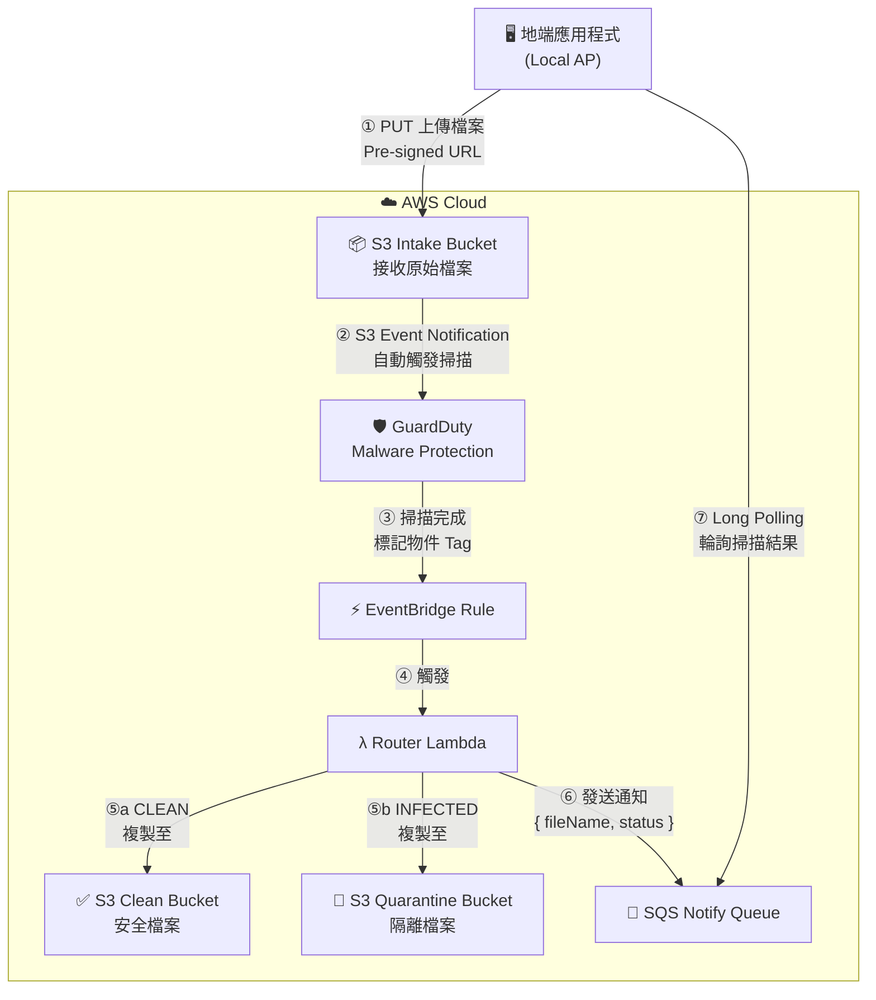
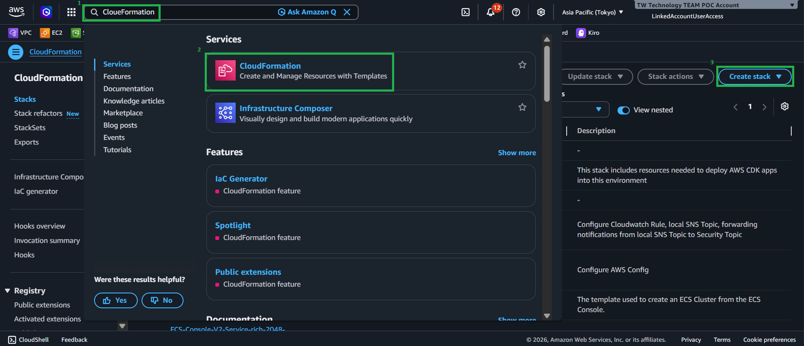
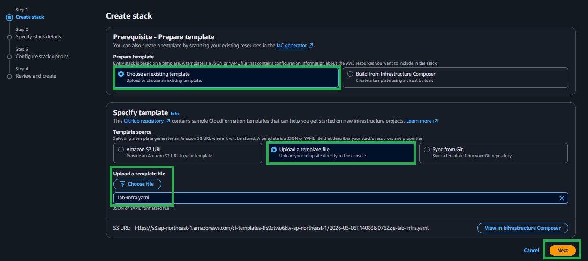
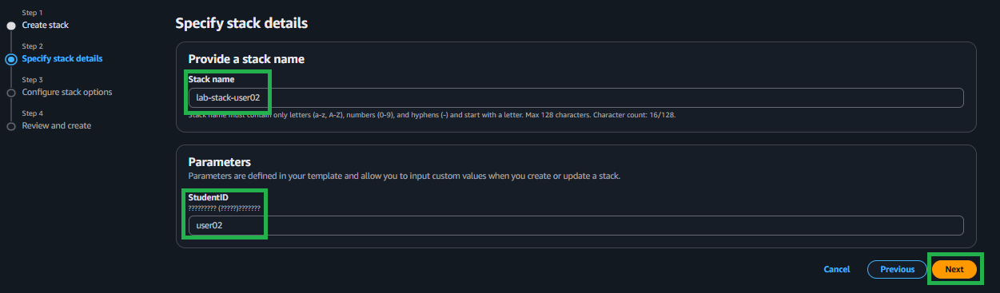
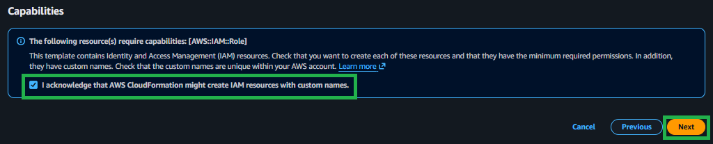
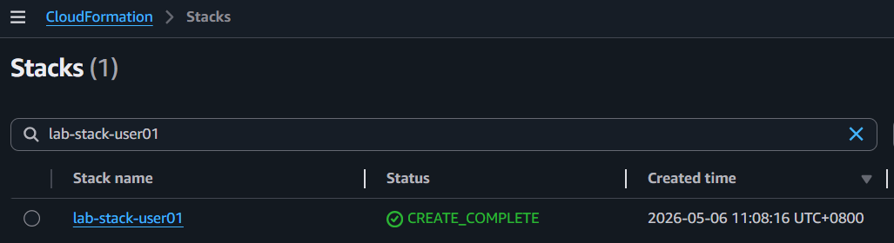
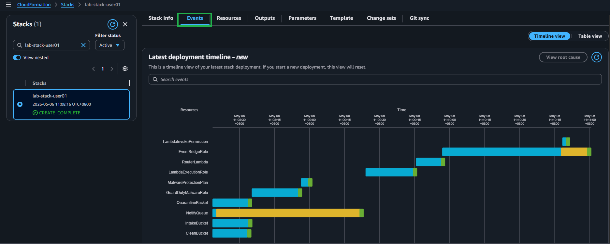
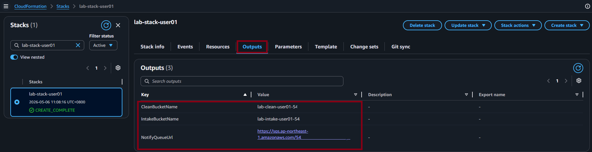

# Task 1：佈署 AWS 基礎設施（IaC）

::badge[30 分鐘]{type="default"}

---

## 目標

用一份 CloudFormation 範本，自動建立本 Lab 所需的全部 AWS 資源。

這個 Task 不需要手動在 Console 上一個個建立資源。所有設定都寫進 YAML，讓 CloudFormation 一次搞定——這就是「**基礎設施即代碼（IaC）**」的核心概念：環境可以重複佈署、版本控管，也可以一鍵清除。

---

## 步驟 1：認識範本內容

本 Lab 的 CloudFormation 範本已準備好，檔案為 ::download-template[下載 lab-infra.yaml]{file="lab-infra.yaml"}。

### 架構圖與資料流

下圖展示本 Lab 的完整雲端架構，以及地端應用程式（Local AP）與各 AWS 服務之間的互動關係：

:::alert{type="info"}
**💡 地端 AP 與 SQS 的關係**

地端應用程式（Local AP）不會直接監聽 GuardDuty 或 EventBridge 的事件，而是透過 **SQS 輪詢（Polling）** 的方式非同步取得掃描結果。

這樣設計的好處是：
- **解耦**：AP 不需要保持長連線，隨時可以查詢
- **可靠**：SQS 保證訊息不遺失，即使 AP 暫時離線也沒關係
- **彈性**：多個 AP 實例可以同時消費同一個 Queue
:::

這份範本會建立以下資源：

| 資源 | 用途 |
|------|------|
| **S3 Intake Bucket** | 接收前端直傳的原始檔案（已設定 CORS 允許瀏覽器直傳）|
| **S3 Clean Bucket** | 存放掃描通過的安全檔案 |
| **S3 Quarantine Bucket** | 隔離被偵測到惡意軟體的檔案 |
| **GuardDuty Malware Protection Plan** | 監控 Intake Bucket，自動掃描新上傳的物件 |
| **SQS Notify Queue** | 讓後端輪詢取得掃描結果通知 |
| **Router Lambda** | 根據掃描結果將檔案分流至對應 Bucket，並發送 SQS 通知 |
| **EventBridge Rule** | 監聽 GuardDuty 掃描完成事件，觸發 Router Lambda |

:::expand{title="💡 查看範本重點說明"}

花一點時間打開 `lab-infra.yaml` 瀏覽一下。特別注意以下幾點：

**RouterLambda 資源**
- Lambda 的 Python 程式碼直接內嵌在 `ZipFile` 區塊中
- 這是 CloudFormation 支援的內嵌方式，適合邏輯簡單的函數
- 函數會根據 GuardDuty 掃描結果自動分流檔案

**CORS 設定**
- Intake Bucket 已設定 CORS 規則
- 允許瀏覽器直接 PUT 上傳檔案
- 支援 Pre-signed URL 機制

**EventBridge 整合**
- 監聽 GuardDuty 的 `Malware Protection` 事件
- 自動觸發 Lambda 進行後續處理
- 實現完全自動化的事件驅動架構

:::

---

## 步驟 2：在 AWS Console 執行佈署

:::steps

1. 登入 [AWS Console](https://console.aws.amazon.com)

2. 確認右上角區域為 **ap-northeast-1（東京）**

3. 前往 **CloudFormation** 服務

4. 點擊 ::button[Create stack]{variant="action"}，選擇 **With new resources (standard)**

   

5. 選擇 **Upload a template file**，上傳 ``lab-infra.yaml``

   

6. 點擊 ::button[Next]{variant="default"}

7. Stack name 填入 ``guardduty-s3-protection-lab-stack-<你的StudentID>``
   
   :::alert{type="info"}
   例如：``guardduty-s3-protection-lab-stack-user01``
   :::

8. Parameters 的 **StudentID** 欄位填入你的 StudentID（小寫英數字）

   

9. 一路點擊 ::button[Next]{variant="default"}，到最後一頁勾選：
   
   ☑ **"I acknowledge that AWS CloudFormation might create IAM resources"**

   

10. 點擊 ::button[Submit]{variant="action"}

11. 等待 Stack 狀態變為 ::status[CREATE_COMPLETE]{type="success" icon="circle-check"}（約 2 ~ 3 分鐘）

   

:::

:::alert{type="info"}
**💡 觀察佈署過程**

佈署過程中切到 **Events** 頁籤，可以即時觀察每個資源的建立順序與狀態，這是理解 CloudFormation 執行邏輯的好機會。

:::

---

## 步驟 3：記錄 Outputs

佈署完成後：

:::steps

1. 點擊你的 Stack 名稱

2. 切換到 **Outputs** 頁籤

3. 將以下三個值複製並記錄下來，後面的 Task 會用到

   

:::

| Key | 說明 | 範例值 |
|-----|------|--------|
| ``IntakeBucketName`` | 前端上傳的目標 Bucket | `lab-intake-user01-123456789012` |
| ``CleanBucketName`` | 掃描通過後的存放 Bucket | `lab-clean-user01-123456789012` |
| ``QuarantineBucketName`` | 惡意檔案隔離 Bucket | `lab-quarantine-user01-123456789012` |
| ``NotifyQueueUrl`` | 後端輪詢掃描結果的 SQS URL | `https://sqs.ap-northeast-1.amazonaws.com/...` |

:::alert{type="warning"}
**重要：請妥善保存這三個值**

這些值在後續的 Task 2 中會用到，建議複製到記事本或文字編輯器中。
:::

---

## ✅ Task 1 回顧

完成這個 Task，你已經：

- ✓ 理解 IaC 的概念，並親眼看到一份 YAML 如何自動建立 7 個 AWS 資源
- ✓ 建立了完整的雲端掃描基礎設施：
  - S3 三個 Bucket（Intake、Clean、Quarantine）
  - GuardDuty 保護計畫
  - SQS 佇列
  - Lambda 路由函數
  - EventBridge 規則
- ✓ 取得了後續 Task 需要的三個關鍵設定值

---

:::banner{type="success"}
**🎉 基礎設施佈署完成！**

你已經成功建立了一套完整的雲端安全掃描架構。接下來我們將建立前後端應用程式來使用這些資源。
:::
