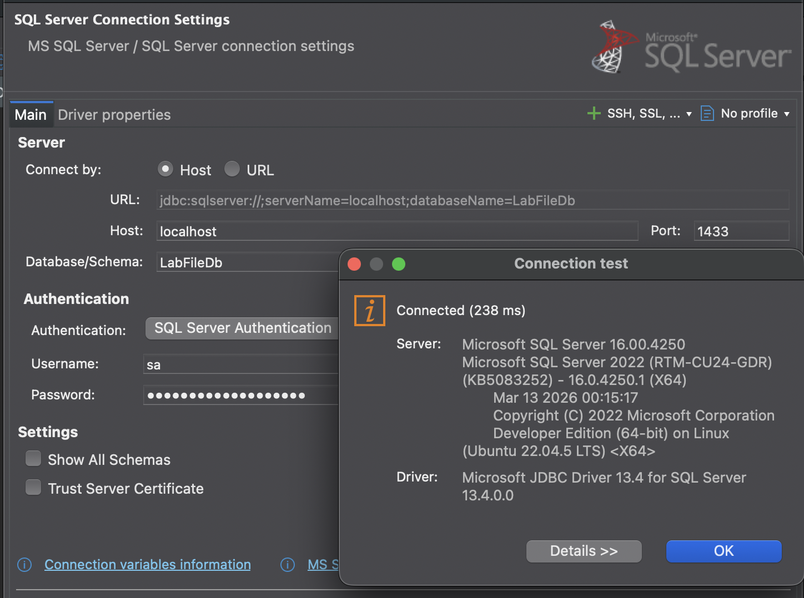
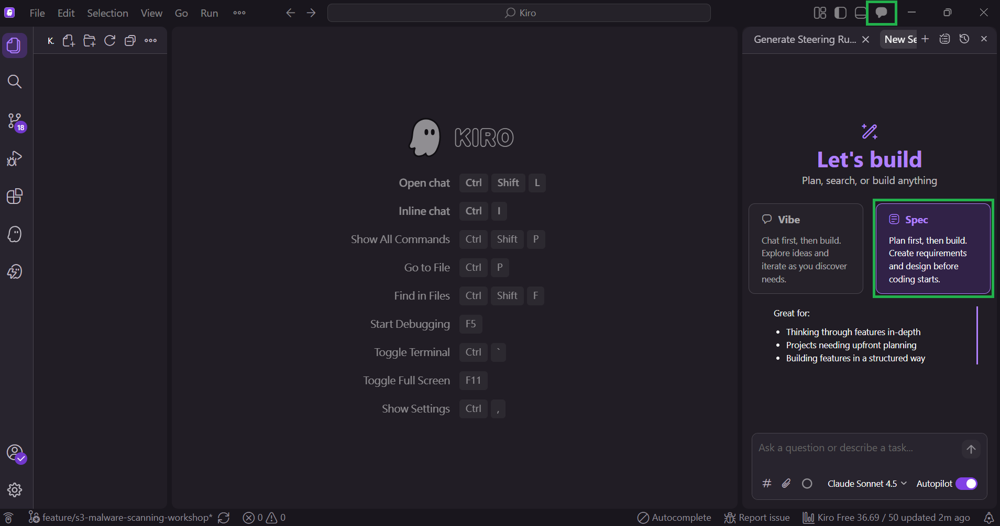
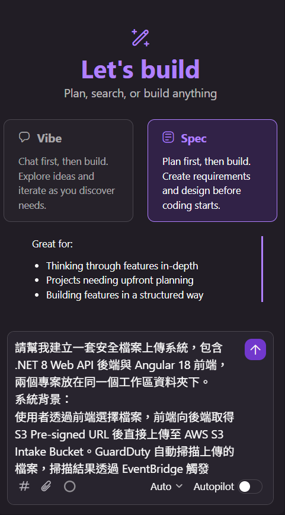
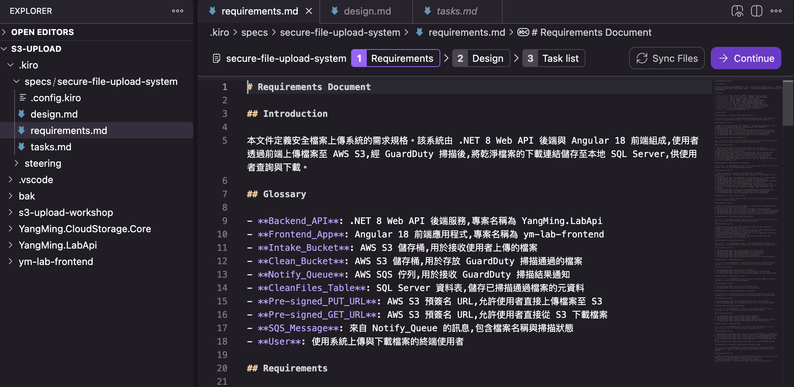
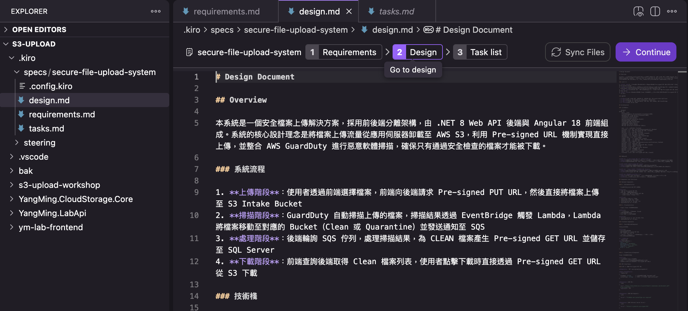
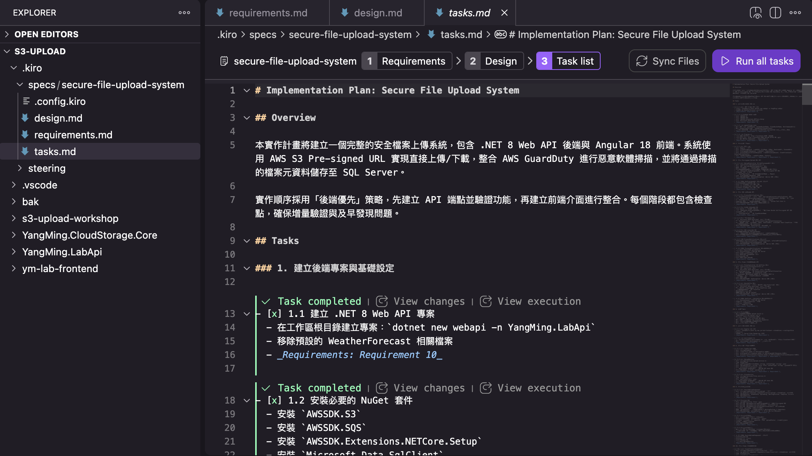
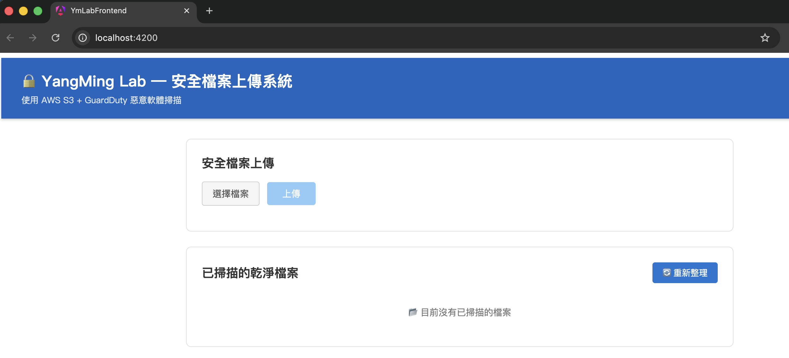

# Task 2：用 Kiro Spec 模式建立安全上傳系統

::badge[90 分鐘]{type="default"}

---

## 目標

用 Kiro 的 **Spec 模式**，一次建立完整的安全上傳系統，包含：

- **.NET 8 Web API（後端）**：產生 Pre-signed URL、處理 SQS 掃描通知、將 Clean 檔案 URL 寫入 SQL Server、提供檔案列表查詢
- **Angular 18 前端**：檔案上傳、Clean 檔案列表顯示、點擊下載

這個 Task 的重點是體驗 Spec 模式如何把一段自然語言需求，自動拆解成 **requirements → design → 實作任務**，讓 Kiro 逐步完成整個系統。

---

## 步驟 1：啟動本地 SQL Server（Docker）

在開始寫程式之前，先把資料庫跑起來。

::steps

1. 啟動 SQL Server 容器
   
   ```bash
   docker run \
     -e "ACCEPT_EULA=Y" \
     -e "MSSQL_SA_PASSWORD=YourStrong@Passw0rd" \
     -p 1433:1433 \
     --name lab-sqlserver \
     -d mcr.microsoft.com/mssql/server:2022-latest
   ```

2. 等待約 15 秒，確認容器正常運行
   
   ```bash
   docker ps
   # 應看到 lab-sqlserver 狀態為 Up
   ```

3. 使用 Azure Data Studio 或 DBeaver 連線至 ``localhost,1433``
   - 帳號：``sa``
   - 密碼：``YourStrong@Passw0rd``

   

4. 執行以下 SQL 建立資料庫與資料表
   
   ```sql
   CREATE DATABASE LabFileDb;
   GO
   
   USE LabFileDb;
   GO
   
   CREATE TABLE CleanFiles (
       Id          INT IDENTITY(1,1) PRIMARY KEY,
       FileName    NVARCHAR(500)  NOT NULL,
       S3Key       NVARCHAR(1000) NOT NULL,
       DownloadUrl NVARCHAR(2000) NOT NULL,
       ScannedAt   DATETIME2      NOT NULL DEFAULT GETUTCDATE()
   );
   GO
   ```

5. 確認資料表建立成功
   
   ```sql
   SELECT * FROM LabFileDb.dbo.CleanFiles;
   -- 應回傳空結果（0 筆記錄）
   ```

:::

---

## 步驟 2：在 Kiro 建立 Spec

::steps

1. 在 Kiro 左側面板找到 **Specs** 區塊

2. 點擊 ::button[+]{variant="action"} 建立新 Spec

   

3. 名稱填入：``secure-file-upload-system``

4. 在需求輸入框貼入以下提示詞

   

:::

:::expand{title="📋 完整 Spec 提示詞（點擊展開）"}

```
請幫我建立一套安全檔案上傳系統，包含 .NET 8 Web API 後端與 Angular 18 前端，兩個專案放在同一個工作區資料夾下。

系統背景：
使用者透過前端選擇檔案，前端向後端取得 S3 Pre-signed URL 後直接上傳至 AWS S3 Intake Bucket。GuardDuty 自動掃描上傳的檔案，掃描結果透過 EventBridge 觸發 Lambda，Lambda 將結果寫入 SQS。後端輪詢 SQS，若結果為 CLEAN，產生下載用的 Pre-signed URL 並寫入本地 SQL Server，供前端查詢與下載。

後端需求（.NET 8 Web API，專案名稱 `YangMing.LabApi`）：
- NuGet 套件：`AWSSDK.S3`、`AWSSDK.SQS`、`AWSSDK.Extensions.NETCore.Setup`、`Microsoft.Data.SqlClient`
- `GET /api/upload/presigned-url?fileName={fileName}&contentType={contentType}`
  使用 AWSSDK.S3 對 IntakeBucketName 產生有效期 5 分鐘的 Pre-signed PUT URL 並回傳
- `POST /api/upload/process-notifications`
  使用 AWSSDK.SQS 從 NotifyQueueUrl 讀取最多 10 則訊息；
  若訊息的 status 為 CLEAN，使用 AWSSDK.S3 對 CleanBucketName 中的對應物件產生有效期 1 小時的 Pre-signed GET URL；
  將 fileName、s3Key、downloadUrl、scannedAt 寫入 SQL Server 的 CleanFiles 資料表；
  最後刪除已處理的 SQS 訊息
- `GET /api/files`
  從 CleanFiles 資料表查詢所有記錄，依 ScannedAt 降冪排序後回傳 JSON 陣列
- `DELETE /api/files/{id}`
  從 CleanFiles 資料表刪除指定 id 的記錄；若記錄不存在回傳 404
- 所有 AWS 設定從 `IConfiguration` 讀取（IntakeBucketName、CleanBucketName、NotifyQueueUrl、Region）
- 在 `Program.cs` 加上 CORS，允許來自 `http://localhost:4200` 的請求
- 後端監聽 `http://localhost:5001`（HTTP，不使用 HTTPS 以簡化本地開發）

前端需求（Angular 18 Standalone，專案名稱 `ym-lab-frontend`）：
- 上傳區塊：
  提供 `<input type="file">` 讓使用者選擇檔案；
  點擊上傳後，先呼叫 `GET /api/upload/presigned-url` 取得 Pre-signed URL，
  再用 `HttpClient` 對 Pre-signed URL 執行 HTTP PUT 直傳 S3（PUT 時需帶上與申請時相同的 Content-Type header）；
  顯示上傳狀態（上傳中 / 完成 / 錯誤）；GuardDuty 掃描在背景非同步進行，不在上傳完成後自動觸發 `process-notifications`，使用者等待後手動點「重新整理」查看掃描結果
- Clean 檔案列表：
  頁面載入時及每次上傳完成後，自動呼叫 `GET /api/files` 取得列表；
  以表格顯示：檔案名稱、掃描時間、下載按鈕、刪除按鈕；
  下載按鈕點擊後在新分頁開啟 downloadUrl（Pre-signed GET URL）；
  刪除按鈕點擊後跳出確認對話框，確認後呼叫 `DELETE /api/files/{id}` 刪除該筆記錄，成功後從列表移除
- Angular Zone 注意（重要）：所有使用 `async/await` + `firstValueFrom()` 的方法，
  必須在 constructor 注入 `NgZone` 與 `ChangeDetectorRef`，以 `this.ngZone.run(async () => { ... })` 包裹整個非同步邏輯，
  並在 `finally` 區塊呼叫 `this.cdr.markForCheck()`，
  否則 Promise 的 resolve 可能在 Angular NgZone 之外執行，導致 `isLoading` / `isRefreshing` 狀態
  雖已更新但畫面不重新渲染，UI 永久卡在「載入中」。
- 後端 API base URL 設定為 `http://localhost:5001`，從 `environment.ts` 讀取

請先產出 requirements 文件，確認需求後再進行 design。
```

:::

---

## 步驟 3：確認 Requirements

Kiro 會產出 requirements 文件，列出它理解的系統需求。花 2 分鐘閱讀，確認以下幾點：



| 檢查項目 | 狀態 |
|---------|:----:|
| Pre-signed URL 的兩種用途（PUT 上傳 / GET 下載）有分開描述 | ☐ |
| SQS 處理邏輯明確說明「只有 CLEAN 才寫入 DB」 | ☐ |
| 前端上傳流程是兩階段：先取 Pre-signed URL，再直傳 S3 | ☐ |
| 四支 API 都有列出 | ☐ |
| 後端 CORS 設定有列出 | ☐ |

確認無誤後，在 Kiro 對話框輸入：

```
需求確認，請繼續產出 design 文件
```

---

## 步驟 4：確認 Design

Kiro 會產出 design 文件，描述 API 端點規格、資料模型、前後端互動流程。重點確認：



| 檢查項目 | 狀態 |
|---------|:----:|
| 四支 API 的 request / response 格式有明確定義 | ☐ |
| `CleanFiles` 資料表欄位與步驟 1 建立的一致 | ☐ |
| 前端呼叫後端的順序正確 | ☐ |

確認後輸入：

```
design 確認，請開始產出實作任務清單
```

---

## 步驟 5：逐步執行實作任務

Kiro 會把整個系統拆成一系列可執行的實作任務。點擊每個任務旁的執行按鈕，讓 Kiro 逐一完成。



:::expand{title="💡 典型任務清單範例"}

1. 建立後端專案 `YangMing.LabApi` 並安裝 NuGet 套件
2. 設定 `appsettings.json`（含 AWS 設定與 DB 連線字串佔位符）
3. 設定 `Program.cs`（CORS、HTTP port）
4. 實作 Pre-signed URL API
5. 實作 SQS 通知處理 API（含 DB 寫入）
6. 實作 Clean 檔案列表 API
7. 建立前端專案 `ym-lab-frontend`
8. 設定 `environment.ts`
9. 實作上傳元件（含狀態顯示）
10. 實作 Clean 檔案列表（含下載按鈕）
11. 實作刪除 Clean 檔案記錄 API，並在前端列表加入刪除按鈕

:::

:::alert{type="info"}
**💡 任務執行提示**

每個任務完成後，觀察 Kiro 修改了哪些檔案，理解它的實作邏輯。如果某個任務的產出不符合預期，直接在對話框描述問題，Kiro 會在當前任務的上下文中修正。
:::

---

## 步驟 6：填入你的 AWS 資源設定

Kiro 產出的 `appsettings.json` 會有佔位符，把它換成 Task 1 記錄的實際值：

```json
{
  "AWS": {
    "Region": "ap-northeast-1",
    "IntakeBucketName": "lab-intake-<你的StudentID>-<AccountID>",
    "CleanBucketName": "lab-clean-<你的StudentID>-<AccountID>",
    "NotifyQueueUrl": "https://sqs.ap-northeast-1.amazonaws.com/<AccountID>/lab-notify-<你的StudentID>"
  },
  "ConnectionStrings": {
    "DefaultConnection": "Server=localhost,1433;Database=LabFileDb;User Id=sa;Password=YourStrong@Passw0rd;TrustServerCertificate=True"
  }
}
```

---

## 步驟 7：確認兩個專案可以正常啟動

開啟兩個終端機視窗，分別啟動前後端：

:::tabs

::tab[後端]

```bash
cd YangMing.LabApi
dotnet run
# 確認看到 "Now listening on: http://localhost:5001"
```

::tab[前端]

```bash
cd ym-lab-frontend
ng serve
# 確認看到 "Application bundle generation complete."
```

:::

開啟瀏覽器前往 ``http://localhost:4200``，確認：



| 檢查項目 | 狀態 |
|---------|:----:|
| 頁面正常顯示，瀏覽器 console 無錯誤 | ☐ |
| 檔案選擇器可以正常開啟 | ☐ |
| Clean 檔案列表區塊正常顯示（目前應為空） | ☐ |

:::alert{type="warning"}
**NgZone 驗收測試**

在瀏覽器 Console 確認 `[loadFiles] done, isLoading=false` 出現後，頁面應同步顯示「目前沒有已掃描的檔案」而非停在「⏳ 載入中...」。

若畫面卡住，代表產出的元件缺少 `NgZone.run()` 包裹，請在對話框告知 Kiro：

```
`loadFiles()` 的 async/await 需要用 `NgZone.run()` 包裹，
並在 `finally` 區塊加上 `cdr.markForCheck()`，
請修正 `CleanFilesListComponent`
```
:::

---

## ✅ Task 2 回顧

完成這個 Task，你體驗了 Kiro Spec 模式的完整流程：

**需求描述 → Requirements 文件 → Design 文件 → 實作任務清單 → 逐步執行**

### Kiro 在這個過程中做了什麼

- ✓ 把一段自然語言需求，轉化成結構化的 requirements 與 design 文件
- ✓ 在 design 階段同時定義前後端的 API 契約，確保兩邊對齊
- ✓ 把整個系統拆成可獨立執行的實作任務，讓你可以在每個節點觀察、介入、修正

### 你現在有的

- ✓ `YangMing.LabApi`：四支 API，整合 AWS SDK 與 SQL Server，跑在 `http://localhost:5001`
- ✓ `ym-lab-frontend`：上傳元件 + Clean 檔案列表，跑在 `http://localhost:4200`

---

:::banner{type="success"}
**🎉 系統建置完成！**

你已經成功建立了一套完整的安全檔案上傳系統。接下來我們將進行端到端測試，驗證整條流程是否正常運作。
:::
