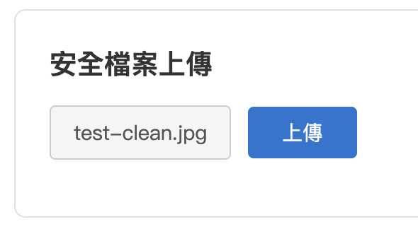
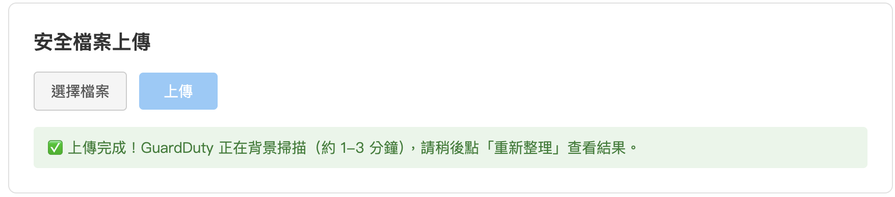
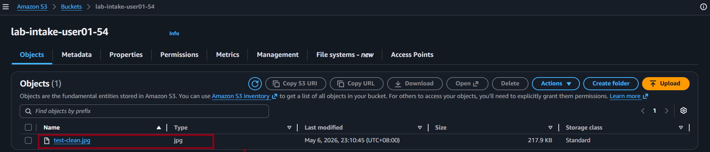
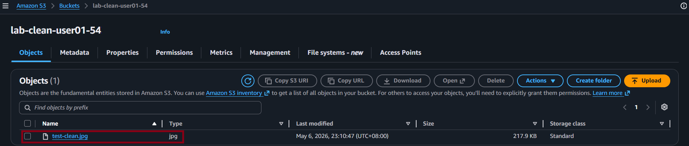
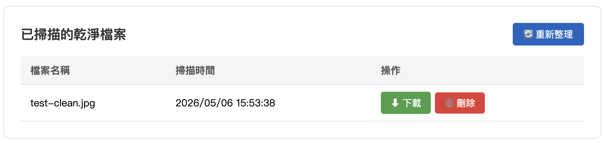
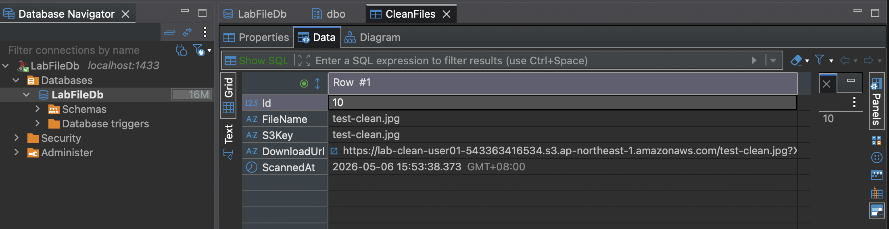
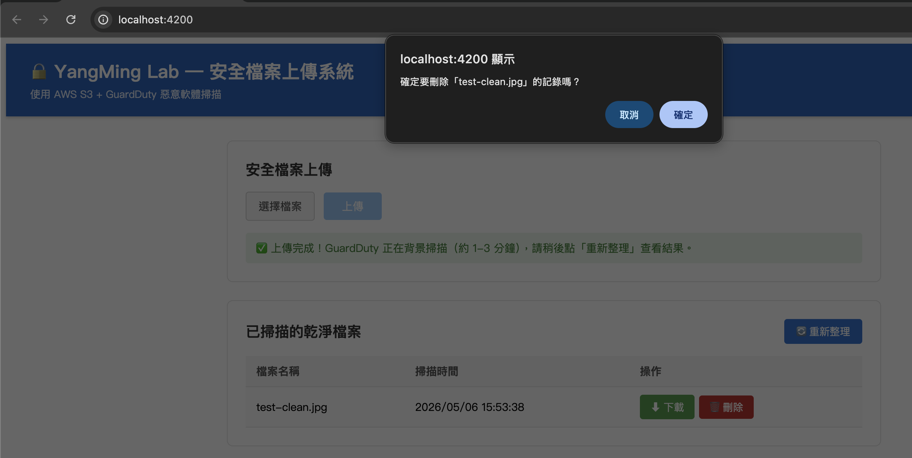
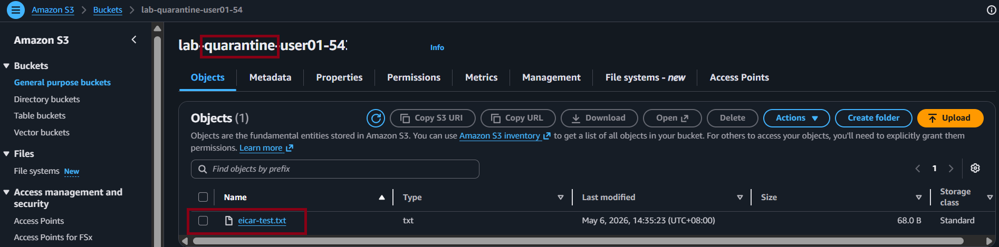

# Task 3：端到端驗證

::badge[30 分鐘]{type="default"}

---

## 目標

實際上傳檔案，驗證整條自動化流程是否正常運作：

**前端上傳 → GuardDuty 掃描 → Lambda 分流 → SQS 通知 → 後端寫入 DB → 前端列表顯示**

---

## 準備：確認所有服務已啟動

| 服務 | 位址 | 確認方式 |
|------|------|----------|
| SQL Server（Docker） | ``localhost,1433`` | ``docker ps`` 看到 ``lab-sqlserver`` 狀態為 Up |
| .NET Web API | ``http://localhost:5001`` | 終端機顯示 "Now listening on: http://localhost:5001" |
| Angular 前端 | ``http://localhost:4200`` | 瀏覽器可正常開啟頁面 |

---

## 測試 1：上傳正常檔案（Clean Flow）

這個測試驗證乾淨檔案能正確流入 Clean Bucket、URL 寫入 DB，並出現在前端列表。

### 上傳階段

::steps

1. 開啟 ``http://localhost:4200``

2. 選擇 ``test-clean.jpg`` 並點擊上傳

   

3. 上傳完成後，頁面顯示「完成」狀態

   

:::

:::alert{type="info"}
**重要：GuardDuty 掃描需要時間**

上傳完成只代表檔案已進入 S3 Intake Bucket，GuardDuty **尚未完成掃描**，SQS 裡還沒有訊息。

GuardDuty 掃描需要約 **30 ~ 60 秒**。``process-notifications`` 是在你點擊「**🔄 重新整理**」按鈕時才會被呼叫。
:::

### 等待掃描

::steps

5. 前往 AWS Console → **S3** → ``IntakeBucket``

6. 確認 ``test-clean.jpg`` 已出現

   

7. 等待約 **30 ~ 60 秒**

:::

### 確認結果

::steps

8. 在前端點擊「重新整理」按鈕，再次觸發 ``POST /api/upload/process-notifications``

9. 確認以下結果

   

:::

| 驗證點 | 預期結果 |
|--------|----------|
| S3 IntakeBucket | ``test-clean.jpg`` 仍在（Lambda 只複製，不刪除）|
| S3 CleanBucket | ``test-clean.jpg`` 出現 ::status[✓]{type="success"} |
| 前端 Clean 檔案列表 | 出現 ``test-clean.jpg``，有下載按鈕 ::status[✓]{type="success"} |
| 點擊下載按鈕 | 在新分頁成功下載檔案 ::status[✓]{type="success"} |



::steps

10. 用 SQL 工具查詢資料庫，確認記錄已寫入
    
    ```sql
    SELECT * FROM LabFileDb.dbo.CleanFiles;
    ```
    
    應看到一筆記錄，``FileName`` 為 ``test-clean.jpg``，``DownloadUrl`` 為 S3 Pre-signed URL

    

11. 測試刪除功能：
    - 在 Clean 檔案列表找到 ``test-clean.jpg``，點擊「刪除」按鈕
    - 確認跳出確認對話框
    
    
    
    - 點擊確認後，該筆記錄從列表移除 ::status[✔]{type="success"}

12. 用 SQL 查詢確認記錄已從 DB 刪除
    
    ```sql
    SELECT * FROM LabFileDb.dbo.CleanFiles WHERE FileName = 'test-clean.jpg';
    -- 應回傳 0 筆
    ```

:::

:::alert{type="info"}
**刪除按鈕的行為**

刪除按鈕只刪除 DB 記錄，S3 CleanBucket 中的檔案本身仍然存在。
:::

---

## 測試 2：上傳惡意軟體測試檔（Infected Flow）

這個測試驗證惡意檔案能被正確隔離，且**不會**出現在前端列表或 DB 中。

::steps

1. 選擇 ``eicar-test.txt`` 並點擊上傳

2. 等待 GuardDuty 掃描完成（約 30 ~ 60 秒）

3. 點擊「重新整理」，觸發 ``POST /api/upload/process-notifications``

4. 確認以下結果

   

:::

| 驗證點 | 預期結果 |
|--------|----------|
| S3 QuarantineBucket | ``eicar-test.txt`` 出現（已被隔離）::status[✓]{type="success"} |
| 前端 Clean 檔案列表 | **不出現** ``eicar-test.txt`` ::status[✓]{type="success"} |
| DB CleanFiles 資料表 | **沒有** ``eicar-test.txt`` 的記錄 ::status[✓]{type="success"} |

:::alert{type="info"}
**安全邊界設計**

``INFECTED`` 的檔案只會進 Quarantine Bucket，後端在處理 SQS 訊息時，只有 ``CLEAN`` 狀態才會觸發寫入 DB 的邏輯。這是設計上的安全邊界。
:::

---

## 流程驗證清單

| 流程步驟 | 狀態 |
|---------|:----:|
| 前端直傳 S3 | ☐ |
| GuardDuty 自動掃描 | ☐ |
| EventBridge 捕捉事件、觸發 Lambda | ☐ |
| Lambda 根據結果分流至 Clean / Quarantine Bucket | ☐ |
| Lambda 發送 SQS 通知 | ☐ |
| 手動點「🔄 重新整理」觸發後端 SQS 輪詢 | ☐ |
| CLEAN 檔案 URL 寫入 SQL Server | ☐ |
| 前端列表顯示 Clean 檔案，使用者可下載 | ☐ |
| 刪除按鈕正確刪除 DB 記錄（不影響 S3 檔案）| ☐ |

---

## ✅ Task 3 回顧

兩個測試都通過，代表整條流程完全打通！

目前的程式碼是「直接寫」的版本，AWS SDK 邏輯直接寫在 Controller 和 Component 裡。接下來的 Task 4 會把這些邏輯抽離封裝成可重用的套件。

---

:::banner{type="success"}
**🎉 端到端驗證完成！**

整條自動化流程已經完全打通。接下來我們將進行企業級套件封裝，讓這些邏輯可以在多個專案中重用。
:::
