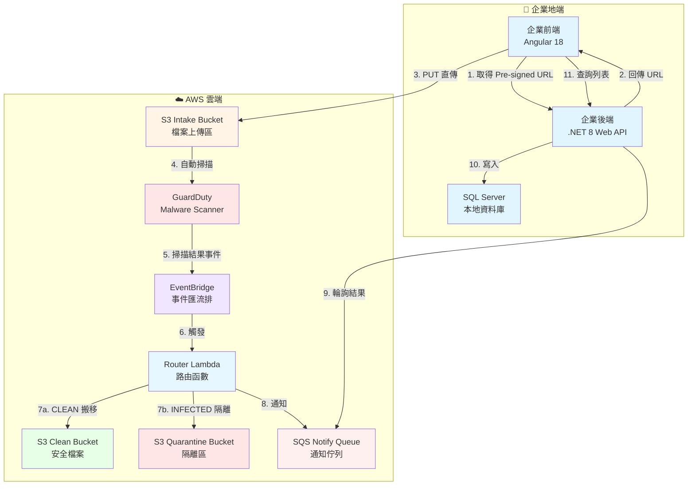

# AWS GuardDuty S3 惡意軟體掃描與自動化隔離實戰 Lab

> 🛡️ 建立企業級安全檔案上傳系統，整合 AWS GuardDuty 惡意軟體掃描、EventBridge 事件驅動、Lambda 自動化處理

本 Workshop 已成功整合至 ECV Workshop 平台。

---

## 🎯 學習目標

- 🔐 實作 S3 Pre-signed URL 安全上傳機制
- 🛡️ 整合 AWS GuardDuty 惡意軟體自動掃描
- ⚡ 建立 EventBridge 事件驅動架構
- 🤖 使用 Lambda 實現自動化檔案分流
- 📨 透過 SQS 實現非同步通知處理
- 📦 封裝企業級可重用套件（NuGet + NPM）
- 🤖 體驗 Kiro Spec 模式 AI 輔助開發

---

## 🏗️ 系統架構



---

## 🚀 快速開始

### 訪問方式

1. **啟動本地開發伺服器**
   ```bash
   cd ecv-aws-workshop
   python3 -m http.server 8080
   ```

2. **開啟瀏覽器訪問**
   ```
   http://localhost:8080
   ```

3. **找到 Workshop**
   
   在首頁卡片中找到「AWS GuardDuty S3 惡意軟體掃描與自動化隔離實戰」

---

## 📚 Workshop 結構

| Task | 主題 | 預估時間 | 重點內容 |
|:----:|------|:--------:|----------|
| **Task 0** | 事前準備 | 15 mins | 環境檢查清單、工具安裝 |
| **Task 1** | 基礎設施佈署 | 30 mins | CloudFormation IaC、AWS 資源建立 |
| **Task 2** | 系統建置 | 90 mins | Kiro Spec 模式開發、前後端實作 |
| **Task 3** | 端到端測試 | 30 mins | 完整流程驗證、Clean/Infected 測試 |
| **Task 4** | 套件封裝 | 60 mins | NuGet + NPM 套件封裝 |
| **Task 5** | 封裝後驗證 | 20 mins | 重構確認、行為一致性驗證 |
| **Task 6** | 資源清除 | 10 mins | AWS 資源清理、成本控制 |

**總時長**：約 4-5 小時

---

## ✨ 內容特色

### 🎨 使用 ECV Workshop 自訂語法

- **互動式步驟**：`::steps` 自動編號步驟指引
- **可展開區塊**：`:::expand` 隱藏詳細說明
- **狀態標籤**：`::status` 顯示成功/失敗狀態
- **提示框**：`:::alert` 重要提示與警告
- **橫幅訊息**：`:::banner` 階段性成果展示
- **程式碼複製**：一鍵複製程式碼區塊
- **Mermaid 圖表**：視覺化架構與流程

### 🎯 學習體驗優化

- ✅ 29 張高品質操作截圖
- ✅ 完整的檢查清單
- ✅ 響應式設計（支援手機/平板）
- ✅ 深色/淺色主題切換
- ✅ 無障礙設計（WCAG 2.1 AA）

---

## 🛠️ 技術棧

### 後端
- .NET 8 Web API
- AWS SDK for .NET
- Microsoft.Data.SqlClient
- SQL Server 2022

### 前端
- Angular 18 (Standalone)
- TypeScript
- RxJS
- Angular HttpClient

### AWS 服務
- Amazon S3
- AWS GuardDuty
- AWS Lambda (Python)
- Amazon EventBridge
- Amazon SQS
- AWS CloudFormation
- AWS IAM

### 開發工具
- Kiro (AI 輔助開發)
- Docker Desktop
- Azure Data Studio / DBeaver
- Visual Studio Code

---

## 📦 產出物

完成本 Workshop 後，你將擁有：

1. **CloudFormation 範本** (`lab-infra.yaml`)
   - 可重複佈署的 IaC 範本
   - 包含 7 個 AWS 資源

2. **NuGet 套件** (`YangMing.CloudStorage.Core`)
   - 封裝 S3 Pre-signed URL 產生
   - 封裝 SQS 通知處理
   - 支援依賴注入（DI）

3. **NPM 套件** (`ym-cloud-storage-ui`)
   - Angular Standalone Component
   - 封裝安全上傳邏輯
   - 可在多個專案中重用

4. **完整應用程式**
   - .NET 8 Web API (`YangMing.LabApi`)
   - Angular 18 前端 (`ym-lab-frontend`)
   - 整合 SQL Server 資料庫

---

## 📸 截圖清單

本 Workshop 包含 29 張操作截圖，涵蓋：

- ✅ CloudFormation 佈署流程 (7 張)
- ✅ Kiro Spec 開發流程 (8 張)
- ✅ 端到端測試驗證 (9 張)
- ✅ 套件封裝成功 (3 張)
- ✅ 資源清理步驟 (2 張)

詳細清單請參考 [`SCREENSHOT_CHECKLIST.md`](SCREENSHOT_CHECKLIST.md)

---

## 🔗 相關資源

- **原始檔案**：`s3-upload-workshop/` 目錄（已保留作為參考）
- **CloudFormation 範本**：`lab-infra.yaml`
- **截圖清單**：`SCREENSHOT_CHECKLIST.md`

---

## 📝 授權

本 Workshop 內容由 eCloudvalley Digital Technology 提供。

© 2026 eCloudvalley Digital Technology
