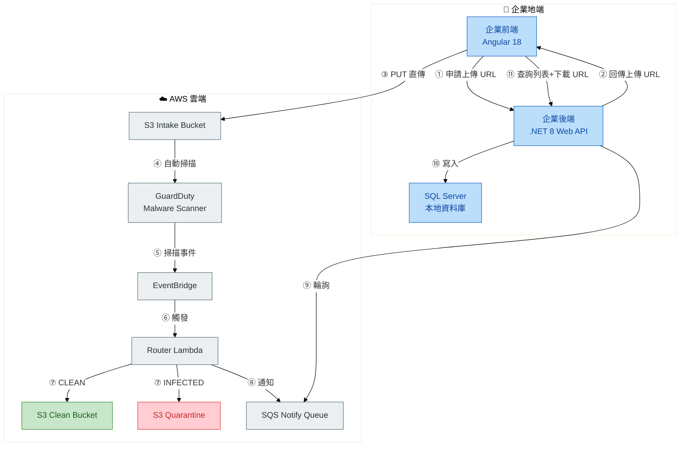

# 工作坊概觀

::badge[HANDS-ON LAB]{type="info"} ::badge[約 4-5 小時]{type="default"} ::badge[進階]{type="warning"}

在這場 Workshop 中，你將從零開始建立一套企業級的安全檔案上傳系統，整合 AWS GuardDuty 惡意軟體掃描、EventBridge 事件驅動架構、Lambda 自動化處理，並將核心邏輯封裝成可重用的 .NET NuGet 套件與 Angular NPM 套件。

---

## 學習目標

- 前端透過 **Pre-signed URL** 直接將檔案上傳至 S3，不經過後端伺服器
- 上傳後自動觸發 **GuardDuty** 進行惡意軟體掃描
- 掃描結果透過 **EventBridge + Lambda** 自動分流：乾淨的檔案進 Clean Bucket，有問題的進 Quarantine Bucket
- 後端透過輪詢 **SQS** 取得掃描結果，將通過的檔案 URL 寫入本地 SQL Server
- 前端從資料庫查詢 Clean 檔案列表，提供使用者下載
- 將 AWS SDK 核心邏輯封裝成 **.NET NuGet 套件** 與 **Angular NPM 套件**，實現企業級程式碼重用
- 體驗 **Kiro Spec 模式** AI 輔助開發流程

---

## 系統架構

---

## 工作坊流程

| Task | 內容 | 預估時間 |
|------|------|----------|
| Task 0 - 事前準備 | 環境檢查與工具安裝 | 15 mins |
| Task 1 - 基礎設施佈署 | 使用 CloudFormation 建立 AWS 資源 | 30 mins |
| Task 2 - 系統建置 | 用 Kiro Spec 模式建立安全上傳系統 | 90 mins |
| Task 3 - 端到端測試 | 驗證完整流程 | 30 mins |
| Task 4 - 套件封裝 | 封裝 NuGet 與 NPM 套件 | 60 mins |
| Task 5 - 封裝後驗證 | 確認重構後功能正常 | 20 mins |

---

## 完成後你將擁有

| 產出物 | 說明 |
|--------|------|
| **lab-infra.yaml** | 可重複佈署的 CloudFormation 範本，包含 7 個 AWS 資源 |
| **YangMing.CloudStorage.Core** | NuGet 套件：封裝 S3 Pre-signed URL 與 SQS 通知處理，支援 DI |
| **ym-cloud-storage-ui** | NPM 套件：封裝安全上傳元件，可在多專案中重用 |
| **YangMing.LabApi** | .NET 8 Web API，整合套件、資料庫寫入與檔案列表查詢 |
| **ym-lab-frontend** | Angular 18 前端，整合上傳元件與 Clean 檔案下載 |

---

## 前置需求

### AWS 帳號與權限

- AWS 帳號，具備 S3、GuardDuty、Lambda、EventBridge、SQS、CloudFormation、IAM 操作權限
- 操作區域：**ap-northeast-1（東京）**
- 個人專屬的 **StudentID**（格式：小寫英數字，例如 `user01`）

### 本機開發環境

**後端（.NET）**
- [.NET 8 SDK](https://dotnet.microsoft.com/download/dotnet/8.0)

**前端（Angular）**
- [Node.js 20 LTS](https://nodejs.org/)
- Angular CLI 18+

**編輯器與 AI 工具**
- [Visual Studio Code](https://code.visualstudio.com/) 或 Visual Studio 2022
- [Kiro](https://kiro.dev)（本 Lab 的核心工具）

**資料庫**
- [Docker Desktop](https://www.docker.com/products/docker-desktop/)
- SQL 工具：[Azure Data Studio](https://azure.microsoft.com/products/data-studio) 或 [DBeaver](https://dbeaver.io/)

---

:::alert{type="warning"}
本工作坊會建立 Lambda、SQS、GuardDuty 等計費資源，完成後請務必執行資源清除步驟，避免產生額外費用。
:::

