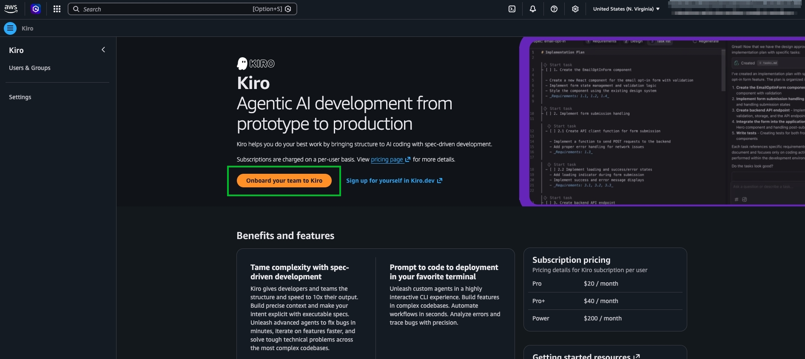
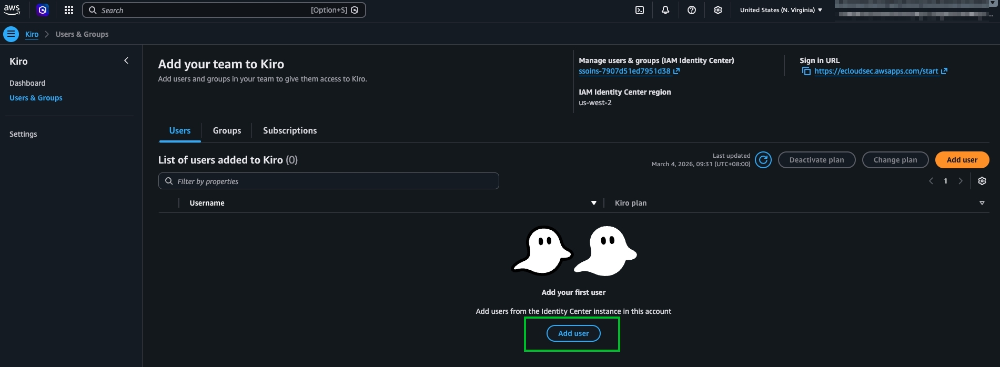
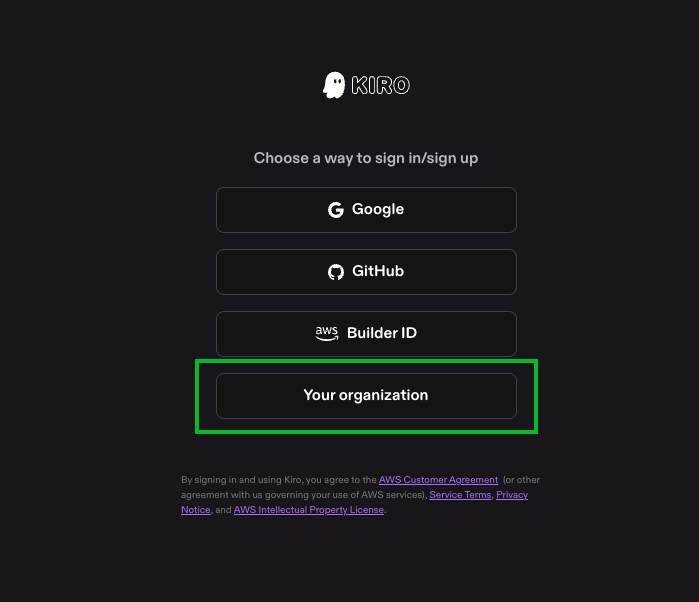
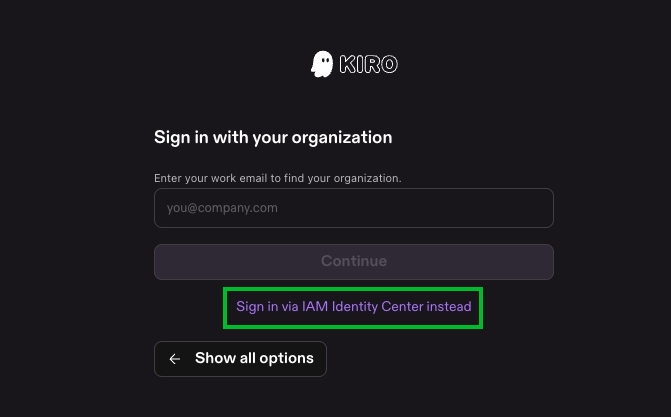
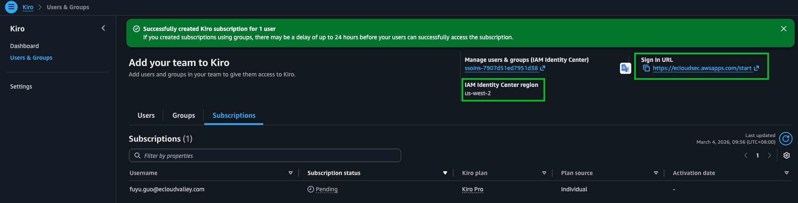
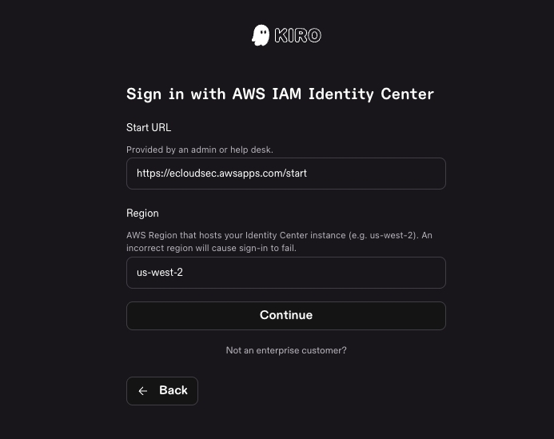
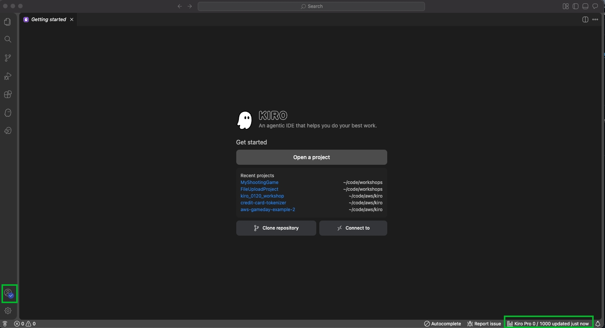

# Kiro 帳號註冊及登入前置作業

## Prerequisites

- 已安裝 [Kiro IDE](https://kiro.dev/downloads/)
- 已有 AWS IAM Identity Center 帳號

---

## 於 AWS Console 註冊 Kiro 帳號

:::steps
1. 登入 AWS Console，在搜尋框查詢 `Kiro`

   

2. 點選 **Onboard your team to Kiro**

   

3. 選擇 **IAM Identity Center**

   

4. 填寫 Email address

   

5. 點選 **Enable**

   

6. 串接好 Identity Center 之後，新增 User

   
   

7. 在搜尋框查詢 User 名稱，並點擊 **Assign**

   
   
   
:::

---

## 於 Kiro IDE 登入 AWS 訂閱的帳號

:::steps
1. 在本機電腦開啟 Kiro IDE，點擊 **Sign in**

   
   

2. 點選 **Sign in via IAM Identity Center instead**

   

3. 填寫 IAM Identity Center 的 Sign in URL 及 Region，然後點選 **Continue**

   
   
   

4. 登入成功

   
:::

:::alert{type="success"}
完成登入後即可開始使用 Kiro IDE 進行開發。
:::
