# 透過 Kiro 開發一個 Shooting Game (30~40 mins)

### Prerequisites

- 已安裝 [Kiro IDE](https://kiro.dev/downloads/)
- 已準備 Kiro 帳號（Org Identity 或是 Builder ID）
- 已安裝 [uv](https://docs.astral.sh/uv/getting-started/installation/) (MCP Servers)
- 已安裝 [AWS CDK](https://docs.aws.amazon.com/zh_tw/cdk/v2/guide/getting-started.html)

### Vibe Coding vs. Spec Coding


### 前置作業

▶️  本地先創建一個 `MyShootingGame` 的資料夾

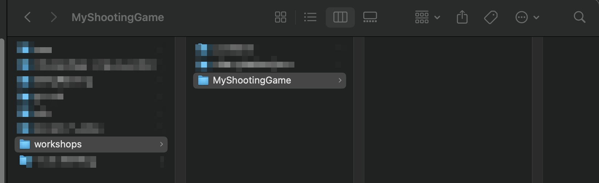

▶️  開啟 Kiro 編輯器


▶️  透過 Kiro 開啟 MyShootingGame 專案


確認右邊出現 Vibe / Spec 的選單

### Exercise - Vibe

Web base shooting game

```json
Please help me to build a web-based shooting game use keyboard control, including a quick instruction page
```


1. 使用 Vibe
2. 模型選用 Claude Sonnet 4.5
3. 貼上 Prompt


▶️  如果有缺少 README.md，可直接請 Kiro 撰寫

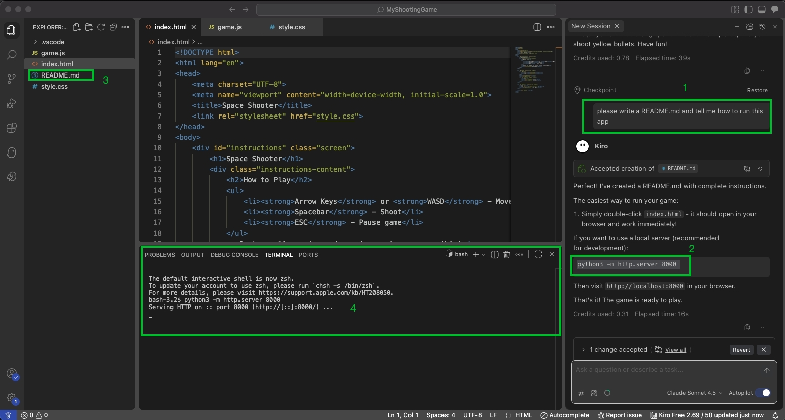


Kiro 透過 WASD 按鍵作為移動指令。但實測發現 D 無法往右走，這沒關係，都可以隨時修正。

▶️  進行 Bug-Fixing

```json
I want to move with arrow keys, not WASD
```

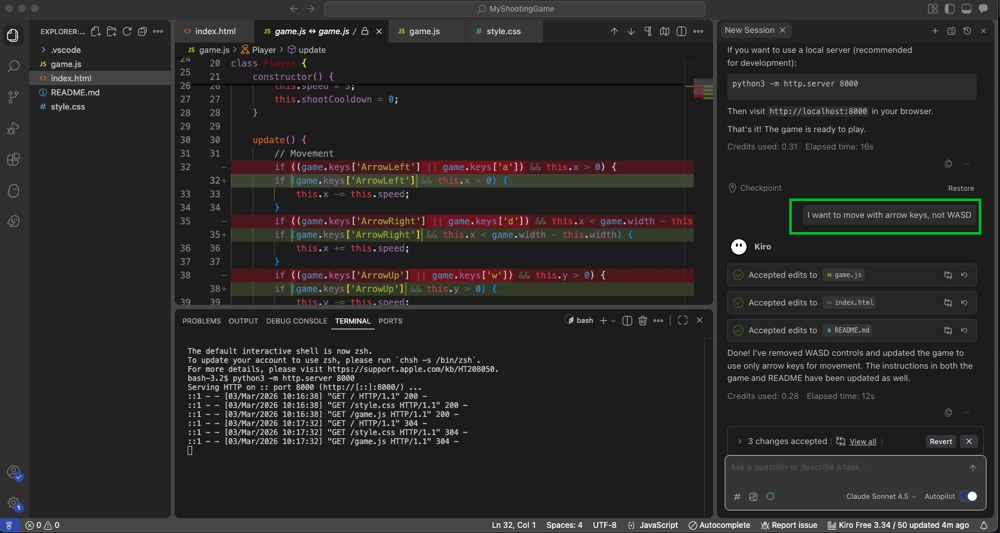

▶️  甚至於可以添加新的功能 Feature-Development

```json
I hope this game can have a health bar and a rating system.
```

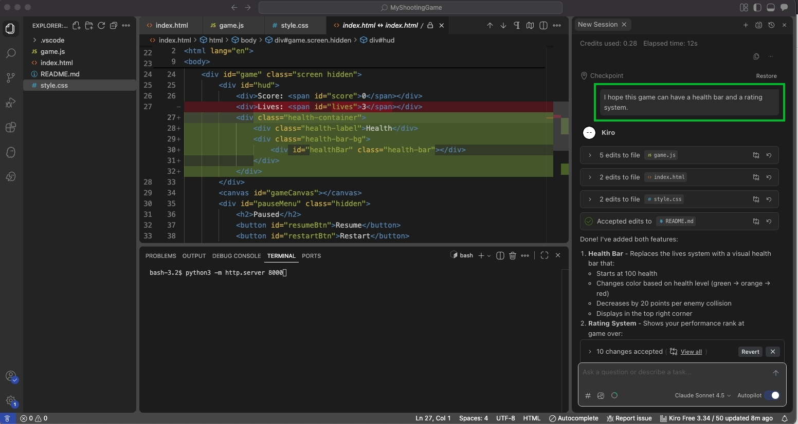

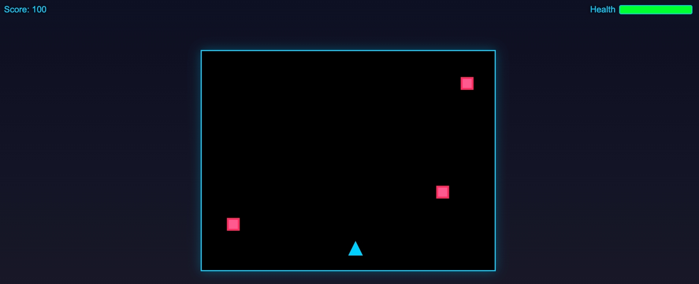

### Exercise - Steering

💡 什麼是 Steering Docs？


▶️ 點選 Generate Steering Docs

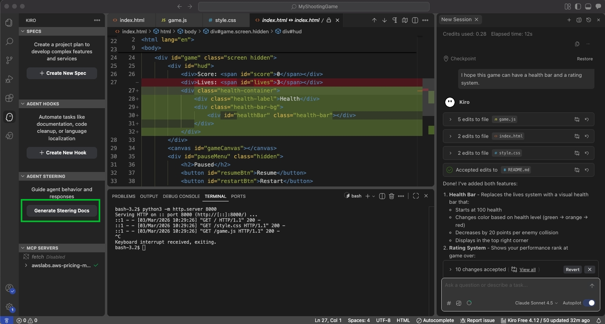

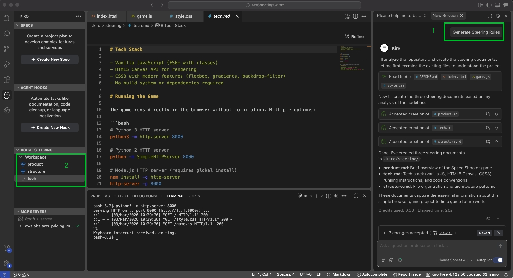

### Exercise - Spec


Spec coding 的主要三個檔案


在 Requirements.md 描述 **Acceptance Criteria** 時的技巧

```json
Create a more comprehensive modern web-based shooting application with following high-level requirements:

1) A healthy bar or status of enemies for user to understand how many time left to take it down 
2) Allow user to select different character, please refer to 1) Annabelle  2) joker 3) Jason Voorhees.
3) Implement a power-up system , add some random items temporarily power up the character. Such as shooting more fast, or shooting more wide, please create 6 different items, the more special the better, also include explanation of the power up items
```

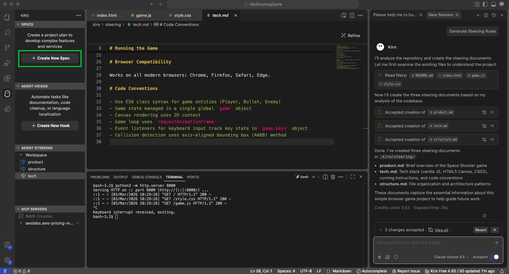


在中間貼上 Spec-Coding 的提示詞

開始 Spec-Coding 產出 requirements.md 檔案

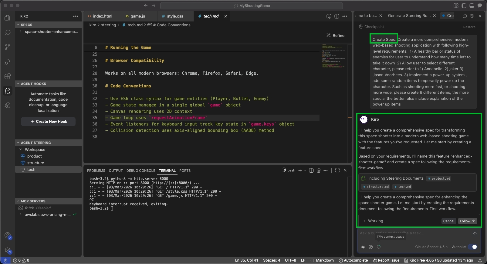

開始產出 Spec-Coding（requirements.md）

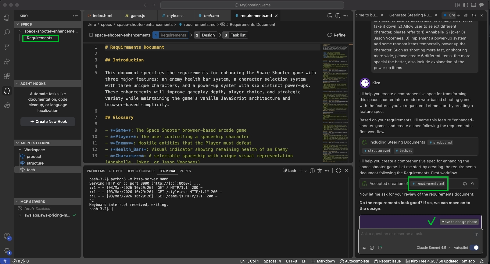

檢視一下 requirements.md 並稍作調整，假設都沒問題之後，在右方點擊 **Move to design phase**

開始 Spec-Coding 產出 design.md 檔案

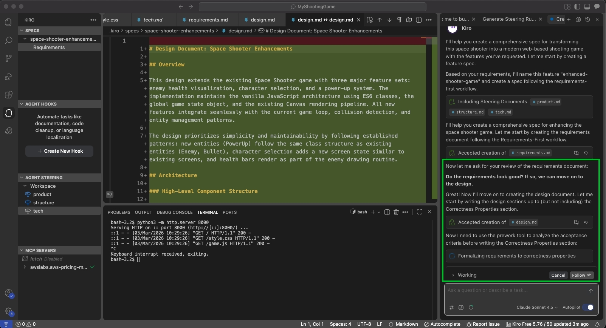

開始撰寫 design.md

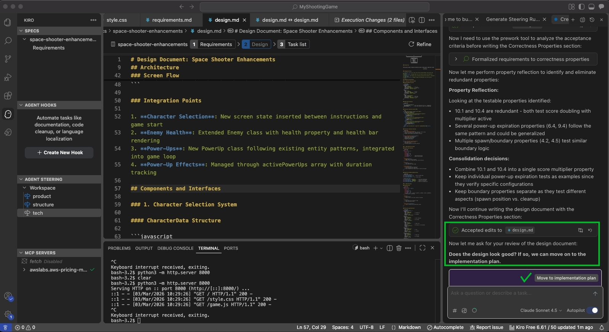

檢視一下 design.md 並稍作調整，假設都沒問題之後，在右方點擊 **Move to implementation plan**

開始 Spec-Coding 產出 tasks.md 檔案

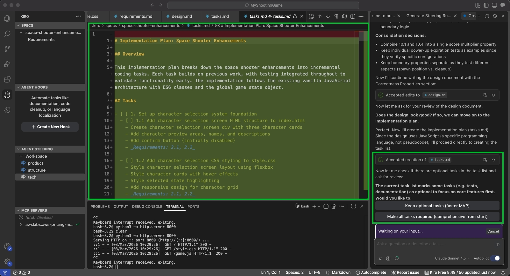

這邊記得先反饋給 Kiro：**looks good to me**

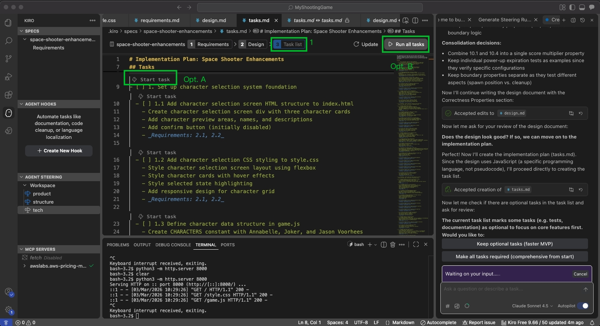

我選擇 Opt. A，開始執行 Task 1，等完成後先進行本地測試。


▶️ 本地驗證完成之後，接著開始執行 Task 2


發現選擇不同角色，箭頭有不同的視覺呈現效果

▶️ 本地驗證完成之後，接著開始執行 Run all tasks，並等待它完成

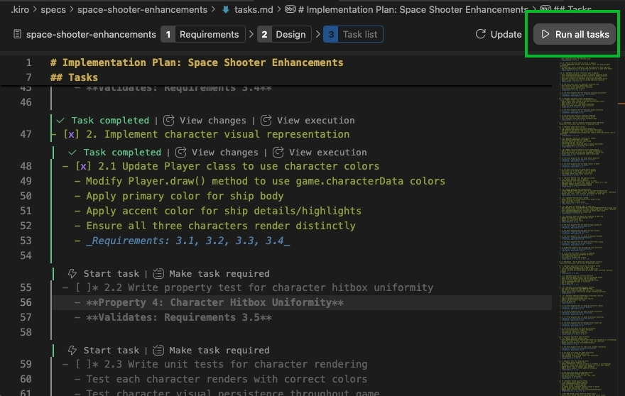


需要 Follow 並且隨時與 Kiro 互動，協助它完成驗證並且讓 Kiro 繼續下一個 Task。


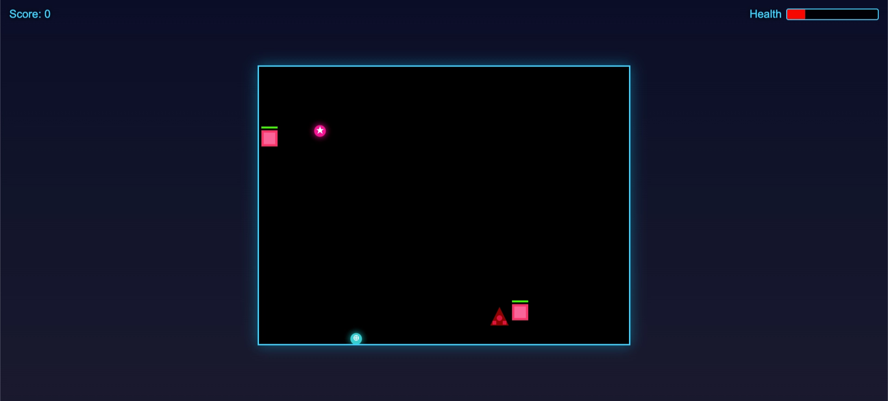


> 💡 全部執行完成將會花費 hours 時間，因此可以在恰當的時機點執行 Cancel，完成 Kiro 開發的初體驗。
> 

### Exercise - MCP

> ⚠️ Before you start this exercise, please make sure you have install the uv command in your environment. To check the uv command whether has been installed, you could use following commnad:
> 

```json
$ uv self version
```

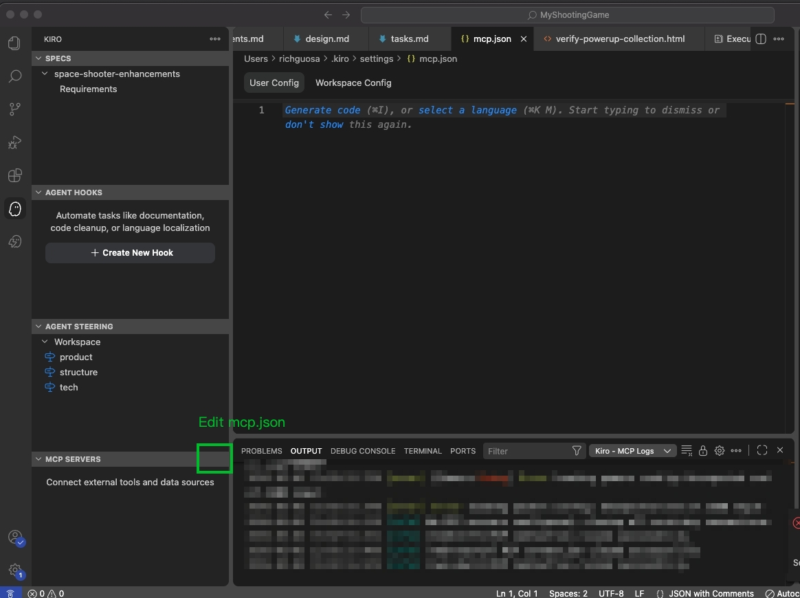

In this workshop, we will add:

- **AWS Documentation MCP Server**: This MCP server provides tools to access AWS documentation, search for content, and get recommendations.
- **AWS Diagram MCP Server**: This MCP server that seamlessly creates diagrams using the Python diagrams package DSL. This server allows you to generate AWS diagrams, sequence diagrams, flow diagrams, and class diagrams using Python code.
- **AWS CDK MCP Server**: MCP server for AWS Cloud Development Kit (CDK) best practices, infrastructure as code patterns, and security compliance with CDK Nag.

```json
{
  "mcpServers": {
    "awslabs.aws-documentation-mcp-server": {
      "command": "uvx",
      "args": ["awslabs.aws-documentation-mcp-server@latest"],
      "env": {
        "FASTMCP_LOG_LEVEL": "ERROR",
        "AWS_DOCUMENTATION_PARTITION": "aws"
      },
      "disabled": false,
      "autoApprove": []
    },
    "awslabs.cdk-mcp-server": {
      "command": "uvx",
      "args": [
        "awslabs.cdk-mcp-server@latest"
      ],
      "env": {
        "FASTMCP_LOG_LEVEL": "ERROR"
      },
      "disabled": false,
      "autoApprove": [
        "GetAwsSolutionsConstructPattern"
      ]
    },
    "awslabs.aws-diagram-mcp-server": {
      "command": "uvx",
      "args": [
        "awslabs.aws-diagram-mcp-server"
      ],
      "env": {
        "FASTMCP_LOG_LEVEL": "ERROR"
      },
      "disabled": false,
      "autoApprove": [
        "list_icons",
        "list_icons",
        "generate_diagram",
        "get_diagram_examples",
        "list_icons"
      ]
    }
  }
}
```


💡 AWS 有提供非常多個 MCP Servers

[Welcome to Open Source MCP Servers for AWS](https://awslabs.github.io/mcp/)

### (Optional) Exercise - Hooks

We want agent hooks to help us monitoring the CDK resource files change, and keep generating the AWS service diagram by using AWS Diagram MCP Server.

```
1) Analyze the modified CDK files and generate or update AWS service architecture diagrams using the PPython diagrams package DSL.
2) Parse the CDK code to identify AWS services, their relationships, and data flow.
3) If the previous diagram not exist, create a visual representation showing the infrastructure components, connections, and dependencies. Include proper grouping for VPCs, subnets, and logical service boundaries.
4) delete the previous diagram before create new one. Output the Python diagrams code that can be executed to generate the architecture diagram.
```

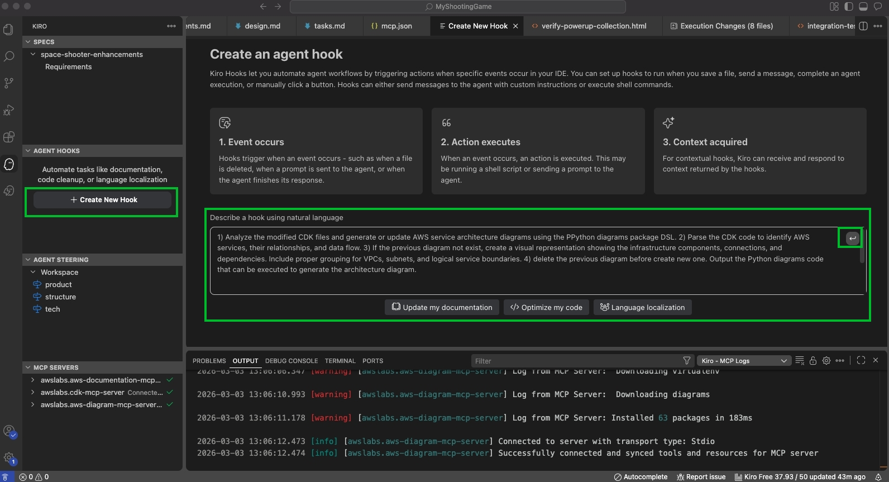


### (Optional) **Exercise - Create a new Spec for AWS enviroment deployment**

web-base shooting game (再另外創建一個 spec-coding)

```json
I have a web-based shooting application need to deploy to AWS Cloud. Create a comprehensive AWS architecture with following high-level requirements:
1) Must use AWS serverless services, such as Cloudfront, S3, etc..
2) Follow each service's configuration best practice
3) Prefer to use Infrasturce as Code solution to deploy, such as AWS CDK.
4) Since we are in demo, please do not add any new feature for the game.
```


https://github.com/lyhsiang/AWS-Kiro-Workshops/blob/main/Spec-Coding/Kiro-Spec-Workshop.md