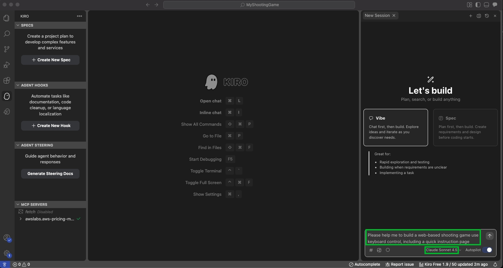

# 透過 Kiro 開發一個 Shooting Game

:::banner{type="info"}
預計完成時間：**30 ~ 40 分鐘**
:::

## Prerequisites

- 已安裝 [Kiro IDE](https://kiro.dev/downloads/)
- 已準備 Kiro 帳號（Org Identity 或是 Builder ID）
- 已安裝 [uv](https://docs.astral.sh/uv/getting-started/installation/)（用於 MCP Servers）
- 已安裝 [AWS CDK](https://docs.aws.amazon.com/zh_tw/cdk/v2/guide/getting-started.html)

---

## Vibe Coding vs. Spec Coding


---

## 前置作業

:::steps
1. 本地先創建一個 `MyShootingGame` 的資料夾

   

2. 開啟 Kiro 編輯器

   

3. 透過 Kiro 開啟 MyShootingGame 專案，確認右邊出現 Vibe / Spec 的選單

   
:::

---

## Exercise - Vibe

:::alert{type="info"}
使用 Vibe 模式快速生成一個 Web-based Shooting Game。
:::

輸入以下 Prompt：

```
Please help me to build a web-based shooting game use keyboard control, including a quick instruction page
```




如果有缺少 README.md，可直接請 Kiro 撰寫：


### Bug Fixing

```
I want to move with arrow keys, not WASD
```


### Feature Development

```
I hope this game can have a health bar and a rating system.
```


---

## Exercise - Steering

:::alert{type="info"}
Steering Docs 是 Kiro 的專案規範文件，讓 AI 在整個專案中保持一致的開發風格與規則。
:::


:::steps
1. 點選 Generate Steering Docs

   

2. 確認生成結果

   
:::

---

## Exercise - Spec

:::alert{type="info"}
Spec Coding 透過三個核心文件（requirements.md、design.md、tasks.md）引導 AI 進行結構化開發。
:::


輸入以下 Prompt 開始 Spec Coding：

```
Create a more comprehensive modern web-based shooting application with following high-level requirements:

1) A healthy bar or status of enemies for user to understand how many time left to take it down 
2) Allow user to select different character, please refer to 1) Annabelle  2) joker 3) Jason Voorhees.
3) Implement a power-up system , add some random items temporarily power up the character. Such as shooting more fast, or shooting more wide, please create 6 different items, the more special the better, also include explanation of the power up items
```


:::steps
1. 開始產出 requirements.md

   

2. 檢視 requirements.md 並稍作調整，確認後點擊 **Move to design phase**

   

3. 開始撰寫 design.md

   

4. 檢視 design.md 並稍作調整，確認後點擊 **Move to implementation plan**

   

5. 回饋 **looks good to me** 讓 Kiro 繼續產出 tasks.md

   

6. 選擇 Opt. A，開始執行 Task 1，完成後進行本地測試

   
:::

本地驗證 Task 1：


本地驗證完成後，繼續執行 Task 2：


本地驗證完成後，執行 Run all tasks 並等待完成：


:::alert{type="warning"}
全部執行完成將會花費數小時，因此可以在恰當的時機點執行 Cancel，完成 Kiro 開發的初體驗。
:::

---

## Exercise - MCP

:::alert{type="warning"}
Before you start this exercise, please make sure you have installed the `uv` command. To verify:
:::

```bash
uv self version
```


本次 Workshop 將加入以下三個 MCP Servers：

- **AWS Documentation MCP Server** — 存取 AWS 官方文件、搜尋內容與取得建議
- **AWS Diagram MCP Server** — 使用 Python diagrams 套件產生 AWS 架構圖、流程圖等
- **AWS CDK MCP Server** — 提供 CDK 最佳實踐、IaC 模式與 CDK Nag 安全合規建議

將以下設定加入 Kiro 的 MCP 設定檔：

```json
{
  "mcpServers": {
    "awslabs.aws-documentation-mcp-server": {
      "command": "uvx",
      "args": ["awslabs.aws-documentation-mcp-server@latest"],
      "env": {
        "FASTMCP_LOG_LEVEL": "ERROR",
        "AWS_DOCUMENTATION_PARTITION": "aws"
      },
      "disabled": false,
      "autoApprove": []
    },
    "awslabs.cdk-mcp-server": {
      "command": "uvx",
      "args": ["awslabs.cdk-mcp-server@latest"],
      "env": {
        "FASTMCP_LOG_LEVEL": "ERROR"
      },
      "disabled": false,
      "autoApprove": ["GetAwsSolutionsConstructPattern"]
    },
    "awslabs.aws-diagram-mcp-server": {
      "command": "uvx",
      "args": ["awslabs.aws-diagram-mcp-server"],
      "env": {
        "FASTMCP_LOG_LEVEL": "ERROR"
      },
      "disabled": false,
      "autoApprove": ["list_icons", "generate_diagram", "get_diagram_examples"]
    }
  }
}
```


:::alert{type="info"}
AWS 有提供非常多個 MCP Servers，可參考：[Welcome to Open Source MCP Servers for AWS](https://awslabs.github.io/mcp/)
:::

---

## (Optional) Exercise - Hooks

我們希望透過 Agent Hooks 監控 CDK 資源檔案的變更，並自動使用 AWS Diagram MCP Server 產生架構圖。

輸入以下 Prompt 建立 Hook：

```
1) Analyze the modified CDK files and generate or update AWS service architecture diagrams using the Python diagrams package DSL.
2) Parse the CDK code to identify AWS services, their relationships, and data flow.
3) If the previous diagram not exist, create a visual representation showing the infrastructure components, connections, and dependencies. Include proper grouping for VPCs, subnets, and logical service boundaries.
4) delete the previous diagram before create new one. Output the Python diagrams code that can be executed to generate the architecture diagram.
```


---

## (Optional) Exercise - AWS 部署 Spec

為 Web-based Shooting Game 建立一個新的 Spec，規劃 AWS 部署架構：

```
I have a web-based shooting application need to deploy to AWS Cloud. Create a comprehensive AWS architecture with following high-level requirements:
1) Must use AWS serverless services, such as Cloudfront, S3, etc..
2) Follow each service's configuration best practice
3) Prefer to use Infrasturce as Code solution to deploy, such as AWS CDK.
4) Since we are in demo, please do not add any new feature for the game.
```


參考範例：[Kiro Spec Workshop on GitHub](https://github.com/lyhsiang/AWS-Kiro-Workshops/blob/main/Spec-Coding/Kiro-Spec-Workshop.md)
