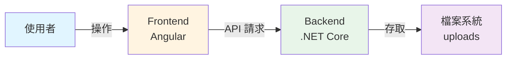
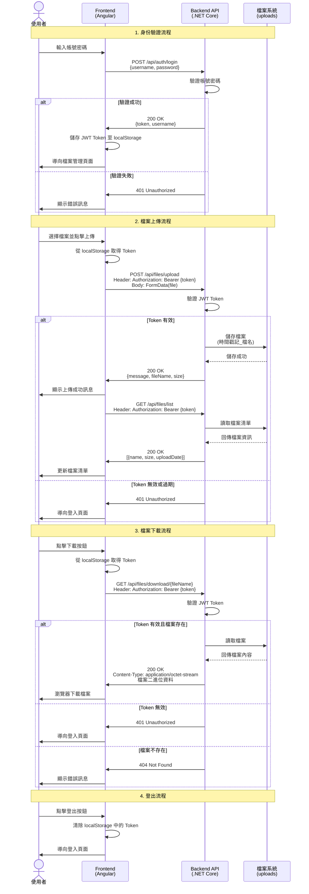
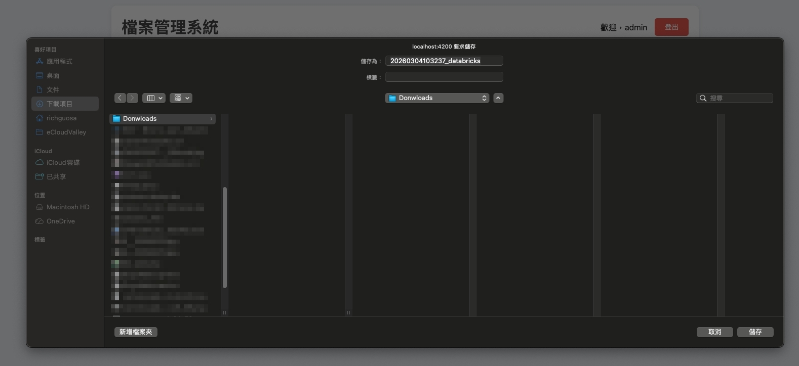
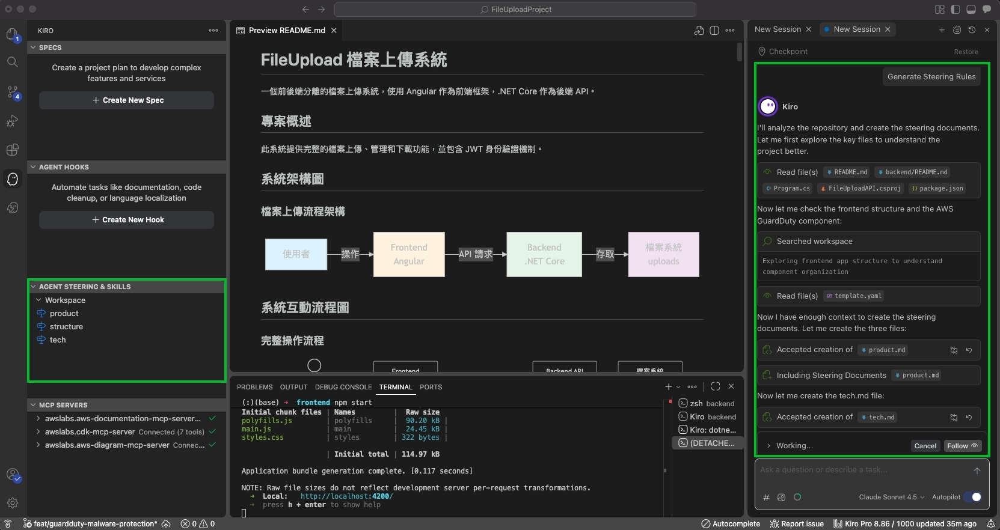

# 透過 Kiro 建立基礎 FileUpload 專案（前後端分離）

### 前置作業

▶️  開啟 Kiro IDE


### 透過 Kiro 開發 FileUpload 程式專案

▶️ 了解目標





▶️  透過 Vibe-coding 輸入以下提示詞

```json
請幫我建立一個前後端分離的 FileUpload 的簡易系統，Frontend使用 Angular，BackendAPI使用 .NET Core，共2份專案，每份專案包含README.md說明文件。

1) Frontend 與 BackendAPI 有一個基本的JWT身份驗證機制，提供使用者進行登入/登出，初始帳號及密碼設置於BackendAPI的配置檔，初始帳號為admin。
2) Frontend 透過 FORM POST 向 BackendAPI 上傳檔案，BackendAPI將檔案存於暫存資料夾。
3) Frontend 透過 GET 請求，向 BackendAPI 讀取檔案清單，呈現於列表畫面，提供使用者下載檔案。
```


")


### 驗證專案成果

> 通常需要檢驗結果，並且回報錯誤給Kiro，引導它進一步完善程式專案。
> 




💡完成驗證 Kiro 的程式專案

[https://github.com/richguosa/FileUploadProject](https://github.com/richguosa/FileUploadProject)

- 紀錄 Kiro Credits 使用率
    
    
### 建立 Kiro Steering



