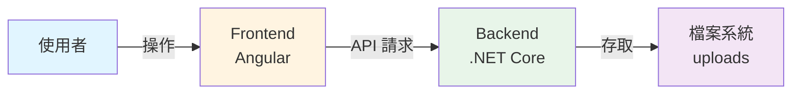
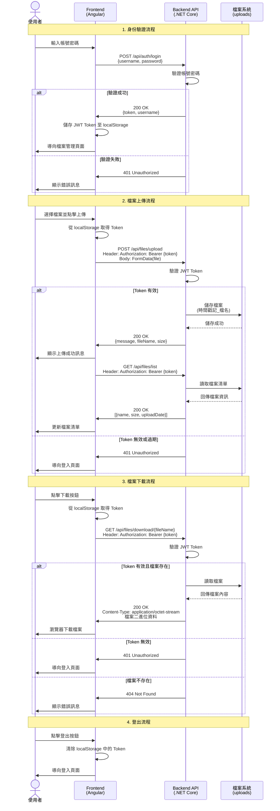

# 透過 Kiro 建立基礎 FileUpload 專案（前後端分離）

### 前置作業

▶️  開啟 Kiro IDE


▶️  透過 Kiro 開啟 FileUploadProject 專案


### 透過 Kiro 開發 FileUpload 程式專案

▶️ 了解目標





▶️  透過 Vibe-coding 輸入以下提示詞

```json
請幫我建立一個前後端分離的 FileUpload 的簡易系統，Frontend使用 Angular，BackendAPI使用 .NET Core，共2份專案，每份專案包含README.md說明文件。

1) Frontend 與 BackendAPI 有一個基本的JWT身份驗證機制，提供使用者進行登入/登出，初始帳號及密碼設置於BackendAPI的配置檔，初始帳號為admin。
2) Frontend 透過 FORM POST 向 BackendAPI 上傳檔案，BackendAPI將檔案存於暫存資料夾。
3) Frontend 透過 GET 請求，向 BackendAPI 讀取檔案清單，呈現於列表畫面，提供使用者下載檔案。
```


▶️  引導 Kiro 完成工作


創建資料夾


確認是否已安裝 ng, donet


協助 kiro 完成 command 並取得回傳


等待 kiro 撰寫程式碼


檢驗 kiro 完成的程式專案，並且補充安裝依賴套件 (e.g. donet sdk)


Backend


Frontend

- backend README.md (參考結果)
    
    ```markdown
    # FileUpload Backend API
    
    這是一個使用 .NET Core 8.0 建立的檔案上傳 Web API，提供 JWT 身份驗證和檔案管理功能。
    
    ## 功能特色
    
    - JWT 身份驗證機制
    - 檔案上傳至暫存資料夾
    - 檔案清單查詢
    - 檔案下載
    
    ## 技術架構
    
    - .NET Core 8.0
    - ASP.NET Core Web API
    - JWT Bearer Authentication
    - CORS 支援
    
    ## 初始設定
    
    ### 預設管理員帳號
    
    在 `appsettings.json` 中設定：
    - 帳號：`admin`
    - 密碼：`admin123`
    
    ### 檔案儲存位置
    
    檔案會儲存在專案根目錄下的 `uploads` 資料夾（自動建立）。
    
    ## 安裝與執行
    
    ### 前置需求
    
    - .NET SDK 8.0 或更高版本
    
    ### 安裝步驟
    
    1. 安裝 .NET SDK（如果尚未安裝）：
       ```bash
       # macOS (使用 Homebrew)
       brew install dotnet-sdk
       
       # 或從官網下載：https://dotnet.microsoft.com/download
       ```
    
    2. 還原套件：
       ```bash
       dotnet restore
       ```
    
    3. 執行應用程式：
       ```bash
       dotnet run
       ```
    
    API 將在 `http://localhost:5000` 或 `https://localhost:5001` 啟動。
    
    ## API 端點
    
    ### 身份驗證
    
    #### 登入
    ```
    POST /api/auth/login
    Content-Type: application/json
    
    {
      "username": "admin",
      "password": "admin123"
    }
    
    回應：
    {
      "token": "eyJhbGciOiJIUzI1NiIsInR5cCI6IkpXVCJ9...",
      "username": "admin"
    }
    ```
    
    ### 檔案管理（需要 JWT Token）
    
    所有檔案管理 API 都需要在 Header 中加入：
    ```
    Authorization: Bearer {your-jwt-token}
    ```
    
    #### 上傳檔案
    ```
    POST /api/files/upload
    Content-Type: multipart/form-data
    
    FormData:
    - file: [檔案]
    
    回應：
    {
      "message": "檔案上傳成功",
      "fileName": "20260304120000_example.pdf",
      "size": 1024
    }
    ```
    
    #### 取得檔案清單
    ```
    GET /api/files/list
    
    回應：
    [
      {
        "name": "20260304120000_example.pdf",
        "size": 1024,
        "uploadDate": "2026-03-04T12:00:00"
      }
    ]
    ```
    
    #### 下載檔案
    ```
    GET /api/files/download/{fileName}
    
    回應：檔案二進位資料
    ```
    
    ## 設定檔說明
    
    ### appsettings.json
    
    ```json
    {
      "JwtSettings": {
        "SecretKey": "密鑰（至少32字元）",
        "Issuer": "發行者",
        "Audience": "接收者",
        "ExpirationMinutes": 60
      },
      "AdminUser": {
        "Username": "admin",
        "Password": "admin123"
      },
      "FileStorage": {
        "TempFolder": "uploads"
      }
    }
    ```
    
    ## 安全性注意事項
    
    1. 在正式環境中，請修改 `JwtSettings.SecretKey` 為更安全的密鑰
    2. 請修改預設的管理員密碼
    3. 考慮使用資料庫儲存使用者資訊而非設定檔
    4. 建議使用 HTTPS 進行通訊
    5. 設定適當的 CORS 政策
    
    ## 開發建議
    
    - 使用 `dotnet watch run` 可以在開發時自動重新載入
    - 查看日誌以了解 API 運作狀況
    - 可以使用 Postman 或 curl 測試 API
    
    ## 疑難排解
    
    ### 無法啟動
    - 確認已安裝 .NET SDK 8.0
    - 檢查連接埠 5000/5001 是否被佔用
    
    ### CORS 錯誤
    - 確認 Frontend 執行在 `http://localhost:4200`
    - 如需修改，請調整 `Program.cs` 中的 CORS 設定
    
    ### JWT 驗證失敗
    - 確認 Token 格式正確：`Bearer {token}`
    - 檢查 Token 是否過期（預設 60 分鐘）
    
    ```
    
- frontend README.md (參考結果)
    
    ```markdown
    # FileUpload Frontend
    
    這是一個使用 Angular 18 建立的檔案上傳系統前端應用程式，提供使用者登入、檔案上傳和檔案管理功能。
    
    ## 功能特色
    
    - JWT 身份驗證（登入/登出）
    - 檔案上傳功能
    - 檔案清單顯示
    - 檔案下載功能
    - 響應式設計
    
    ## 技術架構
    
    - Angular 18
    - TypeScript
    - RxJS
    - Angular Router
    - HttpClient with Interceptors
    - Standalone Components
    
    ## 專案結構
    
    ```
    src/
    ├── app/
    │   ├── components/
    │   │   ├── login/              # 登入元件
    │   │   └── file-manager/       # 檔案管理元件
    │   ├── services/
    │   │   ├── auth.service.ts     # 身份驗證服務
    │   │   └── file.service.ts     # 檔案管理服務
    │   ├── guards/
    │   │   └── auth.guard.ts       # 路由守衛
    │   ├── interceptors/
    │   │   └── auth.interceptor.ts # HTTP 攔截器（自動加入 JWT Token）
    │   ├── models/
    │   │   └── auth.model.ts       # 資料模型
    │   ├── app.routes.ts           # 路由設定
    │   └── app.config.ts           # 應用程式設定
    └── styles.css                  # 全域樣式
    ```
    
    ## 安裝與執行
    
    ### 前置需求
    
    - Node.js 18 或更高版本
    - npm 或 yarn
    
    ### 安裝步驟
    
    1. 安裝相依套件：
       ```bash
       npm install
       ```
    
    2. 啟動開發伺服器：
       ```bash
       npm start
       ```
       或
       ```bash
       ng serve
       ```
    
    3. 開啟瀏覽器訪問：
       ```
       http://localhost:4200
       ```
    
    ### 建置正式版本
    
    ```bash
    npm run build
    ```
    
    建置後的檔案會在 `dist/` 目錄中。
    
    ## 使用說明
    
    ### 登入
    
    1. 開啟應用程式後會自動導向登入頁面
    2. 輸入帳號密碼：
       - 預設帳號：`admin`
       - 預設密碼：`admin123`
    3. 點擊「登入」按鈕
    
    ### 檔案上傳
    
    1. 登入成功後會進入檔案管理頁面
    2. 點擊「選擇檔案」按鈕選擇要上傳的檔案
    3. 點擊「上傳」按鈕完成上傳
    
    ### 檔案管理
    
    - 檔案清單會顯示所有已上傳的檔案
    - 每個檔案顯示：檔案名稱、大小、上傳時間
    - 點擊「下載」按鈕可下載檔案
    
    ### 登出
    
    點擊右上角的「登出」按鈕即可登出系統。
    
    ## API 設定
    
    Backend API 預設位址設定在：
    - `http://localhost:5000`
    
    如需修改，請編輯以下檔案：
    - `src/app/services/auth.service.ts`
    - `src/app/services/file.service.ts`
    
    ## 路由設定
    
    - `/` - 重新導向至登入頁面
    - `/login` - 登入頁面
    - `/files` - 檔案管理頁面（需要身份驗證）
    
    ## 身份驗證機制
    
    ### JWT Token 處理
    
    1. 登入成功後，JWT Token 會儲存在 localStorage
    2. HTTP Interceptor 會自動在每個請求的 Header 加入 Token
    3. Auth Guard 保護需要驗證的路由
    4. Token 過期後需要重新登入
    
    ### 路由守衛
    
    使用 `authGuard` 保護需要身份驗證的路由，未登入的使用者會被重新導向至登入頁面。
    
    ## 開發建議
    
    ### 開發模式
    
    ```bash
    ng serve --open
    ```
    
    這會自動開啟瀏覽器並啟用熱重載功能。
    
    ### 程式碼檢查
    
    ```bash
    ng lint
    ```
    
    ### 執行測試
    
    ```bash
    ng test
    ```
    
    ## 環境需求
    
    確保 Backend API 已經啟動並執行在 `http://localhost:5000`，否則前端將無法正常運作。
    
    ## 疑難排解
    
    ### CORS 錯誤
    
    如果遇到 CORS 錯誤，請確認：
    1. Backend API 已正確設定 CORS 政策
    2. Backend API 允許來自 `http://localhost:4200` 的請求
    
    ### 無法連接 API
    
    1. 確認 Backend API 是否正在執行
    2. 檢查 API 位址是否正確
    3. 查看瀏覽器開發者工具的 Console 和 Network 標籤
    
    ### Token 過期
    
    JWT Token 預設有效期為 60 分鐘，過期後需要重新登入。
    
    ## 安全性注意事項
    
    1. JWT Token 儲存在 localStorage，請注意 XSS 攻擊風險
    2. 在正式環境中應使用 HTTPS
    3. 建議實作 Token 刷新機制
    4. 考慮使用 HttpOnly Cookie 儲存 Token
    
    ## 瀏覽器支援
    
    - Chrome（最新版本）
    - Firefox（最新版本）
    - Safari（最新版本）
    - Edge（最新版本）
    
    ## 授權
    
    此專案僅供學習和開發使用。
    
    ```
    
- overview README.md (參考結果)
    
    ```markdown
    # FileUpload 檔案上傳系統
    
    一個前後端分離的檔案上傳系統，使用 Angular 作為前端框架，.NET Core 作為後端 API。
    
    ## 專案概述
    
    此系統提供完整的檔案上傳、管理和下載功能，並包含 JWT 身份驗證機制。
    
    ### 主要功能
    
    1. **身份驗證**
       - JWT Token 驗證機制
       - 使用者登入/登出功能
       - 預設管理員帳號：admin
    
    2. **檔案上傳**
       - 透過 FORM POST 上傳檔案
       - 檔案儲存於後端暫存資料夾
       - 自動產生唯一檔案名稱
    
    3. **檔案管理**
       - 查看已上傳檔案清單
       - 顯示檔案資訊（名稱、大小、上傳時間）
       - 檔案下載功能
    
    ## 專案結構
    
    ```
    FileUploadProject/
    ├── backend/                    # .NET Core Web API
    │   ├── Controllers/
    │   │   ├── AuthController.cs  # 身份驗證控制器
    │   │   └── FilesController.cs # 檔案管理控制器
    │   ├── FileUploadAPI.csproj   # 專案檔
    │   ├── Program.cs             # 應用程式進入點
    │   ├── appsettings.json       # 設定檔
    │   └── README.md              # Backend 說明文件
    │
    └── frontend/                   # Angular 應用程式
        ├── src/
        │   └── app/
        │       ├── components/    # UI 元件
        │       ├── services/      # 服務層
        │       ├── guards/        # 路由守衛
        │       ├── interceptors/  # HTTP 攔截器
        │       └── models/        # 資料模型
        ├── angular.json           # Angular 設定
        ├── package.json           # npm 相依套件
        └── README.md              # Frontend 說明文件
    ```
    
    ## 快速開始
    
    ### 前置需求
    
    - **Backend**: .NET SDK 8.0 或更高版本
    - **Frontend**: Node.js 18 或更高版本
    
    ### 安裝 .NET SDK（如果尚未安裝）
    
    macOS:
    ```bash
    brew install dotnet-sdk
    ```
    
    或從官網下載：https://dotnet.microsoft.com/download
    
    ### 啟動 Backend API
    
    ```bash
    cd backend
    dotnet restore
    dotnet run
    ```
    
    Backend API 將在 `http://localhost:5000` 啟動。
    
    ### 啟動 Frontend
    
    開啟新的終端視窗：
    
    ```bash
    cd frontend
    npm install
    npm start
    ```
    
    Frontend 將在 `http://localhost:4200` 啟動。
    
    ### 開始使用
    
    1. 開啟瀏覽器訪問 `http://localhost:4200`
    2. 使用預設帳號登入：
       - 帳號：`admin`
       - 密碼：`admin123`
    3. 開始上傳和管理檔案
    
    ## 技術架構
    
    ### Backend (.NET Core)
    
    - **框架**: ASP.NET Core 8.0 Web API
    - **身份驗證**: JWT Bearer Authentication
    - **套件**:
      - Microsoft.AspNetCore.Authentication.JwtBearer
      - System.IdentityModel.Tokens.Jwt
    
    ### Frontend (Angular)
    
    - **框架**: Angular 18
    - **語言**: TypeScript
    - **狀態管理**: RxJS
    - **HTTP 通訊**: HttpClient with Interceptors
    - **路由**: Angular Router with Guards
    
    ## API 端點
    
    ### 身份驗證
    
    - `POST /api/auth/login` - 使用者登入
    
    ### 檔案管理（需要 JWT Token）
    
    - `POST /api/files/upload` - 上傳檔案
    - `GET /api/files/list` - 取得檔案清單
    - `GET /api/files/download/{fileName}` - 下載檔案
    
    詳細 API 文件請參考 `backend/README.md`。
    
    ## 設定說明
    
    ### Backend 設定
    
    編輯 `backend/appsettings.json`：
    
    ```json
    {
      "JwtSettings": {
        "SecretKey": "YourSuperSecretKeyForJWTTokenGeneration123456",
        "ExpirationMinutes": 60
      },
      "AdminUser": {
        "Username": "admin",
        "Password": "admin123"
      },
      "FileStorage": {
        "TempFolder": "uploads"
      }
    }
    ```
    
    ### Frontend 設定
    
    如需修改 API 位址，請編輯：
    - `frontend/src/app/services/auth.service.ts`
    - `frontend/src/app/services/file.service.ts`
    
    ## 開發指南
    
    ### Backend 開發
    
    ```bash
    cd backend
    
    # 執行應用程式
    dotnet run
    
    # 監看模式（自動重載）
    dotnet watch run
    
    # 建置專案
    dotnet build
    ```
    
    ### Frontend 開發
    
    ```bash
    cd frontend
    
    # 啟動開發伺服器
    ng serve
    
    # 建置正式版本
    ng build
    
    # 執行測試
    ng test
    
    # 程式碼檢查
    ng lint
    ```
    
    ## 安全性考量
    
    1. **JWT Secret Key**: 在正式環境中請使用更安全的密鑰
    2. **密碼儲存**: 建議使用資料庫並加密儲存密碼
    3. **HTTPS**: 正式環境應使用 HTTPS 通訊
    4. **CORS**: 根據需求調整 CORS 政策
    5. **檔案驗證**: 建議加入檔案類型和大小限制
    6. **Token 過期**: 考慮實作 Token 刷新機制
    
    ## 疑難排解
    
    ### Backend 無法啟動
    
    - 確認已安裝 .NET SDK 8.0
    - 檢查連接埠 5000/5001 是否被佔用
    - 查看終端錯誤訊息
    
    ### Frontend 無法連接 Backend
    
    - 確認 Backend API 正在執行
    - 檢查 CORS 設定
    - 查看瀏覽器開發者工具的 Console
    
    ### 檔案上傳失敗
    
    - 確認已登入並取得有效 Token
    - 檢查檔案大小限制
    - 確認 uploads 資料夾權限
    
    ## 未來改進建議
    
    1. 加入檔案刪除功能
    2. 實作檔案類型和大小限制
    3. 加入使用者註冊功能
    4. 使用資料庫儲存檔案資訊
    5. 實作檔案預覽功能
    6. 加入分頁和搜尋功能
    7. 實作 Token 刷新機制
    8. 加入檔案上傳進度顯示
    
    ## 授權
    
    此專案僅供學習和開發使用。
    
    ## 聯絡資訊
    
    如有問題或建議，歡迎提出 Issue。
    
    ```
    


Backend 啟動成功


Frontend 啟動成功

### 驗證專案成果

> 通常需要檢驗結果，並且回報錯誤給Kiro，引導它進一步完善程式專案。
> 


測試檔案上傳


檢查 uploads 資料夾（成功）


測試下載功能（成功）

💡完成驗證 Kiro 的程式專案

[https://github.com/richguosa/FileUploadProject](https://github.com/richguosa/FileUploadProject)

- 紀錄 Kiro Credits 使用率
    
    
    

### 建立 Kiro Steering


