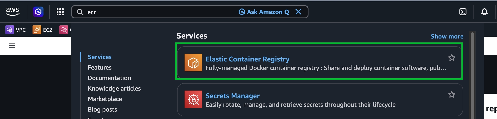
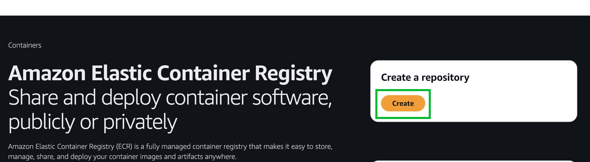
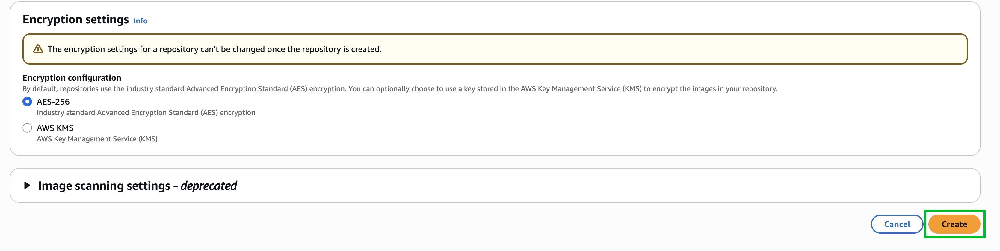
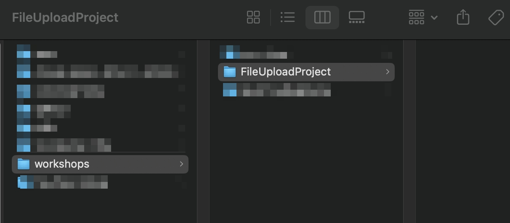
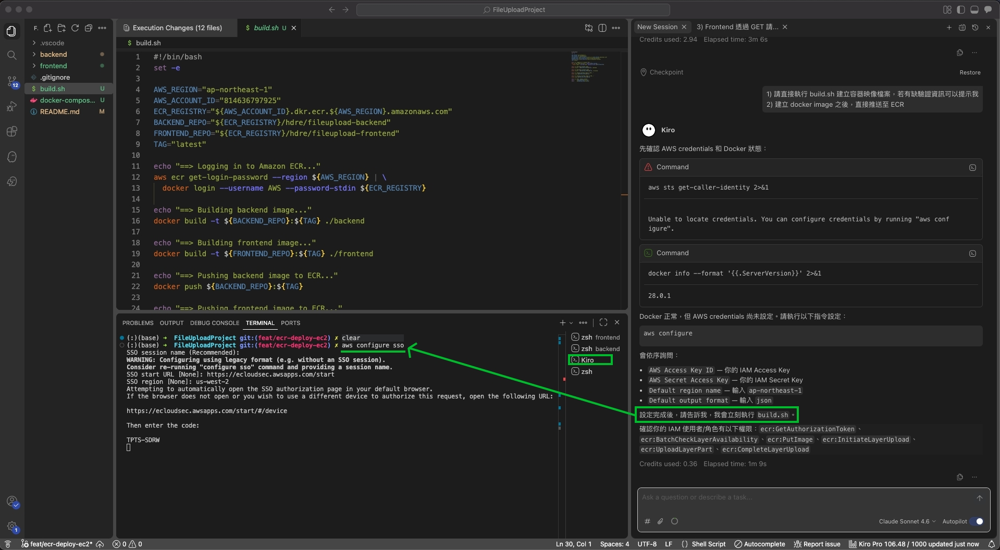

# 透過 Kiro 將 FileUpload 專案容器化 並推送至 Amazon ECR

## Prerequisite

:::alert{type="warning"}
開始前請確認已完成 Task 3-1：透過 Kiro 建立基礎 FileUpload 專案（前後端分離），且本地已安裝 Docker。
:::

---

## 前置作業 - 建立 ECR Repository

前往 AWS Console，切換至對應的 Region，搜尋 `ecr`。





:::steps
1. 建立 Backend Repository

   填上 namespace/repo-name：``hdre/fileupload-backend``

   ")

   

   建立完成後複製 URI，後續步驟會用到。

   

2. 建立 Frontend Repository

   填上 namespace/repo-name：``hdre/fileupload-frontend``

   ")

   

   
:::

---

## 回到 Kiro - 開始容器化

:::steps
1. 開啟 Kiro IDE，透過 Vibe 開啟 FileUploadProject 專案

   
   

2. 選擇 Claude Sonnet 4.6 模型

   

3. 輸入以下 Prompt

   ```
   1) 請幫我將 #backend 及 #frontend 分別進行容器化，產生相應的 Dockerfile，並且建立 build.sh 檔案，更新 README.md 說明如何進行容器化

   2) 這個 Docker Image 將部署於 EC2 (Amazon Linux 2023)

   3) 我已建立 Amazon ECR，請將 Image build 完成後，backend 推送至 814636797925.dkr.ecr.ap-northeast-1.amazonaws.com/hdre/fileupload-backend，frontend 推送至 814636797925.dkr.ecr.ap-northeast-1.amazonaws.com/hdre/fileupload-frontend，Tag 是 latest

   4) 請於 ./docker-compose.yaml 產生一個 docker compose 檔案，將來可部署於 EC2 內

   5) 我的本地電腦環境是 mac，但 EC2 會是 Amazon Linux 2023，在產生 build.sh 檔案時需要注意 platform 的問題
   ```

4. Follow Kiro 執行過程

   
   
   
   
:::

---

## 執行容器化並推送至 ECR

輸入以下 Prompt，請 Kiro 執行 build 與推送：

```
1) 請直接執行 build.sh 建立容器映像檔案，若有缺驗證資訊可以提示我

2) 建立 docker image 之後，直接推送至 ECR
```

:::steps
1. 開啟 Terminal 觀察 Kiro 的執行指令

   
   

2. 進入 Kiro 的終端機，完成 AWS 身份驗證

   

   
   

3. 確認 AWS CLI 及 Docker 的權限設定完成

   

4. 引導 Kiro 繼續執行

   告知 Kiro：「我設定好了 aws cli 的身份驗證，以及 docker 的身份驗證，並且確認具備 ECR 的權限，請繼續執行」

   
   
   

5. 推送映像至 ECR

   
   
:::

---

## 至 AWS Console 確認結果


:::alert{type="success"}
Backend 與 Frontend 映像均已成功推送至 ECR，可直接下載完成品參考：[GitHub - richguosa/FileUploadProject (feat/push-ecr-deploy-ec2)](https://github.com/richguosa/FileUploadProject/tree/feat/push-ecr-deploy-ec2)
:::
