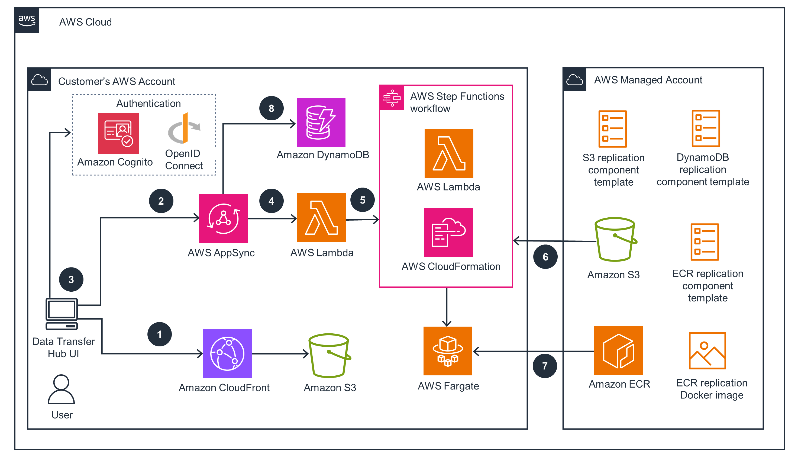
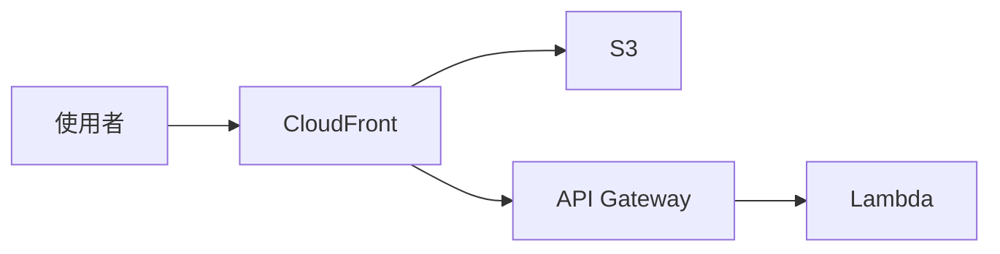

# 媒體嵌入

## 圖片

圖片直接放在**頁面資料夾**下，用相對路徑引用：

```
content/
└── my-workshop/
    └── 01-intro/
        ├── _index.md       ← 這個頁面
        └── architecture.png
```

### 基本用法

```markdown

```

圖片預設置中顯示，最大寬度 85%。點擊可放大檢視原圖（Lightbox）。

### 圖片說明（Caption）

在 URL 後加上引號文字，會渲染為圖片下方的說明文字：

```markdown

```

### 自訂寬度

在圖片語法後加上 `{width="值"}` 可覆蓋預設寬度：

```markdown
{width="100%"}
{width="60%"}
{width="200px"}
```

### 完整語法

Caption 和寬度可以同時使用：

```markdown
{width="60%"}
```

:::alert{type="info"}
相對路徑會自動解析到當前頁面所在的目錄。若圖片放在 workshop 根目錄，需要加上路徑前綴，例如 `../architecture.png`。
:::

實際效果：

{width="85%"}

也支援外部圖片 URL：

```markdown

```

## 影片

支援 YouTube 連結，自動轉換為嵌入式播放器：

```markdown
::video{src="https://www.youtube.com/watch?v=VIDEO_ID"}
::video{src="https://youtu.be/VIDEO_ID"}
```

效果：

::video{src="https://www.youtube.com/watch?v=mUL0ABssVKo"}

## Mermaid 圖表

支援 [Mermaid](https://mermaid.js.org/) 語法，用 fenced code block 標記 `mermaid` 語言即可：

````markdown

````

效果：


支援所有 Mermaid 圖表類型，包括 flowchart、sequence diagram、class diagram、state diagram、ER diagram 等。切換 dark/light 主題時圖表會自動重新渲染。
